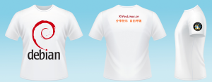

+++
title = "我自己设计的体恤"
date = "2009-04-27T03:59:11+08:00"
tags = ["linux 应用"]
categories = ["linux 应用"]
banner = "img/banners/banner-2.jpg"
draft = false
author = "helight"
authorlink = "https://helight.cn"
summary = ""
keywords = ["linux 应用"]
+++

很喜欢Debian的系统，她的风格，她的颜色，还有她独特的设计。
我也自己设计了一件体恤，准备什么时候自己去印一下。也自由的疯狂一下。
<!--more-->

[这里有大图](../../imgs/2009/04/t-shirt-debian.png)

看完本文有收获？请分享给更多人 

关注「黑光技术」，关注大数据+微服务 

