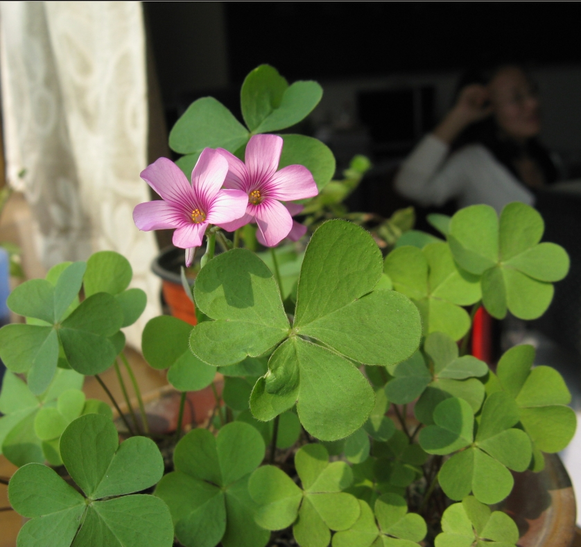

+++
title = "哈哈！！三叶草开花了"
date = "2009-09-29T01:47:23+08:00"
tags = ["生活"]
categories = ["生活"]
banner = "img/banners/banner-2.jpg"
draft = false
author = "helight"
authorlink = "https://helight.cn"
summary = ""
keywords = ["生活"]
+++

哈哈！！三叶草开花了！！

上学期有一天下雨，看到学校路边的三叶草长的很是可爱！所以就移了两株到实验室，种到了一个小花盆里！上学期种了之后一直长的不是很好！加上暑假去了宝鸡，少人照看，赶头我回来，可怜的三叶草已经是一个叶子也没有了！都有点泄气了！后来想种点别的！但最后还是报了一点希望--她可能会活过来的。于是又浇了点水。过了几天意外的发现她长出了一片嫩嫩的叶子，亭亭玉立应该说的就是这一个样子吧，漂亮极了！开心。。。。之后的叶子一个个的，雨后的春笋是不是也是这样阿！哈哈。。。
<!--more-->
昨天早上来到实验室，再去瞟了一眼，哇。。。。居然开花了，两多粉红的小花！漂亮阿。。。今天一早上就过来了，又开了一朵，三朵小花。。。漂亮。。。

最近有点点背！不过还好！还有这么点让人开心不已的事情来!

看完本文有收获？请分享给更多人 

关注「黑光技术」，关注大数据+微服务 

