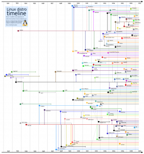

+++
title = "Linux发布版的时间图"
date = "2009-10-16T03:41:12+08:00"
tags = ["kernel"]
categories = ["kernel"]
banner = "img/banners/banner-2.jpg"
draft = false
author = "helight"
authorlink = "https://helight.cn"
summary = ""
keywords = ["kernel"]
+++

之前一直对都对Linux的发布版有错误的理解。今天看了这个图才清楚了。以后给别人讲课也就有依据了！汗那！！！
<!--more-->

[这里看大图](../../imgs/2009/10/linux-vendor.png)

看完本文有收获？请分享给更多人 

关注「黑光技术」，关注大数据+微服务 

