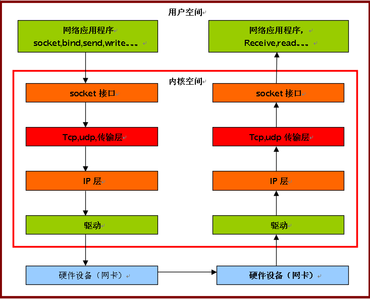

+++
title = "以ipv4来分析Linux网络的基本运行机制(2) "
date = "2009-10-17T13:26:28+08:00"
tags = ["kernel"]
categories = ["kernel"]
banner = "img/banners/banner-2.jpg"
draft = false
author = "helight"
authorlink = "https://helight.cn"
summary = ""
keywords = ["kernel"]
+++

ipv4协议分析框架图:整理了一个网络接口的大致原理图！
<!--more-->

[这里看大图](../../imgs/2009/10/ipv4.png)

看完本文有收获？请分享给更多人 

关注「黑光技术」，关注大数据+微服务 

