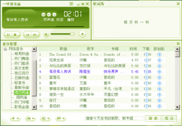

+++
title = "wine一听音乐盒"
date = "2009-10-25T05:59:26+08:00"
tags = ["生活"]
categories = ["生活"]
banner = "img/banners/banner-2.jpg"
draft = false
author = "helight"
authorlink = "https://helight.cn"
summary = ""
keywords = ["生活"]
+++

机子上老是那么些歌曲，每天放来放去我不烦，师弟师妹都已经烦了，我想也找一个好一点的想windwos下的音乐盒之类的软件来试试，最后锁定到了酷狗音乐盒和一听音乐盒。
不过酷狗老是出现乱码，搞了半天都没法解决，而一听就相对好多了，没有乱码而且非常的流畅。不错不错！！！
<!--more-->

[这里看大图](../../imgs/2009/10/iting.png)

看完本文有收获？请分享给更多人 

关注「黑光技术」，关注大数据+微服务 

