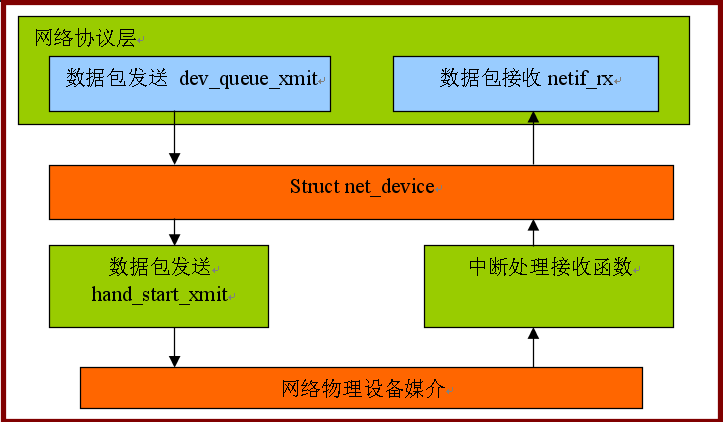

+++
title = "网卡数据流分析图"
date = "2009-10-31T13:28:18+08:00"
tags = ["kernel"]
categories = ["kernel"]
banner = "img/banners/banner-2.jpg"
draft = false
author = "helight"
authorlink = "https://helight.cn"
summary = ""
keywords = ["kernel"]
+++

以前做网卡程序时的一个数据流图，拿出来晒晒。
<!--more-->

[这里看大图](../../imgs/2009/10/netdevice.png)

看完本文有收获？请分享给更多人 

关注「黑光技术」，关注大数据+微服务 

