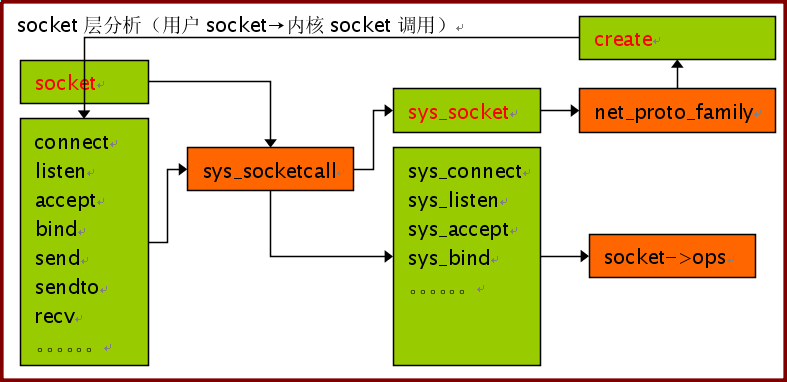
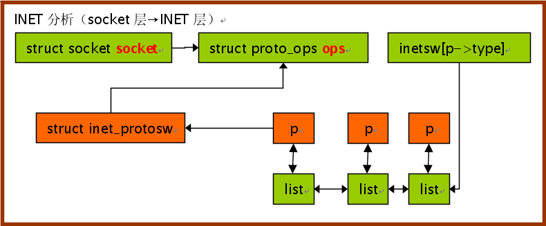

+++
title = "整理了两张linux网络分析的图"
date = "2009-11-24T00:51:35+08:00"
tags = ["kernel"]
categories = ["kernel"]
banner = "img/banners/banner-2.jpg"
draft = false
author = "helight"
authorlink = "https://helight.cn"
summary = ""
keywords = ["kernel"]
+++

整理了两张linux网络分析的图

[这里看大图](../../imgs/2009/11/socket.png)

[这里看大图](../../imgs/2009/11/inet.png)