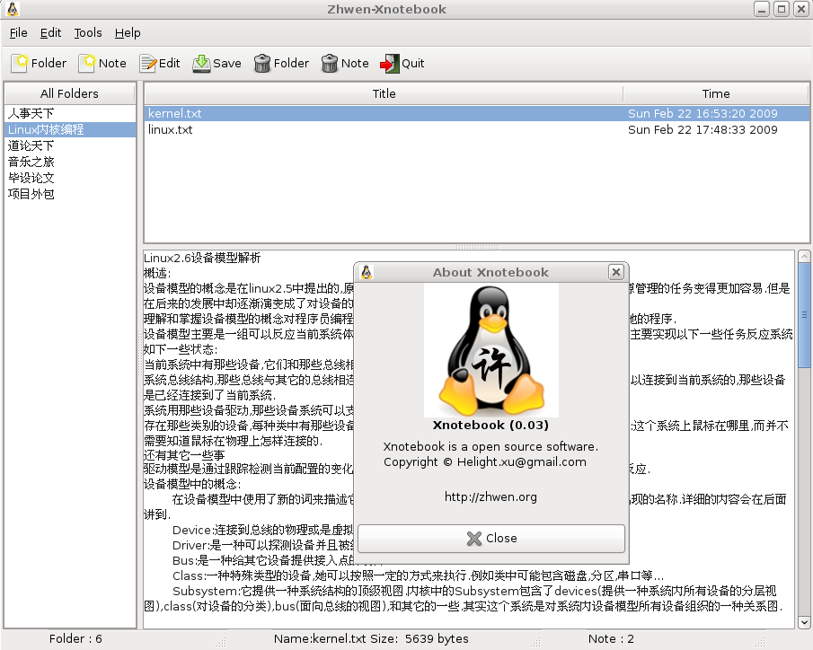

+++
title = "Xnotebook文本资料管理软件"
date = "2009-02-26T13:47:08+02:00"
tags = ["linux", "开源", "tools"]
categories = ["tools"]
banner = "img/banners/banner-2.jpg"
draft = false
author = "helight"
authorlink = "https://helight.cn"
summary = "Xnotebook是一款用gtk＋开发的文本资料管理软件，它主要用于个人文本资料的分类管理。"
keywords = ["开源", "linux", "notebook"]
+++

# 一、软件介绍： 

Xnotebook是一款用gtk＋开发的文本资料管理软件，它主要用于个人文本资料的分类管理。

# 二、安装使用： 
项目源码下载： 项目管理地址：https://github.com/helight/xnotebook 在这上面使用svn下载源码即可进行编译安装。 或者在下面的地址下载源码压缩包： http://code.google.com/p/xnotebook/downloads/list 下载后解压到某处即可进行安装。

(请下载最新版本) 在项目文件根目录下执行一下命令即可： 
xnotebook$ ./autogen.sh 
xnotebook$ make 
xnotebook$ sudo make install 
xnotebook$ xnotebook 
这样既可以使用该软件了。 

# 三、具体功能： 
1. 新建分类：点击工具栏上“New Folder”则会弹出一个对话框，输入要建立分类的名称即可。保证新建名称符合Linux系统文件名命名规则。 
2. 新建分类下面文件：点击工具栏上“New Note”则会弹出一个对话框，输入要建立文件的名称即可。文件名称格式为xxx.txt 
3. 编辑文件：选择具体文件后，即可看到文件内容显示到了文本浏览区。事实上这时的文本区是只可浏览不可编辑的，点击工具栏上“Edit”后文本区才进入可编辑模式。这时便可以编辑文件。编辑后点击工具栏上“Save”后即可保存。 
4. 其它还有删除具体分类及其内容，删除具体文件和退出等功能。 

# 四、进一步要实现功能： 
1. 重命名分类名称。 
2. 重命名具体文件名称。 

# 五、关于作者： 
该软件作者：（Zhwen Xu）Helight.xu@gmail.com 个人站点：http://zhwen.org 

如果在使用中发现什么bug请发邮件通知我，我会尽快改进。 

看完本文有收获？请分享给更多人 

关注「黑光技术」，关注大数据+微服务 

