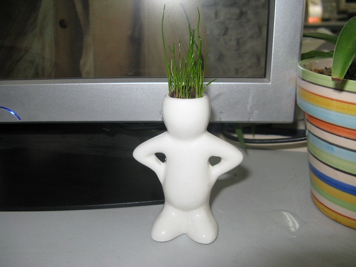

+++
title = "白色陶瓷娃娃"
date = "2010-01-22T06:20:20+08:00"
tags = ["生活"]
categories = ["生活"]
banner = "img/banners/banner-2.jpg"
draft = false
author = "helight"
authorlink = "https://helight.cn"
summary = ""
keywords = ["生活"]
+++

# 生活
小董婷买草娃娃的时候我也要了一个白色的陶瓷娃娃！虽然有点贵，但是玩么！还是挺不错的！

回来在水里泡了泡，每天给浇点水，居然这几天开始疯狂的长了！！！呵呵！不错吧！

早上豆瓣电台给我放了一首Eric Clapron的音乐，有点激动了，好长时间都没有听他的音乐了，暑假去宝鸡市里面逛的时候发现他的CD买到50块一张！有点忒贵了！没有买！！！

呵呵，看我的陶瓷娃娃吧！！

看完本文有收获？请分享给更多人 

关注「黑光技术」，关注大数据+微服务 

