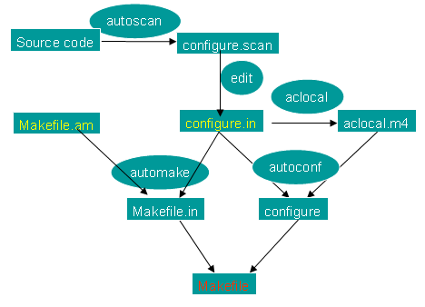

+++
title = "AutoMake 学习笔记"
date = "2010-09-18T13:47:08+02:00"
tags = ["linux", "开源"]
categories = ["programming"]
banner = "img/banners/banner-2.jpg"
draft = false
author = "helight"
authorlink = "https://helight.cn"
summary = "AutoMake 学习笔记"
keywords = ["automake", "开源", "linux"]
+++


# AutoMake 学习笔记</h1>
作者：<a href="mailto:zhwenxu@gmail.com">许振文</a>

## 过程记录：
``` sh
1. autoscan
2. 修改configure.scan，重命名为configure.in,编辑Ｍａｋｅｆｉｌｅ.ａｍ
3. 运行aclocal
4. autoconf
5. automake --add-missing
6. ./configure &&　ｍａｋｅ　&&　ｍａｋｅ　ｉｎｓｔａｌｌ了。
``` 
## 制作目录结构及文件：
``` sh
helight@helight:myshell$ ls
src
helight@helight:myshell$ ls src/
myshell.c
helight@helight:myshell$
``` 
## 接下来运行“autoscan”并且编辑相关文件：
1.将"configure.scan"重命名为"configure.in"。<br>
2.在本文件夹和子文件夹中建立Makefile.am文件。
``` sh
helight@helight:myshell$ autoscan 
helight@helight:myshell$ ls
autoscan.log  configure.scan  src
helight@helight:myshell$ mv configure.scan configure.in
helight@helight:myshell$ vim configure.in 
helight@helight:myshell$ vim Makefile.am
helight@helight:myshell$ vim src/Makefile.am
``` 
## 修改后的configure.in
``` sh
#                                               -*- Autoconf -*-                          
# Process this file with autoconf to produce a configure script.

AC_PREREQ(2.61)
AC_INIT("myshell", "0.01", "helight.xu@gmail.com")
AC_CONFIG_SRCDIR([src/myshell.c])
AC_CONFIG_HEADER([config.h])
AM_INIT_AUTOMAKE("myshell", "0.01")

# Checks for programs.
AC_PROG_CC

# Checks for libraries.

# Checks for header files.
AC_HEADER_STDC
AC_HEADER_SYS_WAIT
AC_CHECK_HEADERS([stdlib.h string.h unistd.h])

# Checks for typedefs, structures, and compiler characteristics.
AC_TYPE_PID_T
AC_TYPE_UID_T

# Checks for library functions.
AC_FUNC_FORK
AC_FUNC_MALLOC
AC_CHECK_FUNCS([memset strrchr])
AC_CONFIG_FILES(Makefile
        src/Makefile)
AC_OUTPUT
``` 
## 与autoscan生成的文件相比，主要添加修改了以下几行:
``` sh
AC_INIT("myshell", "0.01", "helight.xu@gmail.com")
AM_INIT_AUTOMAKE("myshell", "0.01")
AC_CONFIG_FILES(Makefile
        src/Makefile)
``` 
## 新建立的Makefile.am文件的内容
``` sh
helight@helight:myshell$ cat Makefile.am 
#Makefile.am
SUBDIRS = src
helight@helight:myshell$
``` 
## 新建立的src/Makefile.am文件的内容
``` sh
helight@helight:myshell$ cat src/Makefile.am 
#src/Makefiel.am
bin_PROGRAMS = myshell
myshell_SOURCES = myshell.c

helight@helight:myshell$ 
``` 
## 接下来运行aclocal
此时会生成aclocal.m4和autom4te.cache。
``` sh
helight@helight:myshell$ aclocal
helight@helight:myshell$ ls
aclocal.m4  autoscan.log  configure.in  Makefile.am  src
helight@helight:myshell$
``` 
## 再运行:autoconf生成configure文件.
``` sh
helight@helight:myshell$ autoconf 
helight@helight:myshell$ ls
aclocal.m4      autoscan.log  configure.in  src
autom4te.cache  configure     Makefile.am
helight@helight:myshell$
``` 
## 再运行autohead 生成config.h.in
``` sh
helight@helight:myshell$ autoheader 
helight@helight:myshell$ ls
aclocal.m4      autoscan.log  configure     Makefile.am
autom4te.cache  config.h.in   configure.in  src
helight@helight:myshell$
``` 
## 最后运行automake --add-missing 就能得到Makefile.in
``` sh
helight@helight:myshell$ automake --add-missing
configure.in: installing `./install-sh'
configure.in: installing `./mkinstalldirs'
configure.in: installing `./missing'
Makefile.am: installing `./COPYING'
Makefile.am: installing `./INSTALL'
Makefile.am: required file `./NEWS' not found
Makefile.am: required file `./README' not found
Makefile.am: required file `./AUTHORS' not found
Makefile.am: required file `./ChangeLog' not found
src/Makefile.am: installing `./depcomp'
helight@helight:myshell$ ls
aclocal.m4      config.h.in   COPYING  install-sh   missing
autom4te.cache  configure     depcomp  Makefile.am  mkinstalldirs
autoscan.log    configure.in  INSTALL  Makefile.in  src
helight@helight:myshell$
``` 
这里可以看到提示缺少一些文件。但这些文件是可以不要的。
## 可以configure了
``` sh
helight@helight:myshell$ ./configure 
checking for a BSD-compatible install... /usr/bin/install -c
checking whether build environment is sane... yes
checking for gawk... no
checking for mawk... mawk
checking whether make sets $(MAKE)... yes
checking for gcc... gcc
checking for C compiler default output file name... a.out
checking whether the C compiler works... yes
checking whether we are cross compiling... no
checking for suffix of executables... 
checking for suffix of object files... o
checking whether we are using the GNU C compiler... yes
checking whether gcc accepts -g... yes
checking for gcc option to accept ISO C89... none needed
checking for style of include used by make... GNU
checking dependency style of gcc... gcc3
checking how to run the C preprocessor... gcc -E
checking for grep that handles long lines and -e... /bin/grep
checking for egrep... /bin/grep -E
checking for ANSI C header files... yes
checking for sys/wait.h that is POSIX.1 compatible... yes
checking for sys/types.h... yes
checking for sys/stat.h... yes
checking for stdlib.h... yes
checking for string.h... yes
checking for memory.h... yes
checking for strings.h... yes
checking for inttypes.h... yes
checking for stdint.h... yes
checking for unistd.h... yes
checking for stdlib.h... (cached) yes
checking for string.h... (cached) yes
checking for unistd.h... (cached) yes
checking for pid_t... yes
checking for uid_t in sys/types.h... yes
checking vfork.h usability... no
checking vfork.h presence... no
checking for vfork.h... no
checking for fork... yes
checking for vfork... yes
checking for working fork... yes
checking for working vfork... (cached) yes
checking for stdlib.h... (cached) yes
checking for GNU libc compatible malloc... yes
checking for memset... yes
checking for strrchr... yes
configure: creating ./config.status
config.status: creating Makefile
config.status: creating src/Makefile
config.status: creating config.h
config.status: executing depfiles commands
helight@helight:myshell$ 
``` 
## 编译make
``` sh
helight@helight:myshell$ make
``` 
## 最后附上一张automake的工作流程图：




<center>
看完本文有收获？请分享给更多人<br>

关注「黑光技术」，关注大数据+微服务<br>


</center>
