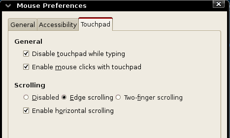

+++
title = "debian下触摸板使用"
date = "2011-10-27T13:26:23+08:00"
tags = ["linux 应用"]
categories = ["linux 应用"]
banner = "img/banners/banner-2.jpg"
draft = false
author = "helight"
authorlink = "https://helight.cn"
summary = ""
keywords = ["linux 应用"]
+++

之前在本本上安装了debian，但是发现触摸板的点击功能就是用不了，以为是驱动问题，加之有鼠标，而且回家用本本来写程序的时间也是很少，因为小丁同学要学习，老占用电脑，所以就没有管这个所谓的问题了，但是总是感觉不方便。

今天从公司同事那里又买了一个本本，配置比原来的本本要高，所以就给她专门使用了，我也专用了这个本，而且现在家里就一个鼠标，当然只能小丁同学用，所以有折腾了一下，突然发现是我设置的问题，简单的只要在系统鼠标配置的面板上够选一下就可以了。。。。

下面附上鼠标控制面板图：

看完本文有收获？请分享给更多人 

关注「黑光技术」，关注大数据+微服务 

