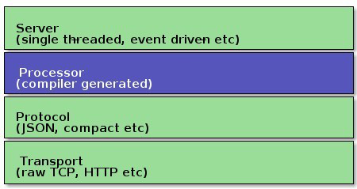
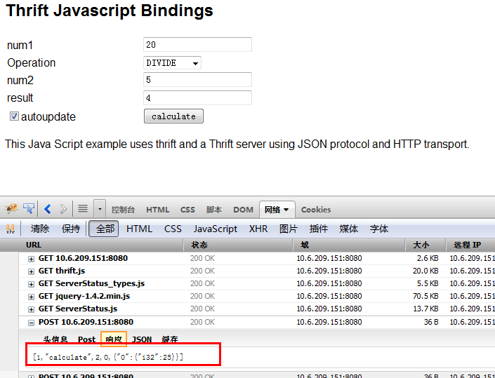

+++
title = "Thrift http嵌入sever设计实现"
date = "2013-11-04T06:16:09+08:00"
tags = ["scons","django"]
categories = ["linux 应用"]
banner = "img/banners/banner-2.jpg"
draft = false
author = "helight"
authorlink = "https://helight.cn"
summary = ""
keywords = ["scons","django"]
+++

## 背景介绍

在服务器模块程序种嵌入一个简单的httpserver，再通过网页或是后台再访问这个httpserver，得到一些服务模块的实时运行数据或是运行环境数据，或者在浏览器端调整服务器的实时运行参数，从而达到对后台服务模块的实时监控。 本文所写的是在thrift框架之下如何嵌入一个httpserver模块，并且如何在thrift框架之下使用js和httpserver交互，发送数据到服务器，并且获取展示服务模块的运算结果。
<!--more-->
## 设计思路
● 让thrift支持http协议 必须这样做，负责无法用浏览器访问。thrift的传输协议种本身是不支持http协议的，但是在分析了thrift代码之后，发现可以利用thrift机制，扩展其传输协议，使其支持http协议。 



● 静态文件打包到二进制程序中要访问httpsever，server返回的内容一般是html，js，xml，json，图片等文件内容，一般xml和json串和服务器交互都可以又服务器生成之后发送给浏览器或是客户端。但是我们使用网页有些内容是不好临时生成的，也不好一起随二进制程序一起部署，这里就有这样一种需求：把js，html模版文件打包为.a静态库，再编译到二进制程序中。这样发布部署则比较灵活。 

● 使用模版灵活生成页面 简单的html页面无法展示动态的内容，这种情况下就必要要让html中的内容可以随时间或是其它环境因素而显示相关内容。因此在sever一端要让html页面也能支持模版 

● 支持ajax访问 客户端的请求和服务器端的响应能够支持以json为传输协议的ajax。页面内容更为灵活的进行数据请求和展示。

## 具体实现
● thrift支持http协议

下面是一个thrift建立服务器的程序片段：
```c
boost::shared_ptr<TProtocolFactory> protocolFactory(new TJSONProtocolFactory());

boost::shared_ptr<ServerStatusHandler> handler(new ServerStatusHandler());

boost::shared_ptr<TProcessor> processor(new ServerStatusProcessor(handler));

boost::shared_ptr<TServerTransport> serverTransport(new TServerSocket(9090));

boost::shared_ptr<TTransportFactory> transportFactory(new THttpServerTransportFactory());

TThreadedServer server(processor, serverTransport, transportFactory,n protocolFactory);
```

交互协议使用json，Servertatusandler是由自己写来和浏览器进行ajax交互的类。serverTransport是负责socket一级的数据收发，这个对象最终会传给httptransport，由它去调用收发数据。

这里主要就是实现THttpServerTransportFactory类来实现对http协议的识别和发送。
```c
class THttpServerTransportFactory : public TTransportFactory
{
public:

THttpServerTransportFactory() {}

virtual ~THttpServerTransportFactory() {}

/**

* Wraps the transport into a buffered one.

*/

virtual boost::shared_ptr<TTransport> getTransport(boost::shared_ptr<TTransport> trans)

{

return boost::shared_ptr<TTransport>(new THttpServer(trans));

}

};
```
在THttpServer的实际实现中，对http协议的支持做了简化，主要简化点：

对于http协议版本的支持，只支持http1.0的协议，不支持1.1。

对get请求只支持注册在server中的html，js或是文件，对其它本地文件访问不支持，而且对get请求中的参数访问不支持。

对于参数请求，只支持ajax发起的post请求。

● 静态文件打包到二进制程序中

静态文件如何打包到二进制程序种呢？思路是将静态文件编程字符串数组，并且生成头文件，再进行编译，编译为静态库，再和其它代码编译到一起。过程使用python脚本进行转换和编译。

将静态文件转换成c代码的文件可以使用xxd工具来进行。


● 使用模版灵活生成页面

在模版的实现上是直接使用ctemplate则可以完成灵活配置。

CTemplate 是一个简单实用、功能强大的文字模板（template language），适用于使用C++语言开发的应用程序。其解决的主要问题是将文字表达和逻辑分离开来：文字模板解决如何用合适的文字和形式来表达的问题，而逻辑问题则由文字模板的调用者在源代码中完成。

ctemplate解决的主要问题是将文字表达和逻辑分离开来：文字模板解决如何用合适的文字和形式来表示问题，而逻辑问题则由文字模板的调用者在源代码中完成。

ctemplate大体上分为两个部分，一部分是模板，另一部分是数据字典。模板定义了界面展现的形式（V），数据字典就是填充模板的数据（M），你自己写业务逻辑去控制界面展现（C），典型的MVC模型。

在具体的实现上因为这里server的js和html等文件都是静态打包到二进制文件的，在server运行的时候也就加载到内存当中了，所以这里模板渲染方式不能使用普通的文件渲染，需要用到ctemplate的内存文件渲染方式：
```c
ctemplate::StringToTemplateCache().

ctemplate::StringToTemplateCache(

html_template_filename,  // 内存文件名

html_template.data(),     // 数据

html_template.size(),     // 数据长度

ctemplate::STRIP_WHITESPACE); // 过滤无用空格
```
● 支持ajax访问

对于ajax的支持则使用thrift提供的js库进行交互。

下面是一个测试实例的代码片段，主要是调用服务器端的calculate方法来做运算，并且把运算结果显示到result框内。
```c
var sip = location.host;
var transport = new Thrift.Transport("http://" + sip);

var protocol  = new Thrift.Protocol(transport);

var client    = new ServerStatusClient(protocol);

var work = new Work()

work.num1 = $("#num1").val();

work.num2 = $("#num2").val();

work.op = $("#op").val();

try {

result = client.calculate(1, work);

console.log(result);

$('#result').val(result);

$('#result').css('color', 'black');

} catch(ouch){

$('#result').val(ouch.why);

$('#result').css('color', 'red');

}
```
下面是测试页面和响应截图：



## 后期计划
进一步优化服务框架

功能实现，对server真实状态进行页面展示


<center>
看完本文有收获？请分享给更多人<br>

关注「黑光技术」，关注大数据+微服务<br>


</center>
