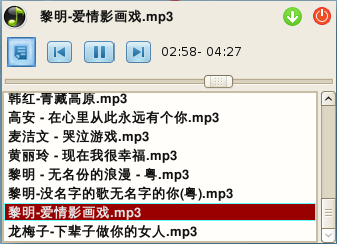

+++
title = "Open Source---我自己设立的一些小项目。。。"
date = "2014-04-05T09:21:39+08:00"
tags = ["life"]
categories = ["life"]
banner = "img/banners/banner-2.jpg"
draft = false
author = "helight"
authorlink = "https://helight.cn"
summary = ""
keywords = ["life"]
+++

## openflow

### 项目简介：
可视化分布式流程控制系统，数据流和业务流控制系统。
<!--more-->
### 项目地址：
https://github.com/helight/openflow

## xrpc

### 项目简介：
rpc server  implemented in c++ json, libev, easy to use

### 项目地址：
https://github.com/helight/xrpc

 

## 小丁音乐

### 项目简介：
Music player for linux, Has the basic music player function，just for fun.

### 项目地址：
https://github.com/helight/xdmusic

## Xcut

### 项目简介：
xcut is a C Unit Test framework maintained by HelightXu. xcut is another branch of lcut and more feature then lcut!

### 项目地址：
https://github.com/helight/xcut/

## Linux嵌入式轻量级http服务器

### 项目简介：
编写一个可以在linux嵌入式下轻量级的http服务器软件，能够支持简单的静态页面的传输和cgi技术.目标是可以移植任意操作系统，但是主要针对于嵌入式linux。主要针对于嵌入式系统的web管理的实现。

### 项目地址：
https://github.com/helight/xhttpd

## Xnotebook文本资料管理软件

### 项目简介：
Xnotebook是一款用gtk＋开发的文本资料管理软件，它主要用于个人文本资料的分类管理。

### 项目地址：
https://github.com/helight/xnotebook

###  

## XGCom串口调试工具

### 项目简介：
一个Linux下的图形化的串口调试工具.帮助开发者调试串口程序。

### 项目地址：
https://github.com/helight/xgcom

###  

# ARM Program---学习ARM时写的程序或文档。。。

## Linux ARM开发文档

### 项目简介：
编写一个关于linux在arm上比较实用的开发文档，当前使用开发芯片有pxa270和S3C2410.

### 项目地址：
http://helight.cn/coding/arm-linux-compile.pdf

###  

## 学习编写嵌入式linux下的一些硬件驱动的开发

自己编写的网卡驱动，spi驱动，GPIO驱动，按键驱动等。。。

# School & Lab Project---Project in school。。。

## 数字微波通信设备网络管理系统

这是我研究生阶段的第一个横向项目。在该项目中主要完成了硬件电路板的软测，在ZLG移植UCOSII的基础之上完成了LPC2214上的移植，并将原有的51c程序移植到LPC2214的UCOSII上，由于系统是双CPU双OS的，所以在前期工作完成后，后期我又转向UClinux系统的移植和其中串口程序的编写，并且编写的虚拟网卡驱动，完成网卡数据到串口的转发。最后做了对整个系统的测试工作。感谢在此期间给予我帮助的所有老师。

### 项目状态：已经完成，已交付企业投入市场，目前正在进行下一个版本的开发。。。

看完本文有收获？请分享给更多人 

关注「黑光技术」，关注大数据+微服务 

