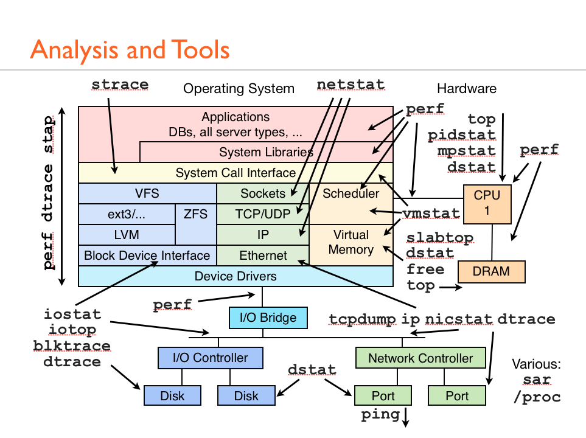

+++
title = "liunx系统分析图解"
date = "2014-04-11T09:51:54+08:00"
tags = ["kernel"]
categories = ["kernel"]
banner = "img/banners/banner-2.jpg"
draft = false
author = "helight"
authorlink = "https://helight.cn"
summary = ""
keywords = ["kernel"]
+++

看完本文有收获？请分享给更多人 

关注「黑光技术」，关注大数据+微服务 

