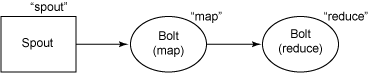

+++
title = "Storm云计算学习摘录总结"
date = "2014-04-12T03:47:12+08:00"
tags = ["linux 应用"]
categories = ["linux 应用"]
banner = "img/banners/banner-2.jpg"
draft = false
author = "helight"
authorlink = "https://helight.cn"
summary = ""
keywords = ["linux 应用"]
+++

本想自己也总结以下，看到这篇文章总结的太好了，直接转载了

原文：http://my.oschina.net/yilian/blog/175451
<!--more-->
## 1.Storm概念：

是一个分布式的、容错的实时计算系统，它被托管在<a href="https://github.com/nathanmarz/storm/" target="_blank" rel="nofollow">GitHub</a>上，遵循 Eclipse Public License 1.0。Storm是由BackType开发的实时处理系统，BackType现在已在Twitter麾下。GitHub上的最新版本是Storm 0.5.2，基本是用<a href="http://www.oschina.net/p/clojure" rel="nofollow">Clojure</a>写的。

Storm为分布式实时计算提供了一组通用原语，可被用于“流处理”之中，实时处理消息并更新数据库。这是管理队列及工作者集群的另一种方式。 Storm也可被用于“连续计算”（continuous computation），对数据流做连续查询，在计算时就将结果以流的形式输出给用户。它还可被用于“分布式RPC”，以并行的方式运行昂贵的运算。

## 2.底层实现原理 

https://github.com/mvogiatzis/first-stories-twitter/wiki/Algorithm-logic
## 2.1 Storm## 架构

Storm集群由一个主节点和多个工作节点组成。主节点运行了一个名为“Nimbus”的守护进程，用于分配代码、布置任务及故障检测。每个工作节点都运行了一个名为“Supervisor”的守护进程，用于监听工作，开始并终止工作进程。Nimbus和Supervisor都能快速失败，而且是无状态的，这样一来它们就变得十分健壮，两者的协调工作是由Zookeeper来完成的。ZooKeeper用于管理集群中的不同组件，ZeroMQ是内部消息系统，JZMQ是ZeroMQMQ的Java Binding。有个名为storm-deploy的子项目，可以在AWS上一键部署Storm集群.

## 3.概念介绍：

## 3.1 Storm## 术语解释

Storm的术语包括Stream、Spout、Bolt、Task、Worker、Stream Grouping和Topology。Stream是被处理的数据。Sprout是数据源。Bolt处理数据。Task是运行于Spout或Bolt中的线程。Worker是运行这些线程的进程。Stream Grouping规定了Bolt接收什么东西作为输入数据。数据可以随机分配（术语为Shuffle），或者根据字段值分配（术语为Fields），或者广播（术语为All），或者总是发给一个Task（术语为Global），也可以不关心该数据（术语为None），或者由自定义逻辑来决定（术语为Direct）。Topology是由Stream Grouping连接起来的Spout和Bolt节点网络.下面进行详细介绍：

1. Topologies 用于封装一个实时计算应用程序的逻辑，类似于Hadoop的MapReduce Job
1. Stream 消息流，是一个没有边界的tuple序列，这些tuples会被以一种分布式的方式并行地创建和处理
1. Spouts 消息源，是消息生产者，他会从一个外部源读取数据并向topology里面面发出消息：tuple
1. Bolts 消息处理者，所有的消息处理逻辑被封装在bolts里面，处理输入的数据流并产生输出的新数据流,可执行过滤，聚合，查询数据库等操作
1. Task 每一个Spout和Bolt会被当作很多task在整个集群里面执行,每一个task对应到一个线程.
1. Stream groupings 消息分发策略,定义一个Topology的其中一步是定义每个tuple接受什么样的流作为输入,stream grouping就是用来定义一个stream应该如果分配给Bolts们.

## 3.2 stream grouping## 分类
1. Shuffle Grouping: 随机分组， 随机派发stream里面的tuple，保证每个bolt接收到的tuple数目相同.
2. Fields Grouping：按字段分组，比如按userid来分组，具有同样userid的tuple会被分到相同的Bolts，而不同的userid则会被分配到不同的Bolts.
3. All Grouping：广播发送， 对于每一个tuple，所有的Bolts都会收到.
4. Global Grouping: 全局分组，这个tuple被分配到storm中的一个bolt的其中一个task.再具体一点就是分配给id值最低的那个task.
5. Non Grouping: 不分组，意思是说stream不关心到底谁会收到它的tuple.目前他和Shuffle grouping是一样的效果,有点不同的是storm会把这个bolt放到这个bolt的订阅者同一个线程去执行.
6. Direct Grouping: 直接分组,这是一种比较特别的分组方法，用这种分组意味着消息的发送者举鼎由消息接收者的哪个task处理这个消息.只有被声明为Direct Stream的消息流可以声明这种分组方法.而且这种消息tuple必须使用emitDirect方法来发射.消息处理者可以通过TopologyContext来或者处理它的消息的taskid (OutputCollector.emit方法也会返回taskid)
详细介绍：

## 3.3 Storm组件 详细介绍

Storm集群主要由一个主节点和一群工作节点（worker node）组成，通过 Zookeeper进行协调。

## 3.3.1 主节点：

主节点通常运行一个后台程序 —— Nimbus，用于响应分布在集群中的节点，分配任务和监测故障。这个很类似于Hadoop中的Job Tracker。

## 3.3.2工作节点：

工作节点同样会运行一个后台程序 —— Supervisor，用于收听工作指派并基于要求运行工作进程。每个工作节点都是topology中一个子集的实现。而Nimbus和Supervisor之间的协调则通过Zookeeper系统或者集群。

## 3.3.3 Zookeeper

Zookeeper是完成Supervisor和Nimbus之间协调的服务。而应用程序实现实时的逻辑则被封装进Storm中的“topology”。topology则是一组由Spouts（数据源）和Bolts（数据操作）通过Stream Groupings进行连接的图。下面对出现的术语进行更深刻的解析。

## 3.3.4 Spout：

简而言之，Spout从来源处读取数据并放入topology。Spout分成可靠和不可靠两种；当Storm接收失败时，可靠的Spout会对tuple（元组，数据项组成的列表）进行重发；而不可靠的Spout不会考虑接收成功与否只发射一次。而Spout中最主要的方法就是nextTuple（），该方法会发射一个新的tuple到topology，如果没有新tuple发射则会简单的返回。

## 3.3.5 Bolt：

Topology中所有的处理都由Bolt完成。Bolt可以完成任何事，比如：连接的过滤、聚合、访问文件/数据库、等等。Bolt从Spout中接收数据并进行处理，如果遇到复杂流的处理也可能将tuple发送给另一个Bolt进行处理。而Bolt中最重要的方法是execute（），以新的tuple作为参数接收。不管是Spout还是Bolt，如果将tuple发射成多个流，这些流都可以通过declareStream（）来声明。

## 3.3.6Stream Groupings：

Stream Grouping定义了一个流在Bolt任务间该如何被切分。这里有<a href="https://github.com/nathanmarz/storm/wiki/Tutorial" target="_blank" rel="nofollow">Storm提供</a>的6个Stream Grouping类型：

1. 随机分组（Shuffle grouping）：随机分发tuple到Bolt的任务，保证每个任务获得相等数量的tuple。

2. 字段分组（Fields grouping）：根据指定字段分割数据流，并分组。例如，根据“user-id”字段，相同“user-id”的元组总是分发到同一个任务，不同“user-id”的元组可能分发到不同的任务。

3. 全部分组（All grouping）：tuple被复制到bolt的所有任务。这种类型需要谨慎使用。

4. 全局分组（Global grouping）：全部流都分配到bolt的同一个任务。明确地说，是分配给ID最小的那个task。

5. 无分组（None grouping）：你不需要关心流是如何分组。目前，无分组等效于随机分组。但最终，Storm将把无分组的Bolts放到Bolts或Spouts订阅它们的同一线程去执行（如果可能）。

6. 直接分组（Direct grouping）：这是一个特别的分组类型。元组生产者决定tuple由哪个元组处理者任务接收。

当然还可以实现CustomStreamGroupimg接口来定制自己需要的分组。

IRichBolt和IRichSpout与IBolt和ISpout的不同在于多了两个接口：

<a href="http://nathanmarz.github.com/storm/doc-0.7.1/backtype/storm/topology/IComponent.html#declareOutputFields(backtype.storm.topology.OutputFieldsDeclarer)" rel="nofollow">declareOutputFields</a>(<a href="http://nathanmarz.github.com/storm/doc-0.7.1/backtype/storm/topology/OutputFieldsDeclarer.html" rel="nofollow">OutputFieldsDeclarer</a> declarer)：声明输出字段

<a href="http://nathanmarz.github.com/storm/doc-0.7.1/backtype/storm/topology/IComponent.html#getComponentConfiguration()" rel="nofollow">getComponentConfiguration</a>() ：该接口是在0.7.0引入的，用于支持组件级的配置，即允许用户针对单个Spout或Bolt进行参数配置。

实现了这两个接口后，通过调用TopologyBuilder建立起Topology。TopologyBuilder实际上是封装了StormTopology的thrift接口，也就是说Topology实际上是通过thrift定义的一个struct，TopologyBuilder将这个对象建立起来，然后nimbus实际上会运行一个thrift服务器，用于接收用户提交的结构。由于是采用thrift实现，所以用户可以用其他语言建立Topology，这样就提供了比较方便的多语言操作支持。

对于用户来说，通常需要做的就是提供自己的ISpout和IBlot实现，然后利用TopologyBuilder建立起自己需要的拓扑结构。

Storm框架会拿到用户提供这个拓扑结构及Spout和Blot对象，驱动整个处理过程。简单介绍下ISpout的那些接口的调用时机，在创建Spout对象时，会调用open函数。对象销毁时调用close()，但是框架并不保证close函数一定会被调用，因为进程可能是通过kill -9被杀死的。activate和deactivate是在spout被activate或deactivate时被调用，这两个动作是由用户从外部触发的，Strom的命令行提供两个命令activate和deactivate，允许用户activate和deactivate一个Topology，当用户执行deactivate时，对应Topology的spout会被deactivate，产生影响就是spout的nextTuple此后将不会被调用，直到用户再调用activate。Spout的核心功能是通过nextTuple实现的，用户通过该函数完成Tuple的发射。该函数会被框架周期性的调用。会有类似如下的一个循环：

While(true)

{

if(…)

spout.activate();

if(…)

sput.deactivate();

if(…)

spout.nextTupe();

}

首先这三个函数都是在一个线程中，因此不需要同步。其次，nextTuple()不能阻塞，如果没有Tuple可以发射需要立即返回，用户不能提供一个阻塞式的实现，否则可能阻塞整个后台循环。另外，后台可能会调节nextTuple()的调用频率，比如系统有一个配置参数可以控制当前被pending的Tuple最大数目，如果达到这个限制，可能就会做一些流控。

ack和fail则是两个回调函数。Spout在发射出一个tuple后，该tuple会通过acking机制被acker追踪，除了显式的fail和ack外，每个tuple有一个超时时间，如果超过这个时间还未确定该tuple的状态，那么acker会通知spout，这个tuple处理失败了，然后框架得到这个消息后，就会调用spout的fail函数，如果acker发现这个tuple处理成功了，也会通知spout，然后会调用spout的ack函数。所以通常来说用户在发射tuple时，要确保数据不丢失，都会将已经发射的tuple缓存起来，然后在ack函数中删除对应tuple，在fail函数中重发对应的tuple。

另外需要注意的一点是，Spout使用的collector是SpoutOutputCollector，Bolt使用的collector是OutputCollector。这两个虽然提供的功能类似，都是负责发送tuple的，但是由于一个是面向Spout，一个是面向Bolt的，它们的接口也略有不同。具体如下：

public interface ISpoutOutputCollector {

List&lt;Integer&gt; emit(String streamId, List&lt;Object&gt; tuple, Object messageId);

void emitDirect(int taskId, String streamId, List&lt;Object&gt; tuple, Object messageId);

void reportError(Throwable error);

}

Spout通过调用ISpoutOutputCollector的emit函数进行tuple的发射，当然实际上emit函数并未完成实际的发送，它主要是根据用户提供的streamId，计算出该tuple需要发送到的目标taskID。emitDirect函数，更裸一些，直接指定目标taskID。它们都只是将&lt;tasked,tuple&gt;组成的序列对放到一个队列中，然后会有另一个线程负责将tuple从队列中取出并发送到目标task。

public interface IOutputCollector extends IErrorReporter {

List&lt;Integer&gt; emit(String streamId, Collection&lt;Tuple&gt; anchors, List&lt;Object&gt; tuple);

void emitDirect(int taskId, String streamId, Collection&lt;Tuple&gt; anchors, List&lt;Object&gt; tuple);

void ack(Tuple input);

void fail(Tuple input);

}

IOutputCollector是会被Bolt调用的，与ISpoutOutputCollector功能类似。但是区别也很明显，首先我们可以看到它的emit系列函数，多了一个参数Collection&lt;Tuple&gt; anchors，增加这样一个anchors原因在于，对于spout来说，它产生的tuple就是root tuple，但是对于bolt来说，它是通过一个或多个输入tuple，进而产生输出tuple的，这样tuple之间是有一个父子关系的，anchors就是用于指定当前要emit的这个tuple的所有父亲，正是通过它，才建立起tuple树，如果用户给了一个空的anchors，那么这个要emit的tuple将不会被加入tuple树，也就不会被追踪，即使后面它丢失了，也不会被spout感知。

除了anchors参数外，IOutputCollector还多了ack和fail两个接口。这两个接口，与Spout的ack和fail完全不同，对于Spout来说ack和fail是提供给Spout在tuple发送成功或失败时进行处理的一个机会。而IOutputCollector的ack和fail则是向acker汇报当前tuple的处理状态的，是需要Bolt在处理完tuple后主动调用的。

## 5. 生命周期过程

1.在提交了一个topology之后(在nimbus所在的机器), 创建spout/bolt实例(spout/bolt在storm中统称为component)并进行序列化.

2.将序列化的component发送给所有的任务所在的机器
3.在每一个任务上反序列化component.
4.在开始执行任务之前, 先执行component的初始化方法(bolt是prepare, spout是open).
component的初始化操作应该在prepare/open方法中进行, 而不是在实例化component的时候进行.

http://www.blogjava.net/killme2008/archive/2011/11/17/364112.html

## 6.保证处理完成

http://xumingming.sinaapp.com/127/twitter-storm%E5%A6%82%E4%BD%95%E4%BF%9D%E8%AF%81%E6%B6%88%E6%81%AF%E4%B8%8D%E4%B8%A2%E5%A4%B1/

## 7.一些常用的操作 有相应的方法支持 无需自己实现 each boardCast 聚合 过滤 等等  BaseFunction

http://blog.csdn.net/derekjiang/article/details/9126185

## 8.一些参考资源 ：

https://github.com/nathanmarz/storm

https://github.com/tdunning/storm-counts

https://github.com/nathanmarz/storm/wiki/Trident-tutorial

https://github.com/nathanmarz/storm-starter

https://github.com/mvogiatzis/first-stories-twitter/wiki/Algorithm-logic

理解了上面

Spont 的基本操作的执行顺序 作用  继承相应的ISpont 或其实现

理解了 上面

Sbold 的基本操作执行顺序 作用 继承相应的ISbold 或其实现

理解了上面分组 拓扑的概念

特别是那个

OutputCollector emit values 与 declareOutputFields declare Fields 关系后 ，一切都明确了

## 9 此文章是摘录网上各类文章总结

参考的主要是官方的文档 网上也有好多中文汉化版本

https://github.com/nathanmarz/storm/wiki/Concepts

https://github.com/nathanmarz/storm/wiki/Trident-tutorial

https://github.com/nathanmarz/storm/wiki/Tutorial

https://github.com/nathanmarz/storm/wiki/Guaranteeing-message-processing

https://github.com/mbonaci/mbo-storm/wiki/Storm-setup-in-Eclipse-with-Maven,-Git-and-GitHub

https://github.com/nathanmarz/storm/wiki/Distributed-RPC

https://github.com/nathanmarz/storm/wiki/Serialization

https://github.com/nathanmarz/storm/wiki/Lifecycle-of-a-topology

https://github.com/nathanmarz/storm/wiki/Spout-implementations

10 。可用的## maven源 pom配置

看完本文有收获？请分享给更多人 

关注「黑光技术」，关注大数据+微服务 

