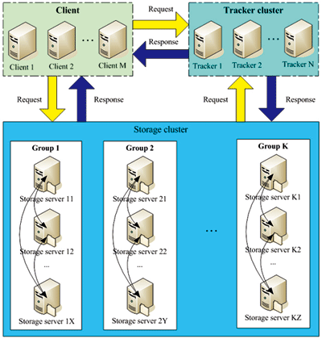

+++
title = " zz分布式文件系统FastDFS架构剖析"
date = "2014-05-04T09:16:07+08:00"
tags = ["rpc"]
categories = ["life"]
banner = "img/banners/banner-2.jpg"
draft = false
author = "helight"
authorlink = "https://helight.cn"
summary = ""
keywords = ["rpc"]
+++

【本文系外部转贴，原文地址：http://www.programmer.com.cn/4380/】

FastDFS是一款类Google FS的开源分布式文件系统，它用纯C语言实现，支持Linux、FreeBSD、AIX等UNIX系统。 它只 能通过专有API对文件进行存取访问，不支持POSIX接口方式，不能mount使用。准确地讲，Google FS以及FastDFS、 mogileFS、HDFS、TFS等类Google FS都不是系统级的分布式文件系统，而是应用级的分布式文件存储服务。
<!--more-->
## FastDFS的设计理念

FastDFS是为互联网应用量身定做的分布式文件系统，充分考虑了冗余备份、负载均衡、线性扩容等机制，并注重高可用、高性能等指标。和现有的类 Google FS分布式文件系统相比，FastDFS的架构和设计理念有其独到之处，主要体现在轻量级、分组方式和对等结构三个方面。

<em>轻量级</em>

FastDFS只有两个角色：Tracker server和Storage server。Tracker server作为中心结点，其主要作 用是负载均衡和调度。Tracker server在内存中记录分组和Storage server的状态等信息，不记录文件索引信息，占用的内存量很 少。另外，客户端（应用）和Storage server访问Tracker server时，Tracker server扫描内存中的分组和 Storage server信息，然后给出应答。由此可以看出Tracker server非常轻量化，不会成为系统瓶颈。

FastDFS中的Storage server在其他文件系统中通常称作Trunk server或Data server。 Storage server直接利用OS的文件系统存储文件。FastDFS不会对文件进行分块存储，客户端上传的文件和Storage server 上的文件一一对应。

众所周知，大多数网站都需要存储用户上传的文件，如图片、视频、电子文档等。出于降低带宽和存储成本的考虑，网站通常都会限制用户上传的文件大小， 例如图片文件不能超过5MB、视频文件不能超过100MB等。我认为，对于互联网应用，文件分块存储没有多大的必要。它既没有带来多大的好处，又增加了系 统的复杂性。FastDFS不对文件进行分块存储，与支持文件分块存储的DFS相比，更加简洁高效，并且完全能满足绝大多数互联网应用的实际需要。

在FastDFS中，客户端上传文件时，文件ID不是由客户端指定，而是由Storage server生成后返回给客户端的。文件ID中包含了组 名、文件相对路径和文件名，Storage server可以根据文件ID直接定位到文件。因此FastDFS集群中根本不需要存储文件索引信息，这是 FastDFS比较轻量级的一个例证。而其他文件系统则需要存储文件索引信息，这样的角色通常称作NameServer。其中mogileFS采用 MySQL数据库来存储文件索引以及系统相关的信息，其局限性显而易见，MySQL将成为整个系统的瓶颈。

FastDFS轻量级的另外一个体现是代码量较小。最新的V2.0包括了C客户端API、FastDHT客户端API和PHP extension等，代码行数不到5.2万行。

<em>分组方式</em>

类Google FS都支持文件冗余备份，例如Google FS、TFS的备份数是3。一个文件存储到哪几个存储结点，通常采用动态分配的方式。 采用这种方式，一个文件存储到的结点是不确定的。举例说明，文件备份数是3，集群中有A、B、C、D四个存储结点。文件1可能存储在A、B、C三个结点， 文件2可能存储在B、C、D三个结点，文件3可能存储在A、B、D三个结点。

FastDFS采用了分组存储方式。集群由一个或多个组构成，集群存储总容量为集群中所有组的存储容量之和。一个组由一台或多台存储服务器组成，同 组内的多台Storage server之间是互备关系，同组存储服务器上的文件是完全一致的。文件上传、下载、删除等操作可以在组内任意一台 Storage server上进行。类似木桶短板效应，一个组的存储容量为该组内存储服务器容量最小的那个，由此可见组内存储服务器的软硬件配置最好是 一致的。

采用分组存储方式的好处是灵活、可控性较强。比如上传文件时，可以由客户端直接指定上传到的组。一个分组的存储服务器访问压力较大时，可以在该组增 加存储服务器来扩充服务能力（纵向扩容）。当系统容量不足时，可以增加组来扩充存储容量（横向扩容）。采用这样的分组存储方式，可以使用FastDFS对 文件进行管理，使用主流的Web server如Apache、nginx等进行文件下载。

<em>对等结构</em>

FastDFS集群中的Tracker server也可以有多台，Tracker server和Storage server均不存在单点问 题。Tracker server之间是对等关系，组内的Storage server之间也是对等关系。传统的Master-Slave结构中的 Master是单点，写操作仅针对Master。如果Master失效，需要将Slave提升为Master，实现逻辑会比较复杂。和Master- Slave结构相比，对等结构中所有结点的地位是相同的，每个结点都是Master，不存在单点问题。

## FastDFS的架构

图1展示的是FastDFS的系统架构。

图1 FastDFS的系统架构

从图1可以看出，Tracker server之间相互独立，不存在直接联系。

客户端和Storage server主动连接Tracker server。Storage server主动向Tracker server报 告其状态信息，包括磁盘剩余空间、文件同步状况、文件上传下载次数等统计信息。Storage server会连接集群中所有的 Tracker server，向他们报告自己的状态。Storage server启动一个单独的线程来完成对一台Tracker server的连接 和定时报告。需要说明的是，一个组包含的Storage server不是通过配置文件设定的，而是通过Tracker server获取到的。

不同组的Storage server之间不会相互通信，同组内的Storage server之间会相互连接进行文件同步。

Storage server采用binlog文件记录文件上传、删除等更新操作。binlog中只记录文件名，不记录文件内容。

文件同步只在同组内的Storage server之间进行，采用push方式，即源头服务器同步给目标服务器。只有源头数据才需要同步，备份数据 并不需要再次同步，否则就构成环路了。有个例外，就是新增加一台Storage server时，由已有的一台Storage server将已有的所有 数据（包括源头数据和备份数据）同步给该新增服务器。

Storage server中由专门的线程根据binlog进行文件同步。为了最大程度地避免相互影响以及出于系统简洁性考虑，Storage server对组内除自己以外的每台服务器都会启动一个线程来进行文件同步。

文件同步采用增量同步方式，系统记录已同步的位置（binlog文件偏移量）到标识文件中。标识文件名格式：{dest storage IP}_{port}.mark，例如：192.168.1.14_23000.mark。

## 文件上传和下载的交互过程

接下来我们一起看一下文件上传和下载的交互过程。文件上传和下载流程分别如图2、图3所示。文件上传流程的步骤如下：

1. Client询问Tracker server上传到的Storage server；

2. Tracker server返回一台可用的Storage server，返回的数据为该Storage server的IP地址和端口；

3. Client直接和该Storage server建立连接，进行文件上传，Storage server返回新生成的文件ID，文件上传结束。

文件下载流程的步骤如下：

1. Client询问Tracker server可以下载指定文件的Storage server，参数为文件ID（包含组名和文件名）；

2. Tracker server返回一台可用的Storage server；

3. Client直接和该Storage server建立连接，完成文件下载。

## 文件同步延迟问题的提出

客户端将一个文件上传到一台Storage server后，文件上传工作就结束了。由该Storage server根据binlog中的上传记 录将这个文件同步到同组的其他Storage server。这样的文件同步方式是异步方式，异步方式带来了文件同步延迟的问题。新上传文件后，在尚未被 同步过去的Storage server上访问该文件，会出现找不到文件的现象。FastDFS是如何解决文件同步延迟这个问题的呢？

文件的访问分为两种情况：文件更新和文件下载。文件更新包括设置文件附加属性和删除文件。文件的附加属性包括文件大小、图片宽度、图片高度等。 FastDFS中，文件更新操作都会优先选择源Storage server，也就是该文件被上传到的那台Storage server。这样的做法不仅 避免了文件同步延迟的问题，而且有效地避免了在多台Storage server上更新同一文件可能引起的时序错乱的问题。

那么文件下载是如何解决文件同步延迟这个问题的呢？

要回答这个问题，需要先了解文件名中包含了什么样的信息。Storage server生成的文件名中，包含了源Storage server的 IP地址和文件创建时间等字段。文件创建时间为UNIX时间戳，后面称为文件时间戳。从文件名或文件ID中，可以反解出这两个字段。

然后我们再来看一下，Tracker server是如何准确地知道一个文件已被同步到一台Storage server上的。前面已经讲过，文件 同步采用主动推送的方式。另外，每台storage server都会定时向tracker server报告它向同组的其他 storage server同步到的文件时间戳。当tracker server收到一台storage server的文件同步报告后，它会依次找出 该组内各个storage server（后称作为S）被同步到的文件时间戳最小值，作为S的一个属性记录到内存中。

## FastDFS对文件同步延迟问题的解决方案

下面我们来看一下FastDFS采取的解决方法。

一个最简单的解决办法，和文件更新一样，优先选择源Storage server下载文件即可。这可以在Tracker server的配置文件中设置，对应的参数名为download_server。

另外一种选择Storage server的方法是轮流选择（round-robin）。当Client询问Tracker server有哪些 Storage server可以下载指定文件时，Tracker server返回满足如下四个条件之一的Storage server：

1. 该文件上传到的源Storage server，文件直接上传到该服务器上的；
2. 文件创建时间戳 < Storage server被同步到的文件时间戳，这意味着当前文件已经被同步过来了；
3. 文件创建时间戳=Storage server被同步到的文件时间戳，且（当前时间—文件创建时间戳） > 一个文件同步完成需要的最大时间（如5分钟）；
4. （当前时间—文件创建时间戳） > 文件同步延迟阈值，比如我们把阈值设置为1天，表示文件同步在一天内肯定可以完成。

## 结束语

看了上面的介绍，你是否认为FastDFS比较简洁高效呢？原雅虎同事——一位比较资深的系统架构师听完FastDFS介绍后，作出这样的评 价：“FastDFS是穷人的解决方案”。他的意思是说FastDFS把简洁和高效做到了极致，非常节约资源，中小网站完全用得起，这是对FastDFS 的极大认可和褒奖。

FastDFS从2008年7月发布至今，已推出31个版本，后续完善和优化工作正在持续进行中。目前已有多家公司在生产环境中使用FastDFS，相信通过我们的不懈努力，FastDFS一定会越来越好！

作者简介：

余庆，现在淘宝网Java中间件团队从事Java基础平台研发工作，有10年互联网开发和架构经历，曾担任新浪网开发工程师、雅虎中国架构师。开源分布式文件系统FastDFS和分布式哈希系统FastDHT的作者，对分布式数据存储架构有比较深入的研究。

看完本文有收获？请分享给更多人 

关注「黑光技术」，关注大数据+微服务 

