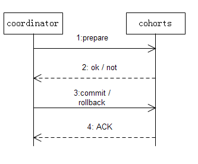
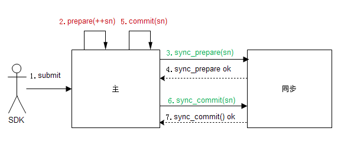

+++
title = "两阶段提交算法"
date = "2015-01-12T10:42:24+08:00"
tags = ["zookerrper"]
categories = ["分布式"]
banner = "img/banners/banner-2.jpg"
draft = false
author = "helight"
authorlink = "https://helight.cn"
summary = ""
keywords = ["zookerrper"]
+++

两阶段提交协议是在事务处理、数据库，以及计算机网络中使用的一种原子提交协议(atomic commitment)。它是一个分布式算法，协调在整个分布式原子事务中的参与者的行为(commit或者roll back)。这个协议在一些系统错误发生时仍然能够成功，((两阶段提交协议))但并不能保证对所有错误都能进行容错。为了能做错误恢复，协议的所有参与 者都需要使用日志对协议状态进行记录。
<!--more-->
两阶段提交协议中，其中一个节点被设置为coordinator，其他节点设置为cohorts。每个Mutation都会经历两个状态：prepare和commit。Master把mutation持久地写入log的时候，算是准备好了（prepared）。当主和备都准备好后，才进入commit状态，向用户返回成功。

Wikipedia对两阶段提交协议（two-phase commit protocol, 2PC）的描述如下：
[http://en.wikipedia.org/wiki/Two-phase_commit_protocol](http://en.wikipedia.org/wiki/Two-phase_commit_protocol)

中文wiki

[http://zh.wikipedia.org/wiki/%E4%BA%8C%E9%98%B6%E6%AE%B5%E6%8F%90%E4%BA%A4](http://zh.wikipedia.org/wiki/%E4%BA%8C%E9%98%B6%E6%AE%B5%E6%8F%90%E4%BA%A4)

在我内部使用的分布式存储MetaNode中实现具体的两阶段协议又有了些调整。目的上任然是保证一致性提交。

1. 主节点有双重角色，是coordinator也是cohorts。
1. 这里只有两个节点，简化了两阶段协议，只需要主备两个商量一致即可。
1. 加入了timeout机制，访问超时后会给sdk返回结果。
1. 以操作流水号为主要同步依据
1. 日志文件切分是用 sn % max_log_record, 非prepare日志
1. dump记录日志文件最后合并一条日志的流水号sn到fsimg文件
1. 异步节点启动，加载img中的sn号，请求日志是对流水号+1

看完本文有收获？请分享给更多人 

关注「黑光技术」，关注大数据+微服务 

