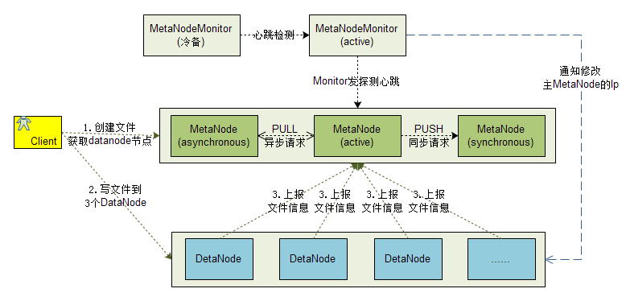

+++
title = "一种简单的分布式存储系统"
date = "2015-01-12T10:46:37+08:00"
tags = ["分布式"]
categories = ["分布式"]
banner = "img/banners/banner-2.jpg"
draft = false
author = "helight"
authorlink = "https://helight.cn"
summary = ""
keywords = ["分布式"]
+++

三层架构（MetaNodeMonitor+MetaNode+DataNode），核心是下面两层（MetaNode+DataNode），下面两层是可以脱离Monitor独立运行。

Monitor的存在主要是作为一个MetaNode的监控和MetaNode出错时进行切换角色，并且通知DataNode进行切换。

DataNode在获取主MetaNode的Ip后进行本地缓存，不需要主动询问Monitor，而且DataNode还可以主动从任意MetaNode获取主MetaNode的IP信息。

MetaNode作为整个系统的大脑，存储所有的文件元信息，这一点和HDFS的NameNode是有点类似的，但是MetaNode做了主备和自动切换设计，相对有更高的可用性。
<!--more-->

## 1.      监控节点MetaNodeMonitor
最上层MetaNodeMonitor主要是监控MetaNode节点，首先在MetaNode中主和同步节点出问题时能对MetaNode的角色进行相应的通知切换，并且通知Datanode切换后的主MetaNode节点ip，对发生的切换必须要有告警信息发送到配置好的接收人。

这里主要是保证MetaNode的单点问题，保证元数据的正确性和服务的稳定性。MetaNodeMonitor和MetaNode之间采用简单被动心跳+被动状态切换的方式来解决单点故障问题。而MetaNodeMonitor本身是采用主节点+冷备方式保证服务稳定它本身的一种可用性。

MetaNodeMonitor内部的设计相对简单，主要包含下面这4个小模块，分别提供对MetaNode的监控，备MetaNodeMonitor的监控，对DataNode的信息广播，还有就是控制或信息获取RPC接口。

## 2.      元数据节点MetaNode
MetaNode采用主+同步+异步节点来保证元数据的一致性和服务的稳定。

一般服务节点都是由主节点来提供，主节点和同步节点之间采用两阶段提交算法保证一次修改提交在两个节点中要么都成功要么都失败，保证数据在主节点和同步节点的强一致。异步节点通过向主节点请求日志记录的方式来学习主节点的变更，使得异步节点在一段时间内可以学习到主节点的变更，和主节点保持相对的一致性。

当主节点或者同步节点发生故障不能服务的时候，则由MetaNodeMonitor决定角色转换并且告知各个MetaNode，让后把角色信息更新配置库，最后MetaNodeMonitor告知各个DataNode变更后主MetaNode的Ip信息，DataNode向新的主MetaNode发送心跳信息。新的主MetaNode在收到一般以上DataNode的心跳才正式对外提供可写服务。

所以对于用户提交的一个修改请求，主节点会主动push给同步节点，而异步节点这是用pull方式来请求主节点进行日志学习的方式和主节点保持一直。
## 3.      数据存储节点DataNode
DataNode是实际的数据存储节点，实际提供对外的数据写入和读取，在文件写入之后DataNode还要上报MetaNode文件信息进行核对。

文件的写入过程：Client在请求MetaNode创建文件，MetaNode会给Client返回文件写入的3个DataNode节点IP，Client再把文件逐个写入到这3个DataNode中。

读取过程：Client请求MetaNode获取要读取文件的DataNode信息，Client随机选取一个DataNode，进行文件读取。

下面是一个文件写入过程的时序图：

在整体功能上，DataNode还需要一下的一些基本功能：

1. 本地资源的监控，对cpu，内存，磁盘使用都需要做到精确的监控上报到MetaNode，做集中管理
1. 带宽控制，在任务并发读取文件的时候需要相对均匀的保持吃满带宽。
1. 数据恢复，能够在MetaNode的指挥下从其它节点拉取恢复本机数据
1. 数据验证，能够对指定文件进行存储版本md5等计算检测
1. 脏数据清理，能够在负载低的时候进行脏数据发现了清理

在实际实现中这些功能都必须实现才能在最终节点上管理好存储数据。

因为DataNode在设计上是只支持文件级别的存储，所以DataNode在存储文件上直接使用本地文件系统，在初始化的时候DataNode分析系统磁盘，优先使用存储空间最大的磁盘作为存储盘，在一个盘存到一定量之后再存储其它盘，整体存储占到80%的时候会告警，90%之后会拒绝存储新文件。

看完本文有收获？请分享给更多人 

关注「黑光技术」，关注大数据+微服务 

