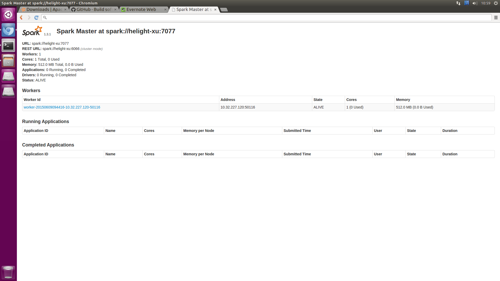
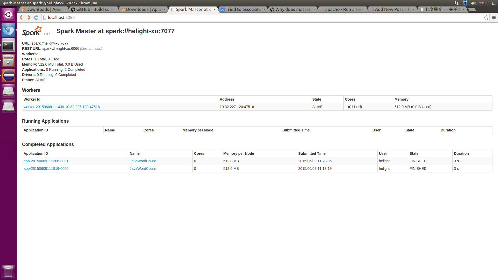

+++
title = "spark1.3.1单机安装测试备忘"
date = "2015-06-09T03:31:45+08:00"
tags = ["Spark"]
categories = ["Spark"]
banner = "img/banners/banner-2.jpg"
draft = false
author = "helight"
authorlink = "http://helight.cn"
summary = ""
keywords = ["Spark","scala"]
+++

## 1.下载,安装spark和scala:
http://spark.apache.org/downloads.html

下载1.3.1的hadoop2.6版本. spark-1.3.1-bin-hadoop2.6.tgz

下载到本地之后直接解压即可:

helight@helight-xu:/data/spark$ tar zxf spark-1.3.1-bin-hadoop2.6.tgz

http://www.scala-lang.org/download/

下载scala,2.11.6,也是直接解压即可:

helight@helight-xu:/data/spark$ tar zxf scala-2.11.6.tgz

<!--more-->

安装spark和scala直接配置环境变量即可,可以直接写到 系统环境变量配置文件/etc/profile
或者写道用户配置文件中~/.bashrc中
```sh
export JAVA_HOME=/usr/lib/jvm/java-8-openjdk-amd64/
export SCALA_HOME=/data/spark/scala-2.11.6 
export PATH=$PATH:$JAVA_HOME/bin:$SCALA_HOME/bin
```
    以下是安装新版本的时候的一些参数，上周测试了以下 2.4.6 的版本，基本安装过程还是一样的。
```sh
export SPARK_SSH_OPTS="-p 3600" # 这个端口是 ssh 的端口，比如我的机器 ssh 的端口是 3600.
export SCALA_HOME=/data/spark/scala-2.12.12/
export JAVA_HOME=/usr/lib/jvm/java-1.8.0-openjdk
export PATH=$PATH:$JAVA_HOME/bin:$SCALA_HOME/bin
```
以上就是基本配置.

## 2.ssh本地互信登录配
这里和hadoop中的互信配置一样.
首先在机器上安装openssh-server和openssh-client.
```sh
helight@helight-xu:~/.ssh$ ssh-keygen
```
一直回车即可,不要输入任何东西
```sh
helight@helight-xu:~/.ssh$ ls
id_rsa id_rsa.pub known_hosts
helight@helight-xu:~/.ssh$ cat id_rsa.pub >authorized_keys
helight@helight-xu:~/.ssh$ ll
total 24
drwx------ 2 helight helight 4096 6月 8 15:06 ./
drwxr-xr-x 23 helight helight 4096 6月 9 09:59 ../
-rw------- 1 helight helight 400 6月 8 15:06 authorized_keys
-rw------- 1 helight helight 1679 6月 8 15:06 id_rsa
-rw-r--r-- 1 helight helight 400 6月 8 15:06 id_rsa.pub
-rw-r--r-- 1 helight helight 444 6月 8 15:21 known_hosts
authorized_keys文件的权限设置为600,如上,这里或需要重新注销登录一下才可以无密码登录
helight@helight-xu:~/.ssh$ ssh localhost
Welcome to Ubuntu 15.04 (GNU/Linux 3.19.0-20-generic x86_64)

* Documentation: https://help.ubuntu.com/

Last login: Mon Jun 8 15:20:51 2015 from localhost
helight@helight-xu:~$
```
如上面的登录方式,则表示本机无密码登录ok了.

## 3.spark启动配置
### 3.1 配置spark-env.sh
Copy一份文件spark-env.sh.template重命名为spark-env.sh，在文件末尾添加
```sh
export JAVA_HOME=/usr/lib/jvm/java-8-openjdk-amd64/
export SCALA_HOME=/data/spark/scala-2.11.6
export SPARK_MASTER_IP=localhost
export SPARK_WORKER_CORES=1
export SPARK_WORKER_INSTANCES=1
export SPARK_WORKER_MEMORY=512M
```
可以看到，JAVA_HOME和SCALA_HOME都关联上了。

赋予spark-env.sh可执行权限
```sh
chmod 777 spark-env.sh
```
### 3.2    配置slaves 

Copy一份slaves.template文件重命名为slaves，添加机器名（或者ip，不过ip没试过）
```sh
# A Spark Worker will be started on each of the machines listed below.

# localhost
localhost
```
### 3.3配置spark-defaults.conf

Copy一份spark-defaults.conf.template重命名为spark-defaults.conf，把相关项打开（最后spark.executor.extraJavaOptions这项我目前还不知道使用，待研究）。
```sh
# Default system properties included when running spark-submit.

# This is useful for setting default environmental settings.

# Example:

spark.master                    spark://localhost:7077
spark.executor.memory 512m
spark.eventLog.enabled true
spark.eventLog.dir          /data/spark/spark-1.3.1-bin-hadoop2.6/logs/
spark.serializer                 org.apache.spark.serializer.KryoSerializer
spark.driver.memory       512m
```
### 3.4       配置log4j.properties

Copy一份log4j.properties.template文件重命名为log4j.properties即可。内容如下：
```sh
# Set everything to be logged to the console

log4j.rootCategory=INFO, console

log4j.appender.console=org.apache.log4j.ConsoleAppender

log4j.appender.console.target=System.err

log4j.appender.console.layout=org.apache.log4j.PatternLayout

log4j.appender.console.layout.ConversionPattern=%d{yy/MM/dd HH:mm:ss} %p %c{1}: %m%n

# Settings to quiet third party logs that are too verbose

log4j.logger.org.eclipse.jetty=WARN

log4j.logger.org.eclipse.jetty.util.component.AbstractLifeCycle=ERROR

log4j.logger.org.apache.spark.repl.SparkIMain$exprTyper=INFO

log4j.logger.org.apache.spark.repl.SparkILoop$SparkILoopInterpreter=INFO
```
### 3.5启动spark
```sh
helight@helight-xu:/data/spark/spark_hadoop$ ./sbin/start-all.sh
starting org.apache.spark.deploy.master.Master, logging to /data/spark/spark-1.3.1-bin-hadoop2.6/sbin/../logs/spark-helight-org.apache.spark.deploy.master.Master-1-helight-xu.out
helight-xu: starting org.apache.spark.deploy.worker.Worker, logging to /data/spark/spark-1.3.1-bin-hadoop2.6/sbin/../logs/spark-helight-org.apache.spark.deploy.worker.Worker-1-helight-xu.out
helight@helight-xu:/data/spark/spark_hadoop$
```
查看启动进程:
```sh
helight@helight-xu:/data/spark/spark_hadoop$ jps
Picked up JAVA_TOOL_OPTIONS: -javaagent:/usr/share/java/jayatanaag.jar
2625 Worker
2758 Jps
2410 Master
helight@helight-xu:/data/spark/spark_hadoop$
 
helight@helight-xu:/data/spark/spark_hadoop/conf$ ps axu|grep spark
helight 2410 0.7 3.6 4064160 292772 pts/0 Sl 09:44 0:34 /usr/lib/jvm/java-8-openjdk-amd64//bin/java -cp /data/spark/spark-1.3.1-bin-hadoop2.6/sbin/../conf:/data/spark/spark-1.3.1-bin-hadoop2.6/lib/spark-assembly-1.3.1-hadoop2.6.0.jar:/data/spark/spark-1.3.1-bin-hadoop2.6/lib/datanucleus-core-3.2.10.jar:/data/spark/spark-1.3.1-bin-hadoop2.6/lib/datanucleus-api-jdo-3.2.6.jar:/data/spark/spark-1.3.1-bin-hadoop2.6/lib/datanucleus-rdbms-3.2.9.jar -Dspark.akka.logLifecycleEvents=true -Xms512m -Xmx512m org.apache.spark.deploy.master.Master --ip helight-xu --port 7077 --webui-port 8080
helight 2625 0.7 3.3 4041960 270248 ? Sl 09:44 0:34 /usr/lib/jvm/java-8-openjdk-amd64//bin/java -cp /data/spark/spark-1.3.1-bin-hadoop2.6/sbin/../conf:/data/spark/spark-1.3.1-bin-hadoop2.6/lib/spark-assembly-1.3.1-hadoop2.6.0.jar:/data/spark/spark-1.3.1-bin-hadoop2.6/lib/datanucleus-core-3.2.10.jar:/data/spark/spark-1.3.1-bin-hadoop2.6/lib/datanucleus-api-jdo-3.2.6.jar:/data/spark/spark-1.3.1-bin-hadoop2.6/lib/datanucleus-rdbms-3.2.9.jar -Dspark.akka.logLifecycleEvents=true -Xms512m -Xmx512m org.apache.spark.deploy.worker.Worker spark://helight-xu:7077 --webui-port 8081
helight 3849 0.0 0.0 11176 2648 pts/0 S+ 10:57 0:00 grep --color=auto spark
helight@helight-xu:/data/spark/spark_hadoop/conf$
```
spark的web ui界面:

http://localhost:8080/


### 3.6提交任务:
```sh
./bin/spark-submit --class org.zhwen.test.spark_test.WordCount --master spark://helight-xu:7077 /data/helight/workspace/spark_test/target/idata-task-project-0.0.1-xu-jar-with-dependencies.jar
```




<center>
看完本文有收获？请分享给更多人<br>

关注「黑光技术」，关注大数据+微服务<br>


</center>
