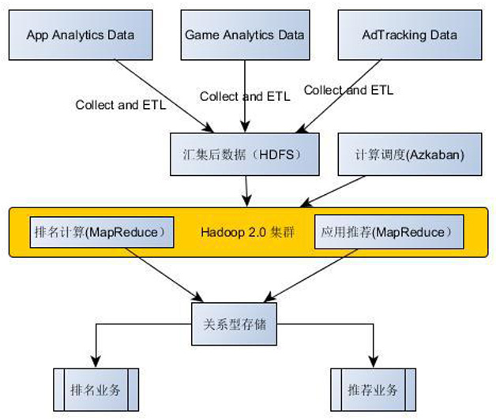
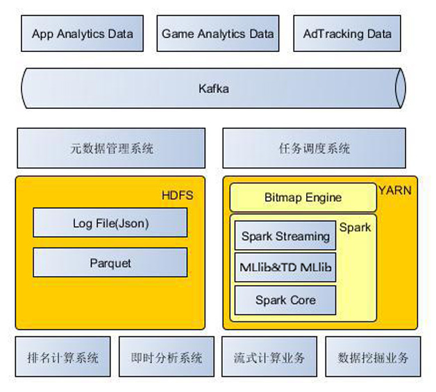

+++
title = "【转载】从Hadoop到Spark的架构实践"
date = "2015-09-29T09:53:35+08:00"
tags = ["Spark","kernel"]
categories = ["Spark"]
banner = "img/banners/banner-2.jpg"
draft = false
author = "helight"
authorlink = "http://helight.info"
summary = ""
keywords = ["Spark","kernel"]
+++

当下，Spark已经在国内得到了广泛的认可和支持：2014年，Spark Summit China在北京召开，场面火爆；同年，Spark Meetup在北京、上海、深圳和杭州四个城市举办，其中仅北京就成功举办了5次，内容更涵盖Spark Core、Spark Streaming、Spark MLlib、Spark SQL等众多领域。而作为较早关注和引入Spark的移动互联网大数据综合服务公司，TalkingData也积极地参与到国内Spark社区的各种活动，并多次在Meetup中分享公司的Spark使用经验。本文则主要介绍TalkingData在大数据平台建设过程中，逐渐引入Spark，并且以Hadoop YARN和Spark为基础来构建移动大数据平台的过程。
<!--more-->
## 初识Spark

作为一家在移动互联网大数据领域创业的公司，时刻关注大数据技术领域的发展和进步是公司技术团队必做的功课。而在整理Strata 2013公开的讲义时，一篇主题为《An Introduction on the Berkeley Data Analytics Stack_BDAS_Featuring Spark,Spark Streaming,and Shark》的教程引起了整个技术团队的关注和讨论，其中Spark基于内存的RDD模型、对机器学习算法的支持、整个技术栈中实时处理和离线处理的统一模型以及Shark都让人眼前一亮。同时期我们关注的还有Impala，但对比Spark，Impala可以理解为对Hive的升级，而Spark则尝试围绕RDD建立一个用于大数据处理的生态系统。对于一家数据量高速增长，业务又是以大数据处理为核心并且在不断变化的创业公司而言，后者无疑更值得进一步关注和研究。

## Spark初探

2013年中期，随着业务高速发展，越来越多的移动设备侧数据被各个不同的业务平台收集。那么这些数据除了提供不同业务所需要的业务指标，是否还蕴藏着更多的价值？为了更好地挖掘数据潜在价值，我们决定建造自己的数据中心，将各业务平台的数据汇集到一起，对覆盖设备的相关数据进行加工、分析和挖掘，从而探索数据的价值。初期数据中心主要功能设置如下所示：

1. 跨市场聚合的安卓应用排名；

2. 基于用户兴趣的应用推荐。

基于当时的技术掌握程度和功能需求，数据中心所采用的技术架构如图1。

整个系统构建基于Hadoop 2.0（Cloudera CDH4.3），采用了最原始的大数据计算架构。通过日志汇集程序，将不同业务平台的日志汇集到数据中心，并通过ETL将数据进行格式化处理，储存到HDFS。其中，排名和推荐算法的实现都采用了MapReduce，系统中只存在离线批量计算，并通过基于Azkaban的调度系统进行离线任务的调度。

第一个版本的数据中心架构基本上是以满足“最基本的数据利用”这一目的进行设计的。然而，随着对数据价值探索得逐渐加深，越来越多的实时分析需求被提出。与此同时，更多的机器学习算法也亟需添加，以便支持不同的数据挖掘需求。对于实时数据分析，显然不能通过“对每个分析需求单独开发MapReduce任务”来完成，因此引入Hive 是一个简单而直接的选择。鉴于传统的MapReduce模型并不能很好地支持迭代计算，我们需要一个更好的并行计算框架来支持机器学习算法。而这些正是我们一直在密切关注的Spark所擅长的领域——凭借其对迭代计算的友好支持，Spark理所当然地成为了不二之选。2013年9月底，随着Spark 0.8.0发布，我们决定对最初的架构进行演进，引入Hive作为即时查询的基础，同时引入Spark计算框架来支持机器学习类型的计算，并且验证Spark这个新的计算框架是否能够全面替代传统的以MapReduce为基础的计算框架。图2为整个系统的架构演变。

在这个架构中，我们将Spark 0.8.1部署在YARN上，通过分Queue，来隔离基于Spark的机器学习任务，计算排名的日常MapReduce任务和基于Hive的即时分析任务。

想要引入Spark，第一步需要做的就是要取得支持我们Hadoop环境的Spark包。我们的Hadoop环境是Cloudera发布的CDH 4.3，默认的Spark发布包并不包含支持CDH 4.3的版本，因此只能自己编译。Spark官方文档推荐用Maven进行编译，可是编译却不如想象中顺利。各种包依赖由于众所周知的原因，不能顺利地从某些依赖中心库下载。于是我们采取了最简单直接的绕开办法，利用AWS云主机进行编译。需要注意的是，编译前一定要遵循文档的建议，设置：

export MAVEN_OPTS="-Xmx2g -XX:MaxPermSize=512M -XX:ReservedCodeCacheSize=512m"

否则，编译过程中就会遇到内存溢出的问题。针对CDH 4.3，mvn build的参数为：

mvn -Pyarn-alpha -Phive -Dhadoop.version=2.0.0-cdh4.3.0 -DskipTests clean package

在编译成功所需要的Spark包后，部署和在Hadoop环境中运行Spark则是非常简单的事情。将编译好的Spark目录打包压缩后，在可以运行Hadoop Client的机器上解压缩，就可以运行Spark了。想要验证Spark是否能够正常在目标Hadoop环境上运行，可以参照Spark的官方文档，运行example中的SparkPi来验证：

<code class="plain plain">./bin/spark-submit --class org.apache.spark.examples.SparkPi \</code>

<code class="plain spaces">    </code><code class="plain plain">--master yarn-cluster \</code>

<code class="plain spaces">    </code><code class="plain plain">--num-executors 3 \</code>

<code class="plain spaces">    </code><code class="plain plain">--driver-memory 4g \</code>

<code class="plain spaces">    </code><code class="plain plain">--executor-memory 2g \</code>

<code class="plain spaces">    </code><code class="plain plain">--executor-cores 1 \</code>

<code class="plain spaces">    </code><code class="plain plain">--queue sparkqueue \</code>

<code class="plain spaces">    </code><code class="plain plain">lib/spark-examples*.jar \</code>

<code class="plain spaces">    </code><code class="plain plain">10</code>

完成Spark部署之后，剩下的就是开发基于Spark的程序了。虽然Spark支持Java、Python，但最合适开发Spark程序的语言还是Scala。经过一段时间的摸索实践，我们掌握了Scala语言的函数式编程语言特点后，终于体会了利用Scala开发Spark应用的巨大好处。同样的功能，用MapReduce几百行才能实现的计算，在Spark中，Scala通过短短的数十行代码就能完成。而在运行时，同样的计算功能，Spark上执行则比MapReduce有数十倍的提高。对于需要迭代的机器学习算法来讲，Spark的RDD模型相比MapReduce的优势则更是明显，更何况还有基本的MLlib的支持。经过几个月的实践，数据挖掘相关工作被完全迁移到Spark，并且在Spark上实现了适合我们数据集的更高效的LR等等算法。

## 全面拥抱Spark

进入2014年，公司的业务有了长足的发展，对比数据中心平台建立时，每日处理的数据量亦翻了几番。每日的排名计算所花的时间越来越长，而基于Hive的即时计算只能支持日尺度的计算，如果到周这个尺度，计算所花的时间已经很难忍受，到月这个尺度则基本上没办法完成计算。基于在Spark上的认知和积累，是时候将整个数据中心迁移到Spark上了。

2014年4月，Spark Summit China在北京举行。抱着学习的目的，我们技术团队也参加了在中国举行的这一次Spark盛会。通过这次盛会，我们了解到国内的很多同行已经开始采用Spark来建造自己的大数据平台，而Spark也变成了在ASF中最为活跃的项目之一。另外，越来越多的大数据相关的产品也逐渐在和Spark相融合或者在向Spark迁移。Spark无疑将会变为一个相比Hadoop MapReduce更好的生态系统。通过这次大会，我们更加坚定了全面拥抱Spark的决心。

基于YARN和Spark，我们开始重新架构数据中心依赖的大数据平台。整个新的数据平台应该能够承载：

1. 准实时的数据汇集和ETL；

2. 支持流式的数据加工；

3. 更高效的离线计算能力；

4. 高速的多维分析能力；

5. 更高效的即时分析能力；

6. 高效的机器学习能力；

7. 统一的数据访问接口；

8. 统一的数据视图；

9. 灵活的任务调度.

整个新的架构充分地利用YARN和Spark，并且融合公司的一些技术积累，架构如图3所示。

在新的架构中，引入了Kafka作为日志汇集的通道。几个业务系统收集的移动设备侧的日志，实时地写入到Kafka 中，从而方便后续的数据消费。

利用Spark Streaming，可以方便地对Kafka中的数据进行消费处理。在整个架构中，Spark Streaming主要完成了以下工作。

1. 原始日志的保存。将Kafka中的原始日志以JSON格式无损的保存在HDFS中。

2. 数据清洗和转换，清洗和标准化之后，转变为Parquet格式，存储在HDFS中，方便后续的各种数据计算任务。

3. 定义好的流式计算任务，比如基于频次规则的标签加工等等，计算结果直接存储在MongoDB中。

排名计算任务则在Spark上做了重新实现，借力Spark带来的性能提高，以及Parquet列式存储带来的高效数据访问。同样的计算任务，在数据量提高到原来3倍的情况下，时间开销只有原来的1/6。

同时，在利用Spark和Parquet列式存储带来的性能提升之外，曾经很难满足业务需求的即时多维度数据分析终于成为了可能。曾经利用Hive需要小时级别才能完成日尺度的多维度即时分析，在新架构上，只需要2分钟就能够顺利完成。而周尺度上也不过十分钟就能够算出结果。曾经在Hive上无法完成的月尺度多维度分析计算，则在两个小时内也可以算出结果。另外Spark SQL的逐渐完善也降低了开发的难度。

利用YARN提供的资源管理能力，用于多维度分析，自主研发的Bitmap引擎也被迁移到了YARN上。对于已经确定好的维度，可以预先创建Bitmap索引。而多维度的分析，如果所需要的维度已经预先建立了Bitmap索引，则通过Bitmap引擎由Bitmap计算来实现，从而可以提供实时的多维度的分析能力。

在新的架构中，为了更方便地管理数据，我们引入了基于HCatalog的元数据管理系统，数据的定义、存储、访问都通过元数据管理系统，从而实现了数据的统一视图，方便了数据资产的管理。

YARN只提供了资源的调度能力，在一个大数据平台，分布式的任务调度系统同样不可或缺。在新的架构中，我们自行开发了一个支持DAG的分布式任务调度系统，结合YARN提供的资源调度能力，从而实现定时任务、即时任务以及不同任务构成的pipeline。

基于围绕YARN和Spark的新的架构，一个针对数据业务部门的自服务大数据平台得以实现，数据业务部门可以方便地利用这个平台对进行多维度的分析、数据的抽取，以及进行自定义的标签加工。自服务系统提高了数据利用的能力，同时也大大提高了数据利用的效率。

## 使用Spark遇到的一些坑

任何新技术的引入都会历经陌生到熟悉，从最初新技术带来的惊喜，到后来遇到困难时的一筹莫展和惆怅，再到问题解决后的愉悦，大数据新贵Spark同样不能免俗。下面就列举一些我们遇到的坑。

【坑一：跑很大的数据集的时候，会遇到org.apache.spark.SparkException: Error communicating with MapOutputTracker】

这个错误报得很隐晦，从错误日志看，是Spark集群partition了，但如果观察物理机器的运行情况，会发现磁盘I/O非常高。进一步分析会发现原因是Spark在处理大数据集时的shuffle过程中生成了太多的临时文件，造成了操作系统磁盘I/O负载过大。找到原因后，解决起来就很简单了，设置spark.shuffle.consolidateFiles为true。这个参数在默认的设置中是false的，对于linux的ext4文件系统，建议大家还是默认设置为true吧。Spark官方文档的描述也建议ext4文件系统设置为true来提高性能。

【坑二：运行时报Fetch failure错】

在大数据集上，运行Spark程序，在很多情况下会遇到Fetch failure的错。由于Spark本身设计是容错的，大部分的Fetch failure会经过重试后通过，因此整个Spark任务会正常跑完，不过由于重试的影响，执行时间会显著增长。造成Fetch failure的根本原因则不尽相同。从错误本身看，是由于任务不能从远程的节点读取shuffle的数据，具体原因则需要利用：

yarn logs –applicationId appid

查看Spark的运行日志，从而找到造成Fetch failure的根本原因。其中大部分的问题都可以通过合理的参数配置以及对程序进行优化来解决。2014年Spark Summit China上陈超的那个专题，对于如何对Spark性能进行优化，有非常好的建议。

当然，在使用Spark过程中还遇到过其他不同的问题，不过由于Spark本身是开源的，通过源代码的阅读，以及借助开源社区的帮助，大部分问题都可以顺利解决。

## 下一步的计划

Spark在2014年取得了长足的发展，围绕Spark的大数据生态系统也逐渐的完善。Spark 1.3引入了一个新的DataFrame API，这个新的DataFrame API将会使得Spark对于数据的处理更加友好。同样出自于AMPLab的分布式缓存系统Tachyon因为其与Spark的良好集成也逐渐引起了人们的注意。鉴于在业务场景中，很多基础数据是需要被多个不同的Spark任务重复使用，下一步，我们将会在架构中引入Tachyon来作为缓存层。另外，随着SSD的日益普及，我们后续的计划是在集群中每台机器都引入SSD存储，配置Spark的shuffle的输出到SSD，利用SSD的高速随机读写能力，进一步提高大数据处理效率。

在机器学习方面，H2O机器学习引擎也和Spark有了良好的集成从而产生了Sparkling-water。相信利用Sparking-water，作为一家创业公司，我们也可以利用深度学习的力量来进一步挖掘数据的价值。

## 结语

2004年，Google的MapReduce论文揭开了大数据处理的时代，Hadoop的MapReduce在过去接近10年的时间成了大数据处理的代名词。而Matei Zaharia 2012年关于RDD的一篇论文“Resilient Distributed Datasets: A Fault-Tolerant Abstraction for In-Memory Cluster Computing”则揭示了大数据处理技术一个新时代的到来。伴随着新的硬件技术的发展、低延迟大数据处理的广泛需求以及数据挖掘在大数据领域的日益普及，Spark作为一个崭新的大数据生态系统，逐渐取代传统的MapReduce而成为新一代大数据处理技术的热门。我们过去两年从MapReduce到Spark架构的演变过程，也基本上代表了相当一部分大数据领域从业者的技术演进的历程。相信随着Spark生态的日益完善，会有越来越多的企业将自己的数据处理迁移到Spark上来。而伴随着越来越多的大数据工程师熟悉和了解Spark，国内的Spark社区也会越来越活跃，Spark作为一个开源的平台，相信也会有越来越多的华人变成Spark相关项目的Contributor，Spark也会变得越来越成熟和强大。

作者简介：阎志涛，TalkingData研发副总裁，领导研发了公司的数据管理平台（DMP）、数据观象台等产品，并且负责公司大数据计算平台的研发。

看完本文有收获？请分享给更多人 

关注「黑光技术」，关注大数据+微服务 

