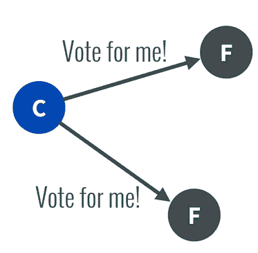
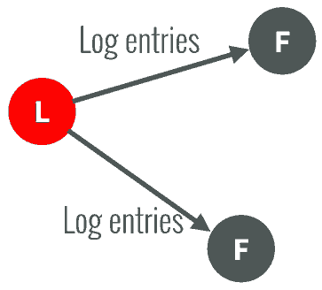
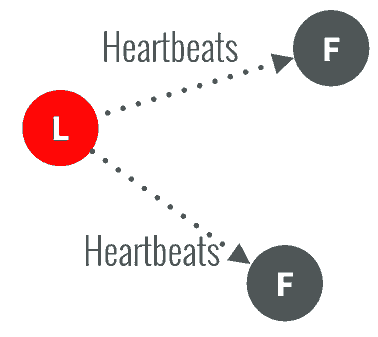
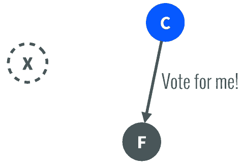
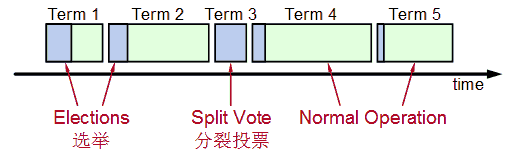
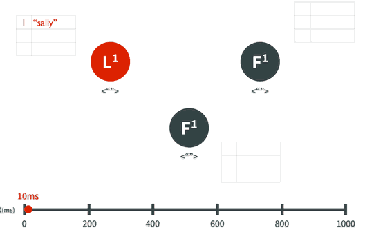
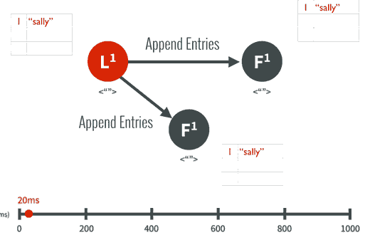
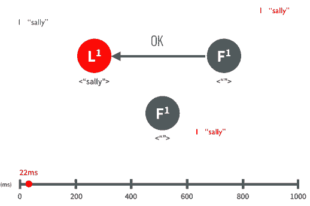

+++
title = "分布式系统的Raft算法(转)"
date = "2015-10-14T07:58:03+08:00"
tags = ["分布式"]
categories = ["分布式"]
banner = "img/banners/banner-2.jpg"
draft = false
author = "helight"
authorlink = "https://helight.cn"
summary = ""
keywords = ["分布式"]
+++

过去, Paxos一直是分布式协议的标准，但是Paxos难于理解，更难以实现，Google的分布式锁系统Chubby作为Paxos实现曾经遭遇到很多坑。

来自Stanford的新的分布式协议研究称为Raft，它是一个为真实世界应用建立的协议，主要注重协议的落地性和可理解性。

在了解Raft之前，我们先了解Consensus一致性这个概念，它是指多个服务器在状态达成一致，但是在一个分布式系统中，因为各种意外可能，有的服务器可能会崩溃或变得不可靠，它就不能和其他服务器达成一致状态。这样就需要一种Consensus协议，一致性协议是为了确保容错性，也就是即使系统中有一两个服务器当机，也不会影响其处理过程。
<!--more-->
为了以容错方式达成一致，我们不可能要求所有服务器100%都达成一致状态，只要超过半数的大多数服务器达成一致就可以了，假设有N台服务器，N/2 +1 就超过半数，代表大多数了。

Paxos和Raft都是为了实现Consensus一致性这个目标，这个过程如同选举一样，参选者需要说服大多数选民(服务器)投票给他，一旦选定后就跟随其操作。Paxos和Raft的区别在于选举的具体过程不同。

在Raft中，任何时候一个服务器可以扮演下面角色之一：

1. Leader: 处理所有客户端交互，日志复制等，一般一次只有一个Leader.
1. Follower: 类似选民，完全被动
1. Candidate候选人: 类似Proposer律师，可以被选为一个新的领导人。

Raft阶段分为两个，首先是选举过程，然后在选举出来的领导人带领进行正常操作，比如日志复制等。下面用图示展示这个过程：

1. 任何一个服务器都可以成为一个候选者Candidate，它向其他服务器Follower发出要求选举自己的请求：

2. 其他服务器同意了，发出OK。

注意如果在这个过程中，有一个Follower当机，没有收到请求选举的要求，因此候选者可以自己选自己，只要达到N/2 + 1 的大多数票，候选人还是可以成为Leader的。

3. 这样这个候选者就成为了Leader领导人，它可以向选民也就是Follower们发出指令，比如进行日志复制。

4. 以后通过心跳进行日志复制的通知
5. 

5. 如果一旦这个Leader当机崩溃了，那么Follower中有一个成为候选者，发出邀票选举。
6. 

6. Follower同意后，其成为Leader，继续承担日志复制等指导工作：

值得注意的是，整个选举过程是有一个时间限制的，如下图：

Splite Vote是因为如果同时有两个候选人向大家邀票，这时通过类似加时赛来解决，两个候选者在一段timeout比如300ms互相不服气的等待以后，因为双方得到的票数是一样的，一半对一半，那么在300ms以后，再由这两个候选者发出邀票，这时同时的概率大大降低，那么首先发出邀票的的候选者得到了大多数同意，成为领导者Leader，而另外一个候选者后来发出邀票时，那些Follower选民已经投票给第一个候选者，不能再投票给它，它就成为落选者了，最后这个落选者也成为普通Follower一员了。

## 日志复制
下面以日志复制为例子说明Raft算法，假设Leader领导人已经选出，这时客户端发出增加一个日志的要求，比如日志是"sally"：

1. Leader要求Followe遵从他的指令，都将这个新的日志内容追加到他们各自日志中：

3.大多数follower服务器将日志写入磁盘文件后，确认追加成功，发出Commited Ok:

1. 在下一个心跳heartbeat中，Leader会通知所有Follwer更新commited 项目。

对于每个新的日志记录，重复上述过程。

如果在这一过程中，发生了网络分区或者网络通信故障，使得Leader不能访问大多数Follwers了，那么Leader只能正常更新它能访问的那些Follower服务器，而大多数的服务器Follower因为没有了Leader，他们重新选举一个候选者作为Leader，然后这个Leader作为代表于外界打交道，如果外界要求其添加新的日志，这个新的Leader就按上述步骤通知大多数Followers，如果这时网络故障修复了，那么原先的Leader就变成Follower，在失联阶段这个老Leader的任何更新都不能算commit，都回滚，接受新的Leader的新的更新。

总结：目前几乎所有语言都已经有支持Raft算法的库包，具体可参考：[http://raftconsensus.github.io/](http://raftconsensus.github.io/)

[英文动画演示Raft](http://thesecretlivesofdata.com/raft/)
[CAP定理](http://www.jdon.com/37625)
[分布式Paxos算法](http://www.jdon.com/artichect/paxos.html)

看完本文有收获？请分享给更多人 

关注「黑光技术」，关注大数据+微服务 

