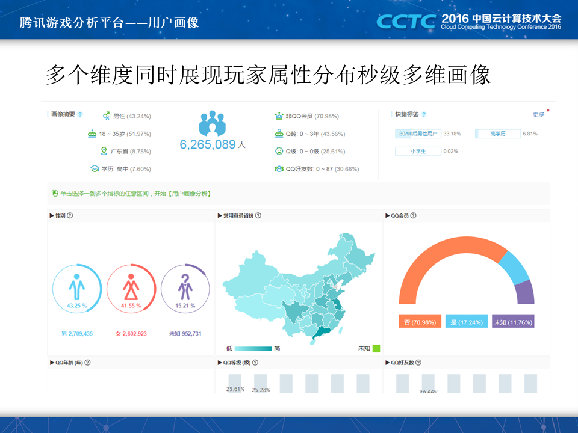
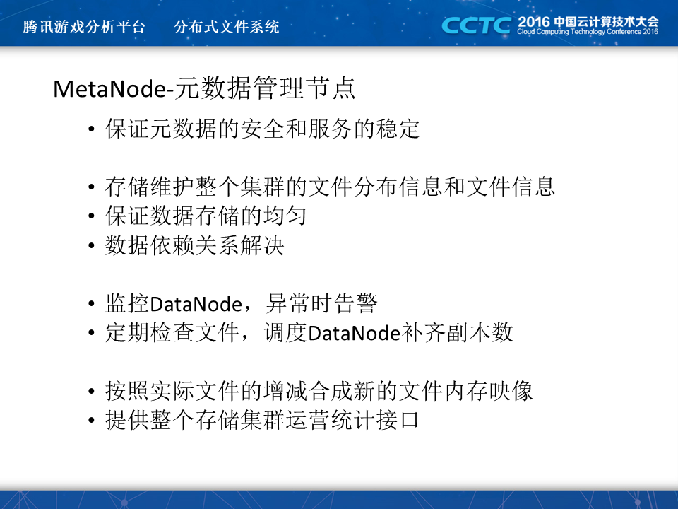

+++
title = "腾讯游戏数据分析平台"
date = "2016-05-18T13:47:08+02:00"
tags = ["bigdata"]
categories = ["bigdata"]
banner = "img/banners/banner-2.jpg"
draft = false
author = "helight"
authorlink = "https://helight.cn"
summary = "腾讯游戏数据分析平台"
keywords = ["bigdata", "数据分析"]
+++

# 前言    

​    本文是在2016年CSDN主办的中国云计算技术大会上分享内容，主要介绍在腾讯内部如何进行高效的数据分析和提取分析。

​    主要介绍了腾讯在2014到2016年在游戏数据分析和应用方面的建设思路，主要介绍了为了更高效的进行游戏数据分析而设计研发的一套存储+分析系统。系统采用分布式存储和分布式计算，在设计实现上整体考虑了从底层硬件的使用到上层计算逻辑的最大优化。

# 大纲

   本次讲述主要从这三个方面进行：

1. 首先介绍一下腾讯游戏数据分析平台iData，iData是我们主力打造的腾讯游戏数据分析平台，这几年我的所有精力都是投入到这个平台的建设中了。iData负责了腾讯400多款游戏业务的整体分析业务，是内部游戏分析必不可少的一个平台。
2. 其次介绍一下iData整个平台的一些架构和设计思路，我们的出发点，我们的初心是什么，为什么要建设这样的系统，怎样建设这样的系统。
3. 最后也是本次讲述的重点，为游戏数据分析定制的一套分布式存储计算系统，当然这套系统除了在游戏数据分析中使用，开放来说的话很多服务的数据分析也可以使用这套系统。

​    腾讯游戏分析平台的建设是为了什么呢？游戏是怎么运行的？每个玩家在游戏中的过程是什么样的？游戏的世界中有哪些规律可言呢？可以直白说腾讯游戏分析平台就是为研究这个而来的。

​    每个玩家在游戏里面都有他的生命周期：新进，活跃，活跃下降，流失，流失挽回，活跃，活跃下降，彻底流失。。。对每个玩家都不太一样，而iData就可以分析玩家的这些阶段和这些阶段在游戏内的各种表现。每个人都在游戏内有一个完整的生命周期，我称它为游戏人生。而且iData可以针对每个阶段的用户进行精准的用户干预，已达到对玩家游戏体验的定制提升。

​    用一句话来介绍iData就是一个一站式游戏数据服务平台，提供集数据报表服务，在线分析服务和用户干预服务为一体的游戏数据运营服务平台，微游戏打造了数据化的运营闭环。

​    数据报表服务iData主要是打通了和游戏数据对接的通道，并且对数据进行了离线和实时的运算，运算后的数据可以直接以框架报表的形式展示，另外还提供了自助报表开发，就是你只要有数据，就可以基于数据做出各种图形的报表出来。报表服务是iData中用的最为广泛的服务。

​    数据分析服务，主要是提供了用户数据提取，用户行为跟踪，用户画像分析，下钻分析，多维分析等等，这里也是我这几年的建设重点。建设这个服务的主要目标就是，我们可以在数据报表中看到有数据问题之后，可以把时间段的游戏进行用户分析，究竟是那一批用户，因为什么原因导致了问题。所以这里就要用到跟踪分析、画像下钻分析和提取分析，甚至更复杂的二次计算分析吧用户和原因能够定位清楚。在定位清楚之后就可以采用相应的用户干预措施进行对用户的干预。

​    用户干预服务，1是对接了各种游戏的营销渠道，2是对接了游戏内外的一些用户触达渠道，通过这些渠道我们可以较为方便的找到用户，并且用相应的运营方案来影响用户，主要目标还是提升玩家的参与度，为玩家提供更合适他们的玩法、道具或者是玩家匹配，以此来提升游戏体验。

​    今天我们的重点是介绍在线分析部分，其它部分以后有机会再和大家分享。

​    在游戏分析中典型的分析有一下几种，用户提取，用户跟踪分析，用户下钻分析，用户画像分析以及交叉分析。这也是我们今天介绍的重点。

​    这些分析怎么做呢？从流程上来说也是比较简单的，首先我们得有游戏内的数据，还有一些玩家的自然属性数据，设计数据以及其它类型的数据，这些数据大多数都是以玩家为主纬度的。在分析时有3种方式：

1. 指定用户群进行分析，就是那一个用户包来分析看，把这批用户和游戏大数据进行join操作，在对join之后的记过进行统计分析，最后展示出统计分析结果，或是提供数据下载服务。

2. 指定条件，就是直接在游戏大数据中根据指定的条件进行筛选，把筛选到的数据再进行统计分析，最后以报表展示，或者提供数据下载服务

3. 这种就是前面两种的结合了，即指定了用户群，又指定了条件进行分析。

   分析的结果一般可以算出活跃用户群，资深玩家，鲸鱼玩家等等，下面是我们的一个宣传图，通过iData我们可以细分人群。当然这只是iData的一个简单功能。

这里是一个条件提取功能，在2~3亿用户的游戏数据中按照条件提取符合条件的用户包，只需要5秒左右。

这个是针对5亿左右用户的游戏内，针对1000万左右用户进行join分析出100多个分析指标，只需要60秒左右。这里一般是分析出1天的情况。

看完本文有收获？请分享给更多人 

关注「黑光技术」，关注大数据+微服务 

