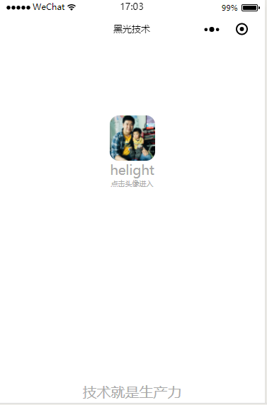
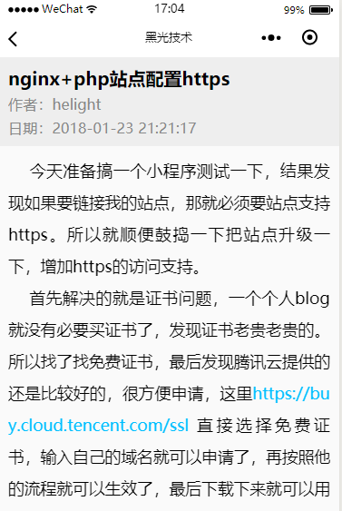
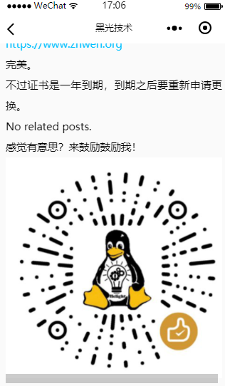

+++
title = "微信小程序开发体验"
date = "2018-01-25T09:30:12+08:00"
tags = ["music","wordpress"]
categories = ["programming"]
banner = "img/banners/banner-2.jpg"
draft = false
author = "helight"
authorlink = "https://helight.cn"
summary = ""
keywords = ["music","wordpress"]
+++

一直在想怎么做一个小程序，当然是一个有用的小程序，前天突然想到可以做一个小程序，把我的blog的内容拉去下来，并且在里面可以展示，给自己的blog增加一个移动端的入口，而且可以在每篇文章后面放一个打赏码。自己想着还是挺好的， 所以昨天注册了一个小程序“黑光技术”，现在申请还是比较方便的，不太好的一点就是要每次申请都要用一个不同的邮箱地址，我是用QQ邮箱的域名邮箱来做的，都是一个邮箱，每次申请就增加一个别名。
做一个这样的一个小程序需要几个方面的配合：
<!--more-->
1. 第一步就是申请一个小程序
2. 有一个blog，可以自己定制修改
3. blog的feed和内容页面可以支持json格式的返回，wordpress挺好的就是有很多这类的插件，很方便就可以做到
4. 需要blog网站支持https，微信小程序要求要用https。这个我是申请了腾讯云的免费证书，再配置了nginx就可以了，这个上篇文章有介绍。
5. 最后就是开发和发布了
6. 
    下来介绍一下基本的开发过程，微信小程序也提供了一个开发ide，有调试器，模拟器和代码编写edit等，而且还可以直接提交代码到网上，连接手机调试也非常方便，而且开发版做的就很好，直接在收集上就可以收集执行过程中很多详细信息。
在这个ide中可以直接连接已经申请好的小程序，就可以编码联调了。我们先来看看小程序整个工程的结构，下面是我这个项目现在的结构：
```sh
-rw-r--r-- 1 helightxu 1049089 1085 1月  24 10:11 app.js
-rw-r--r-- 1 helightxu 1049089  301 1月  24 16:40 app.json
-rw-r--r-- 1 helightxu 1049089 1164 1月  25 09:52 app.wxss
drwxr-xr-x 1 helightxu 1049089    0 1月  25 14:45 pages/
-rw-r--r-- 1 helightxu 1049089  557 1月  25 14:45 project.config.json
-rw-r--r-- 1 helightxu 1049089  172 1月  25 14:48 README.md
drwxr-xr-x 1 helightxu 1049089    0 1月  25 14:45 utils/
drwxr-xr-x 1 helightxu 1049089    0 1月  25 14:45 wxParse/
```
    这里首先排除wxParse这个文件夹，这个是我引入的一个第三方库。初次之外其它文件和目录都是工程初始化的时候生成的，当然从原理上来讲，除了app.*和project.config.json这些文件外，其它文件都可以自定义。project.config.json 是对整个工程信息的定义和配置，包含了项目名次，appid，基础库的版本，js支持情况等。app.*文件有三个：js，json，wxss；js文件是启动执行程序，json是一个数据配置文件，wxss是一个wx的css配置文件，这个可以是全局的，也可以给每个页面单独配置。

utils文件主要是放一些功能性的js程序，在我这里面主要放了一些时间格式转换，网络请求等功能函数。
pages才是重头，这里面存放所有的页面和页面逻辑，可以看看这个里面的内容：
```sh
$ ls pages/ -l
total 12
drwxr-xr-x 1 helightxu 1049089 0 1月  25 14:45 detail/
drwxr-xr-x 1 helightxu 1049089 0 1月  25 14:45 feed/
drwxr-xr-x 1 helightxu 1049089 0 1月  25 14:45 index/
drwxr-xr-x 1 helightxu 1049089 0 1月  25 14:45 logs/
```
里面有4个文件夹，也就是说我这个小程序只有4个页面，实际上我只使用了3个页面，就是index，feed，detail。先看看主页面index文件夹：
```sh
$ ls pages/index/ -l
total 6
-rw-r--r-- 1 helightxu 1049089 1301 1月  24 15:54 index.js
-rw-r--r-- 1 helightxu 1049089  580 1月  25 12:58 index.wxml
-rw-r--r-- 1 helightxu 1049089  387 1月  25 13:00 index.wxss
```
    可以看到有三个文件，其实一般情况下，一个小程序页面是有4个文件：js，wxml，wxss，json文件。 js是页面执行的js，在页面加载，加载完成，页面有所操作等都会有响应的js函数执行，我们就可以在这个js中的响应函数中增加处理代码，wxss文件是相当于web开发中css的功能，是针对这个页面的css定义。wxml是页面布局文件，最终用户看到的页面就是以这个页面渲染出来的。json文件一般是存放数据的。看看feed这个文件夹：
```sh
$ ls pages/feed/ -l
total 7
-rw-r--r-- 1 helightxu 1049089 1897 1月  25 09:45 feed.js
-rw-r--r-- 1 helightxu 1049089    2 1月  24 15:28 feed.json
-rw-r--r-- 1 helightxu 1049089  568 1月  25 09:48 feed.wxml
-rw-r--r-- 1 helightxu 1049089   26 1月  24 15:28 feed.wxss
```
    结构介绍完，我们再来看看这个小程序中的主体功能，其实主要就是一个网络请求，并且把请求回来的内容进行展示。因为都是get请求，所以这里会比较简单，微信小程序把网络请求进行了封装，只能用它封装的函数进行请求，函数是wx.request，具体的使用在微信公众平台上有详细介绍，<a href="https://mp.weixin.qq.com/debug/wxadoc/dev/api/network-request.html#wxrequestobject">https://mp.weixin.qq.com/debug/wxadoc/dev/api/network-request.html#wxrequestobject</a>。在我的这个使用中，我进行简化使用，使用方式如下：详细的可以看utils/request.js文件中的实现。

```js
function request(url, successCb, errorCb, completeCb) {
wx.request({
    url: url,
    method: 'GET',
    success: function (res) {successCb },
    error: function () {errorCb },
    complete: function () {completeCb }
  });</blockquote>
}
```
在来看看一段代码：feed.js中在页面加载的时候去请求feed数据，并且赋值到本地数据。

```js
onLoad: function (options) {
var _this = this;
requests.requestFeed((data) => {
_this.setData({
result: data.items,
totalRecord: 1 // len(data.items)
});
}, () => {
;
}, () => {
;
});
},
```
feed.wxml布局页面如下：
```html
<scroll-view scroll-y="true" style="height:{{scrollHeight}}px"
bindscrolltolower="scrollLowerEvent">
<div style="padding-left: 60px;"><view class="common-list" wx:if="{{totalRecord > 0}}">
<div style="padding-left: 90px;"><block wx:for="{{result}}">
<div style="padding-left: 120px;"><view class="list-item" data-index="{{item.url}}" bindtap="toDetailPage">
<div style="padding-left: 150px;"><view class="index-list-item">
<div style="padding-left: 180px;"><view class="content">
<div style="padding-left: 180px;"><view class="title">{{item.title}}</view>
<div style="padding-left: 180px;"><text class="desc">{{item.date_modified}}</text>
<div style="padding-left: 180px;"></view>
<div style="padding-left: 150px;"></view>
<div style="padding-left: 120px;"></view>
<div style="padding-left: 90px;"></block>
<div style="padding-left: 60px;"></view>
</scroll-view>
```
所有代码已经提交在了github上，大家可以来这里看https://github.com/helight/
最后看看几张效果图。看起来还可以。






<center> 
看完本文有收获？请分享给更多人 <br> 关注「黑光技术」，关注大数据+微服务 <br> 

 
</center>
