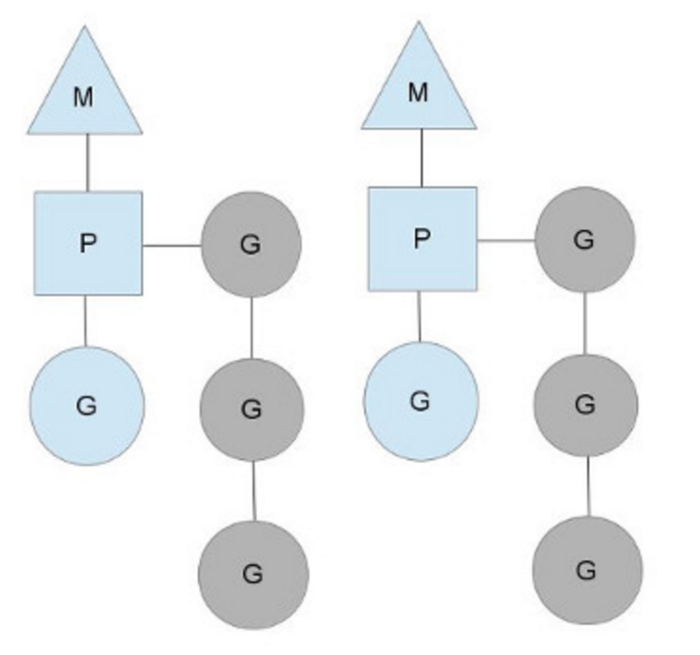

+++
title = "golang调度机制学习"
date = "2018-05-15T03:48:35+08:00"
tags = ["golang"]
categories = ["golang"]
banner = "img/banners/banner-2.jpg"
draft = false
author = "helight"
authorlink = "https://helight.cn"
summary = ""
keywords = ["golang"]
+++

## 1.Golang的核心之一gorountine
go语言非常重要的一个特性就是gorountine，有了这个东东，就可以很简单的做并发处理程序，比起c++和java的方式来说可以说简单了很多很多。那么gorountine又是一个什么样的东东呢? 从使用上来看它就是一个函数，使用起来有点像thread，但是实际上又不是，thread我们一般说起是指内核中的调度单元，他也是又用户态传递一个函数给thread，再由内核来调度执行，而gorountine是完全用户态的一个东西，而它要想和thread一样被执行那么就需要设计一个用户态的调度器，来保存它结构，执行现场和调度切换不同的gorountine进行执行。更多的说是一种叫做协程的东西，完全由用户态程序控制。这和C、C++完全不一样，C、C++的语言编译之后执行完全是交给操作系统内核来控制执行，而golang，在编译时会加入自己的调度器代码，在执行上按照自己的调度器进行调度执行。
<!--more-->
## 2.调度器必要的作用有那些
### 2.1调度数据结构
调度器的数据结构的设计是调度器中的核心要素，队列怎么组织，最简单的队列组织方式就是像链表，双向链表，复杂点的由结构体在组织，结构体中增加queen，list，hashmap，set等等。不同的组织方式会直接影响调度器的调度算法和性能。
### 2.2调度算法
对应于数据结构的组织，就是调度算法，很多时候数据结构的设计就是为了算法的实现更方便，简单的算法如fifo，另外复杂的根据权重调度，时间片调度，根据优先级调度，任务大小调度等等。还要包括任务抢占等。
### 2.3调度时环境管理
这里说的调度时环境管理在gorountine调度中主要就是指的它的堆栈管理，我们指导gorountine是一个用户态级别的运行，所以它的堆栈也必然是在用户态的调度器中进行管理的。在golang中每一个gorountine产生事都会给分配一片用户态内存用做自己的堆栈，在Golang的栈管理中还使用了连续栈实现方式也先分配一块固定大小的栈，在栈空间不足时，分配一块更大的栈，并把旧的栈全部拷贝到新栈中。
## 3.gorountine调度器的设计
gorountine的调度器的主要数据结构：
G 代表一个Goroutine；存储了goroutine的执行stack信息、goroutine状态以及goroutine的任务函数等；另外G对象是可以重用的。
M 代表一个操作系统的线程；M代表着真正的执行计算资源。在绑定有效的p后，进入schedule循环；而schedule循环的机制大致是从各种队列、p的本地队列中获取G，切换到G的执行栈上并执行G的函数，调用goexit做清理工作并回到m，如此反复。M并不保留G状态，这是G可以跨M调度的基础。
P 代表一个逻辑CPU处理器（在golang中这个是一个对cpu的抽象），通过runtime.GOMAXPROCS (numLogicalProcessors)可以控制多少P，但是通常P的数量设置是等于CPU核数（GOMAXPROCS）。P的数量决定了系统内最大可并行的G的数量（前提：系统的物理cpu核数>=P的数量）；P的最大作用还是其拥有的各种G对象队列、链表、一些cache和状态。


三者都在runtime2.go中定义，https://go.googlesource.com/go/+/go1.10.1/src/runtime/runtime2.go
```go
type g struct {
....
stack stack // offset known to runtime/cgo
.....
m *m // current m; offset known to arm liblink
...}
```
这个结构体的字段用来跟踪此goroutine的栈(stack)和状态，所以你可以认为G = goroutine。
```go
type m struct {
g0 *g // goroutine with scheduling stack
....
curg *g // current running goroutine
caughtsig guintptr // goroutine running during fatal signal
p puintptr // attached p for executing go code (nil if not executing go code)
nextp puintptr
....}
```
运行时管理着G并把它们映射到逻辑处理器(称之为P). P可以看作是一个抽象的资源或者一个上下文，它需要获取以便操作系统线程(称之为M)可以运行G。
```go
type p struct {
....
m muintptr // back-link to associated m (nil if idle)
....}
```
它们之间的关系如下：
1. G需要绑定在M上才能运行；
2. M需要绑定P才能运行；
3. 程序中的多个M并不会同时都处于执行状态，最多只有GOMAXPROCS个M在执行。
4. 每个P维护一个G队列；
5. 当一个G被创建出来，或者变为可执行状态时，就把他放到P的可执行队列中；
6. 当一个G执行结束时，P会从队列中把该G取出；如果此时P的队列为空，即没有其他G可以执行， 就随机选择另外一个P，从其可执行的G队列中偷取一半（work-stealing调度算法）。


为了运行goroutine, M需要持有上下文P。M会从P的queue弹出一个goroutine并执行。当你创建一个新的goroutine的时候(go func()方法)，它会被放入P的queue。

当你的goroutine执行阻塞的系统调用的时候(syscall)，阻塞的系统调用会中断(intercepted)，如果当前有一些G在执行，运行时会把这个线程从P中摘除(detach)，然后再创建一个新的操作系统的线程(如果没有空闲的线程可用的话)来服务于这个P。
当系统调用继续的时候，这个goroutine被放入到本地运行queue，线程会park它自己(休眠)， 加入到空闲线程中。
Go运行时会在下面的goroutine被阻塞的情况下运行另外一个goroutine：

－ blocking syscall (for example opening a file),
－ network input,
－ channel operations,
－ primitives in the sync package.
```go
struct Sched {
Lock; // global sched lock .
// must be held to edit G or M queues
G ∗gfree; // available g’ s ( status == Gdead)
G ∗ghead; // g’ s waiting to run queue
G ∗gtail; // tail of g’ s waiting to run queue
int32 gwait; // number of g’s waiting to run
int32 gcount; // number of g’s that are alive
int32 grunning; // number of g’s running on cpu
// or in syscall
M ∗mhead; // m’s waiting for work
int32 mwait; // number of m’s waiting for work
int32 mcount; // number of m’s that have been created
...
};
```


<center> 
看完本文有收获？请分享给更多人 <br> 关注「黑光技术」，关注大数据+微服务 <br> 

 
</center>
