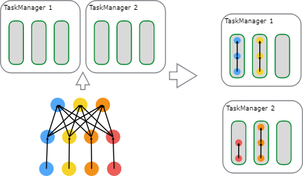
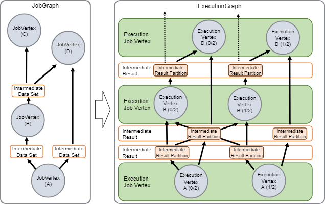
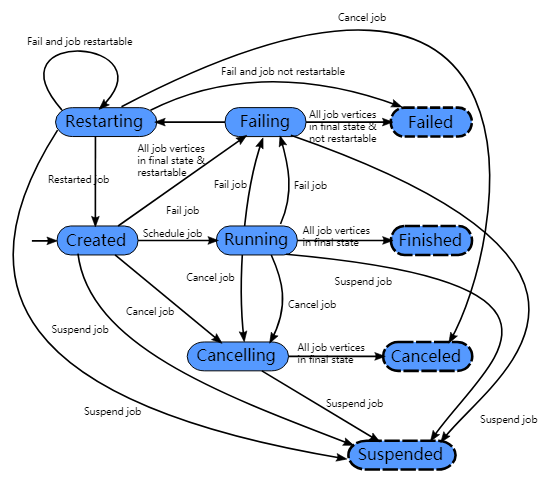
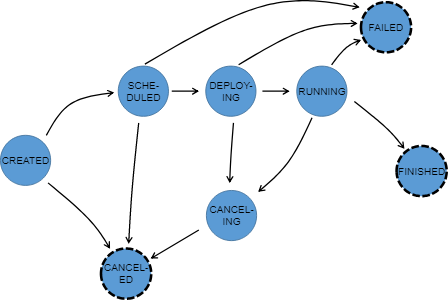

+++
title = "Apache Flink 1.6 Documentation: Jobs and Scheduling"
date = "2018-08-15T07:20:39+08:00"
tags = ["flink"]
categories = ["flink"]
banner = "img/banners/banner-2.jpg"
draft = false
author = "helight"
authorlink = "https://helight.cn"
summary = ""
keywords = ["flink"]
+++

这边文档简要的描述了Flink怎么样调度作业和Flink在JobManager中如何表述和跟踪作业。
<!--more-->
## Scheduling [调度](https://ci.apache.org/projects/flink/flink-docs-release-1.6/internals/job_scheduling.html#jobs-and-scheduling)
Flink中的执行资源是通过任务执行槽来确定的。每个TaskManager有一个或者多个任务执行槽，每个可以运行一个并行任务的流水线。每个流水线包含多个连续的任务，像N次的MapFunction的并行实例跟一个ReduceFunction的n次并行实例。注意Flink经常同时执行多个连续的任务：对数据流程序来说都会这样，但是对于批处理程序来只是频繁发生。

下面的图说明了这个情况。一个带数据源的程序，一个MapFunction和一个ReduceFunction。数据源和MapFunction都是按照4个并发度来执行的，而ReduceFunction是按照3个并发度来执行。这是一个包含了顺序Source到Map到Reduce的流水线。在一个有两个TaskManager的集群上，每个TaskManager各有3个任务执行槽，这个程序将会按照下面的描述来执行。

在内部，Flink通过<a href="https://github.com/apache/flink/blob/master//flink-runtime/src/main/java/org/apache/flink/runtime/jobmanager/scheduler/SlotSharingGroup.java">SlotSharingGroup</a> 和 <a href="https://github.com/apache/flink/blob/master//flink-runtime/src/main/java/org/apache/flink/runtime/jobmanager/scheduler/CoLocationGroup.java">CoLocationGroup</a>来确定那些任务可以共享一个任务槽（许可的）， 分别要把那些任务严格的放置到同一个执行槽中。

## JobManager Data Structures<a href="https://ci.apache.org/projects/flink/flink-docs-release-1.6/internals/job_scheduling.html#jobmanager-data-structures"></a> JobManager数据结构

在作业执行阶段，JobManager会持续跟踪那些分布式执行的任务，决定什么时候调度执行下一个任务（或者一组任务）， 对完成的任务或执行失败作出反应。

JobManager接收到<a href="https://github.com/apache/flink/blob/master//flink-runtime/src/main/java/org/apache/flink/runtime/jobgraph/">JobGraph</a>， JobGraph由包含操作的数据流(<a href="https://github.com/apache/flink/blob/master//flink-runtime/src/main/java/org/apache/flink/runtime/jobgraph/JobVertex.java">JobVertex</a>) 和中间结果(<a href="https://github.com/apache/flink/blob/master//flink-runtime/src/main/java/org/apache/flink/runtime/jobgraph/IntermediateDataSet.java">IntermediateDataSet</a>)来描述表示。每个操作都有属性，像并行度执行的代码。另外JobGraph包含一组附加的操作代码执行必须的库。

JobManager把JobGraph转换成执行图<a href="https://github.com/apache/flink/blob/master//flink-runtime/src/main/java/org/apache/flink/runtime/executiongraph/">ExecutionGraph</a>。ExecutionGraph执行图 是一个JobGraph的并行版本：对于每个JobVertex ，它包含每个并行子任务的<a href="https://github.com/apache/flink/blob/master//flink-runtime/src/main/java/org/apache/flink/runtime/executiongraph/ExecutionVertex.java">ExecutionVertex</a>。一个并行度为100的操作会有一个JobVertex和100个ExecutionVertices。ExecutionVertex跟踪具体任务的执行状态。一个JobVertex中所有的ExecutionVertices都会在一个<a href="https://github.com/apache/flink/blob/master//flink-runtime/src/main/java/org/apache/flink/runtime/executiongraph/ExecutionJobVertex.java">ExecutionJobVertex</a>中。<a href="https://github.com/apache/flink/blob/master//flink-runtime/src/main/java/org/apache/flink/runtime/executiongraph/ExecutionJobVertex.java">ExecutionJobVertex</a>跟踪操作的的整体状态。除了顶点，ExecutionGraph执行图还包含中间结果<a href="https://github.com/apache/flink/blob/master//flink-runtime/src/main/java/org/apache/flink/runtime/executiongraph/IntermediateResult.java">IntermediateResult</a> 和中间结果分区 <a href="https://github.com/apache/flink/blob/master//flink-runtime/src/main/java/org/apache/flink/runtime/executiongraph/IntermediateResultPartition.java">IntermediateResultPartition</a>。前者跟踪中间数据集的状态，后者跟踪每个分区的状态。

每个执行图ExecutionGraph有个一个与之关联的作业状态。这个作业状态表示了作业执行的当前状态。

一个Flink作业开始是创建状态完成，然后转为运行中状态，在完成所有作业之后再转为完成状态。万一失败了，作业就会转为失败中状态并且会撤销所有运行的任务。如果作业定点到了最后的状态并且作业不能重启，那么作业转为已经失败状态。如果作业可以重启，那么作业会进入重启中状态。一旦作业重启完成，作业会变成创建状态完成。

如果用户取消了作业，那么作业就变成了取消中状态。同时还需要撤销所有正在运行的任务。一旦所有的运行的任务到了最终的状态，这个作业就编程了取消完成状态。

不像已经完成状态，已经取消和已经失败状态表示的是全局最终状态，并且会粗发清理作业任务，已经挂起状态是只在本地终端的。本地终端的意思是作业的执行已经被自己的JobManager终止了，但是FLink集群上的另外一个JobManager可以通过持久化的HA存储获取这个作业并重启这个作业。因此被挂起的作业是不会被完全清理的。

在执行图ExecutionGraph执行时，每个并行任务都经过了多个状态，从被创建完成到已完成或已失败。下面这个图说明这些状态和他们之间可能的转移关系。一个任务可能会执行多次（例如：在故障恢复过程中）。由于这个原因，在一次执行中<a href="https://github.com/apache/flink/blob/master//flink-runtime/src/main/java/org/apache/flink/runtime/executiongraph/Execution.java">Execution</a>会跟踪ExecutionVertex的执行。
<a href="/zb_users/upload/2018/08/4-2.png">

 
看完本文有收获？请分享给更多人   关注「黑光技术」，关注大数据+微服务   

 

