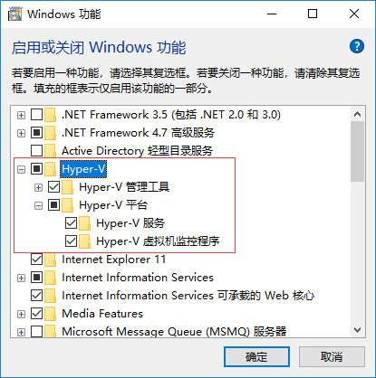
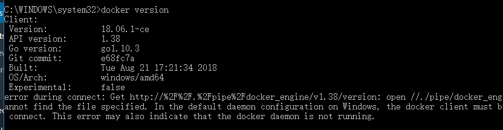
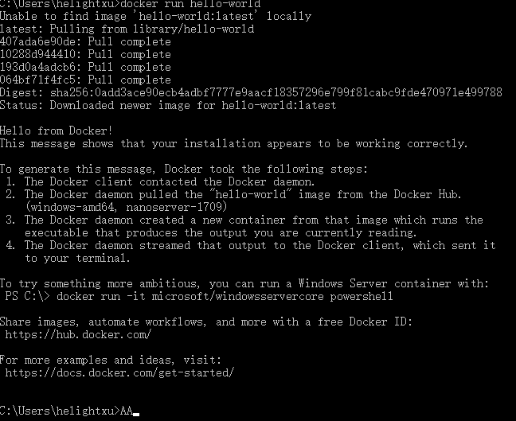

+++
title = "Windows10下安装Docker记录"
date = "2018-11-05T08:16:52+08:00"
tags = ["docker"]
categories = ["linux 应用"]
banner = "img/banners/banner-2.jpg"
draft = false
author = "helight"
authorlink = "https://helight.cn"
summary = ""
keywords = ["Docker"]
+++

之前一直使用window安装虚拟机的方式来做linux应用，这次想使用docker来试试，这里顺便记录一下，部分资料来自网上。
## 一、启用Hyper-V

打开控制面板 - 程序和功能 - 启用或关闭Windows功能，勾选Hyper-V，然后点击确定即可，如图：
<!--more-->

点击确定后，启用完毕会提示重启系统，我们可以稍后再重启。

## 二、安装Docker

Docker下载地址为：[https://store.docker.com/editions/community/docker-ce-desktop-windows](https://store.docker.com/editions/community/docker-ce-desktop-window)

下载需要登录才可以，注册登录之后就可以下载了，安装包有500M左右。

安装过程比较简单，这里就不详细介绍了。

安装之后点电脑需要重启。

## 三、启用Docker

1.在桌面找到Docker for Windows快捷方式，双击启动即可！启动成功后托盘处会有一个小鲸鱼的图标。打开命令行输入命令：docker version可以查看当前docker版本号，如图：


2.更换镜像源地址

中国官方镜像源地址为：[https://registry.docker-cn.com/](https://registry.docker-cn.com/)

点击托盘处docker图标右键选择-Settings->Daemon->Registry mirrors 中配置，配置完成之后需要重启docker，重启之后即可。

3.测试

输入命名“docker run hello-world”




基本使用还算顺畅，后面测试一下开发过程，目前我喜欢用debian和ubuntu的系统，下一步下一个ubuntu来玩玩，顺便看是否直接开发代码并提交git。

4.启动测试
```sh
docker run -it -v D:\code_dev:/mnt xubuntu:v1 /bin/bash
```
这里我映射了本地目录到docker，进入系统之后我安装了不少软件，vim，go，git等等，都是必须的。在安装之后，我想把这些修改都保留下来，所以我又使用commit命令提交了这个镜像修改，生成一个新的镜像。
```sh
docker commit 1ad531e5ab33 xubuntu:v2
```
这个命令是把修改的内容提交为一个新的镜像。使用镜像方式开发就方便很多了。

下面是我的提交的内容
```sh
C:\Users\helightxu>docker images
REPOSITORY TAG IMAGE ID CREATED SIZE
xubuntu v2 2d5023c27812 11 seconds ago 999MB
xubuntu v1 d7778d7fa65f 25 hours ago 383MB
ubuntu latest ea4c82dcd15a 2 weeks ago 123MB

```
5.平常开发测试
```sh
docker run -it -v D:\code_dev:/mnt xubuntu:v3 /bin/bash
```
启动之后看已经产生的容器，
```sh
docker ps -a
CONTAINER ID IMAGE COMMAND CREATED STATUS PORTS NAMES
c7848ee82d12 xubuntu:v3 "/bin/bash" 4 minutes ago Up 4 minutes hardcore_clarke
9ae04ad06f13 xubuntu:v3 "/bin/bash" 22 hours ago Exited (2) 20 hours ago naughty_saha
7db87867e252 xubuntu:v2 "/bin/bash" 22 hours ago Exited (130) 22 hours ago focused_babbage
```
在开发的过程中有时候会退出容器，退出容器之后，可以使用docker ps -a看到容器已经停止运行了，那下次还想使用这个容器怎么做呢？

docker提供了两个命令可以可以启动容器和进入一个已经启动容器：docker start和docker attach

如下操作：
```sh
root@c7848ee82d12:/# ls
bin boot dev etc home lib lib64 media mnt opt proc root run sbin srv sys tmp usr var
root@c7848ee82d12:/# exit
exit
PS C:\Users\helightxu> docker ps -a
CONTAINER ID IMAGE COMMAND CREATED STATUS PORTS NAMES
c7848ee82d12 xubuntu:v3 "/bin/bash" 10 minutes ago Exited (0) 11 seconds ago hardcore_clarke
PS C:\Users\helightxu> docker start c7848ee82d12
c7848ee82d12
PS C:\Users\helightxu> docker attach c7848ee82d12
root@c7848ee82d12:/# ls
bin boot dev etc home lib lib64 media mnt opt proc root run sbin srv sys tmp usr var
root@c7848ee82d12:/#
```


<center> 
看完本文有收获？请分享给更多人 <br> 关注「黑光技术」，关注大数据+微服务 <br> 

 
</center>

