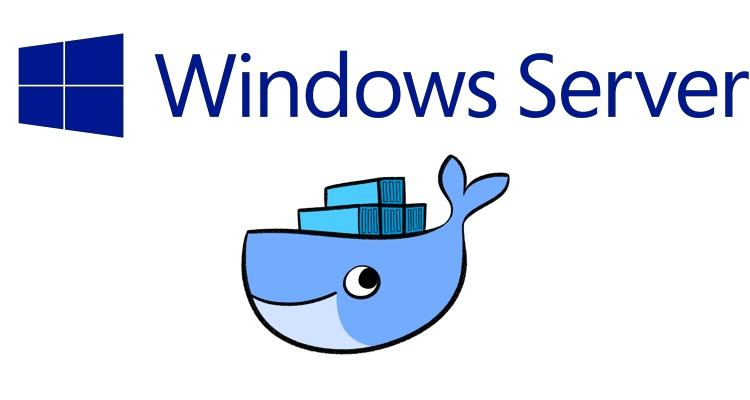

+++
title = "windows10下使用dockerfile制作镜像"
date = "2018-11-07T10:50:40+08:00"
tags = ["docker"]
categories = ["linux 应用"]
banner = "img/banners/banner-2.jpg"
draft = false
author = "helight"
authorlink = "https://helight.cn"
summary = ""
keywords = ["docker"]
+++

其实操作系统没有关系，主要还是Dockerfile的编写和执行，过程来说比较简单。


## 1.编写Dockerfile

我的dockerfile如下，主要是用于golang和c++的开发，所以相关软件安装都是和这方面有关的。 本来打算使用163的源的，后来看了一下官方源速度也还不错，就直接用官方的源了。
<!--more-->
安装的主要软件是mysql，git，nginx，golang，vim
```sh
#Version 0.1
FROM ubuntu:latest

MAINTAINER helight "helight@qq.com"

#设置root用户为后续命令的执行者
USER root

# RUN rm -rf /etc/apt/sources.list
# RUN echo 'deb http://mirrors.163.com/ubuntu/ bionic main restricted universe multiverse' >> /etc/apt/sources.list
# RUN echo 'deb http://mirrors.163.com/ubuntu/ bionic-security main restricted universe multiverse' >> /etc/apt/sources.list
# RUN echo 'deb http://mirrors.163.com/ubuntu/ bionic-updates main restricted universe multiverse' >> /etc/apt/sources.list
# RUN echo 'deb http://mirrors.163.com/ubuntu/ bionic-proposed main restricted universe multiverse' >> /etc/apt/sources.list
# RUN echo 'deb http://mirrors.163.com/ubuntu/ bionic-backports main restricted universe multiverse' >> /etc/apt/sources.list

#执行操作
RUN \
apt-get update &amp;&amp; \
apt-get install -y build-essential &amp;&amp; \
apt-get install -y mariadb-server mariadb-common &amp;&amp; \
apt-get install -y git net-tools iputils-ping curl &amp;&amp; \
apt-get install -y golang-1.10 golang &amp;&amp; \
apt-get install -y nginx &amp;&amp; \
apt-get install -y sqlite3 &amp;&amp; \
apt-get install -y vim lua5.1
RUN apt-get install -y c++ make autoconf
#对外暴露端口
EXPOSE 80 8080 3306

CMD ["/bin/bash"]
```
## 2制作镜像

在Dockerfile文件所在目录执行以下命令就可以了，
```sh
docker build -t xubuntu:v4 .
```
制作完成就可以看到制作好的镜像了。
```sh
PS C:\Users\helightxu> docker images
REPOSITORY TAG IMAGE ID CREATED SIZE
xubuntu v4 037aaa8b4678 9 seconds ago 1.3GB
ubuntu latest ea4c82dcd15a 2 weeks ago 123MB
```
&nbsp;

<center> 
看完本文有收获？请分享给更多人 <br> 关注「黑光技术」，关注大数据+微服务 <br> 

 
</center>
