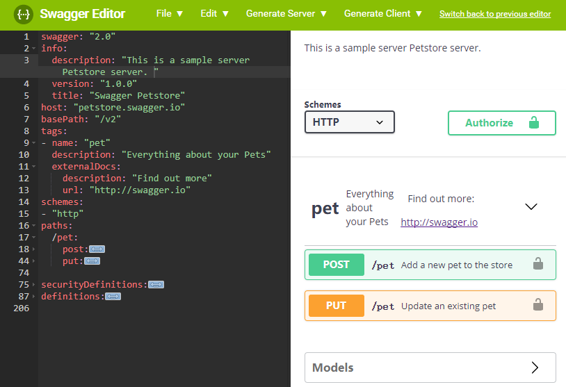

+++
title = "如何使用Swagger编写API文档"
date = "2018-01-19T15:04:42+08:00"
tags = ["lex"]
categories = ["linux 应用"]
banner = "img/banners/banner-2.jpg"
draft = false
author = "helight"
authorlink = "https://helight.cn"
summary = ""
keywords = ["lex"]
+++

    最近在梳理内部系统的架构设计，而且前端时间也在kindle上看了一些国外开发在API的架构设计上的一些思考。所以就想着我们内部系统的api也应该梳理梳理了。
    目前内部使用golang开发是重头，基本上的服务和调度都是使用golang来开发，而且内部模块之间的调用都是http的接口。而且目前golang1.8已经默认支持了http2的协议，在效率上以前顾虑的问题，现在都有所缓解，所以把这块的梳理重点放在了http接口的梳理上。

    重点看了soap，json-rpc，restfull。在梳理中发现一个比较有意思的东东，叫 Swagger，中文名字也比较有意思：丝袜哥，哈哈。这个东西是做什么的呢：专门用户规范设计API的，简单用了一下还是非常好用的。在其官网这样介绍的：
<!--more-->
    Swagger is the world’s largest framework of API developer tools for the OpenAPI Specification(OAS), enabling development across the entire API lifecycle, from design and documentation, to test and deployment.

    丝袜哥是世界上最大的针对OpenAPI规范的API开发框架工具，从设计和文档到测试和部署丝袜哥可以使用在整个API的生命周期中使用。

另外同时介绍一下OpenAPI这个组织，OpenAPI规范是Linux基金会的一个项目，试图通过定义一种用来描述API格式或API定义的语言，来规范RESTful服务开发过程。OpenAPI规范帮助我们描述一个API的基本信息，比如：

1. 有关该API的一般性描述
1. 可用路径（/资源）
1. 在每个路径上的可用操作（获取/提交...）
1. 每个操作的输入/输出格式

目前[V2.0版本的OpenAPI规范](ttps://github.com/OAI/OpenAPI-Specification/blob/master/versions/2.0.md)（也就是SwaggerV2.0规范）已经发布并开源在github上。该文档写的非常好，结构清晰，方便随时查阅。

    那为什么要目前这个OpenAPI规范有什么好处，为什么我们要用呢？实际上目前的OpenAPI规范也是遵循Restfull规范的，在这个基础上更加规范了每个api接口的定义，描述等信息，后面会详细介绍。并且我们定义了每个api之后，就可以根据这个我们编写的api文档进行各种语言服务端和客户端的代码生成。

    当然这个OpenAPI规范也是Swagger所在公司SmartBear软件公司推动起来的。不过这个工具我简单用了一下，还是挺好用的，即可以作为调试测试工具，更加可以梳理规范API开发。在提倡流程和规范的开发团队应该可以有用。

    下面介绍一下怎么使用，Swagger提供了在线版本和开源代码，代码是nodejs的，所以也可以在自己机器上很方便的安装起来，在线版本可以直接访问这里：<a href="https://editor.swagger.io/">https://editor.swagger.io/</a>，界面看起来也非常好，左边是API定义文档，右边是API查看和测试的界面，我这里把原来的定义文档删减了一部分。上面菜单栏可以看到有Generate Server和Generate Client。能支持的语言还是非常多的基本常用的语言都支持了。

API的定义文档使用的YAML，当也可以使用json的格式，但是我发现这类定义YAML的可读性比jason的好很多，可能是习惯问题。其详细的语法这里就不细说了，<a href="https://www.gitbook.com/book/huangwenchao/swagger/details">https://www.gitbook.com/book/huangwenchao/swagger/details</a> 这里有个文档对这部分写的非常详细，我也就没有必要再重复去介绍了。

 
看完本文有收获？请分享给更多人   关注「黑光技术」，关注大数据+微服务   

 

