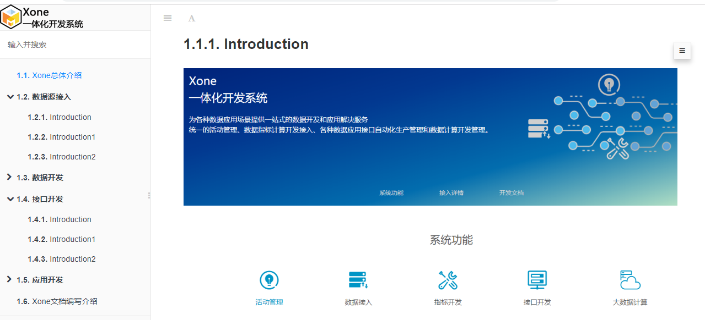
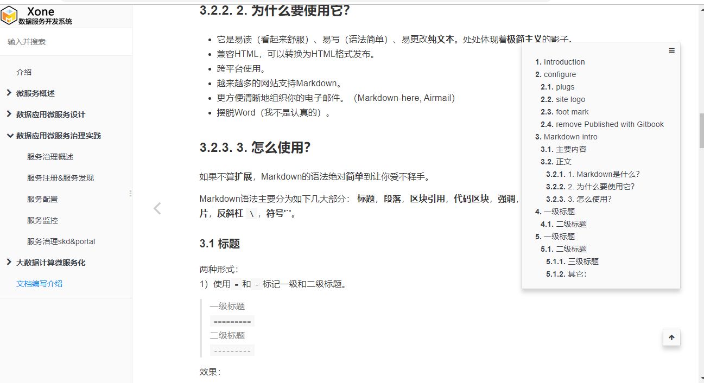

+++
title = "使用gitbook来写文档和文章"
date = "2018-11-18T13:47:08+02:00"
tags = ["git"]
categories = ["tools"]
banner = "img/banners/gitbook.png"
draft = false
author = "helight"
authorlink = "https://helight.cn"
summary = "	gitbook其实是一个nodejs的一个工具软件，是基于nodejs的。gitbook.com就是基于这个工具开发的系统，他是一个提供了在线文档书籍开发管理的系统，它同时打通了github。"
keywords = ["git","gitbook", "nodejs"]
+++

# 前言​
项目中文档管理是一个比较麻烦的事情，一般的做法都是写word文档，或者pdf；针对代码或者接口文档高级一点的可以使用Doxygen或者swagger这样的工具自动生成更新文档。但是项目中还有很多文档有是图文混合的。那这样的文档怎么有效管理呢？

​	在找了几个工具之后，发现了一个比较合适的工具gitbook。这个工具之前也接触过，主要是用来书籍编写管理，这方面确实做的非常专业。但是我发现用来做文档管理也是非常好用的，所以拿来测试了一下，效果还是不错的。看看这个效果，也是左右分栏，左边是目录分类列表，右边是内容。还可以直接进行搜索。



# gitbook介绍
​	gitbook其实是一个nodejs的一个工具软件，是基于nodejs的。gitbook.com就是基于这个工具开发的系统，他是一个提供了在线文档书籍开发管理的系统，它同时打通了github。gitbook作为一个工具当然也可以本地使用，gitbook也是开源的代码在[github](https://github.com/GitbookIO/gitbook)，在[toolchain](https://toolchain.gitbook.com/setup.html)这个里专门介绍本地安装使用的方式。

​	接下来简单介绍一下安装方式，过程非常简单，我使用的ubuntu系统来使用，安装方法如下。

# 安装和简单使用
## 安装
``` bash
apt-get install nodejs npm
npm install gitbook-cli
```
安装之后就可以使用了，直接运行一下gitbook命令看看：

``` bash
root@c43ee1d7ec6f:/mnt/docs# gitbook 

  Usage: gitbook [options] [command]


  Options:

    -v, --gitbook [version]  specify GitBook version to use
    -d, --debug              enable verbose error
    -V, --version            Display running versions of gitbook and gitbook-cli
    -h, --help               output usage information


  Commands:

    ls                        List versions installed locally
    current                   Display currently activated version
    ls-remote                 List remote versions available for install
    fetch [version]           Download and install a <version>
    alias [folder] [version]  Set an alias named <version> pointing to <folder>
    uninstall [version]       Uninstall a version
    update [tag]              Update to the latest version of GitBook
    help                      List commands for GitBook
    *                         run a command with a specific gitbook version
```
## 简单使用
  新建一个目录，在目录中直接运行gitbook init就可以初始化一个项目了：
```
root@c43ee1d7ec6f:/mnt/docs# ls
README.md  SUMMARY.md 
root@c43ee1d7ec6f:/mnt/docs# 
```
​	gitbook使用markdown来写，所以创建的文件都是md文件，初始化文件有两个README.md和SUMMARY.md，其中SUMMARY.md是目录文件，整个图书或者文档的目录结构就是在这个文件中定义的。一般情况下这样的方式就可以编写文档了，如果需要图片也是非常简单的，在本地目录中新建图片文件夹，把图片放里面，再在文件中写引用路径即可。
## 编辑器选择
工欲善其事，必先利其器。一个好的开发工具还是能非常有效的提升开发效率的，这个项目也是一样的。Markdown虽然可以用简单的文本编辑器，但是也有免费的非常好用的工具，你选择那个，哈哈，这里我推荐这两种组合：
1. GitBook + Typora + Git
2. GitBook + vscode + Git

Typora是一个非常好用的Markdown编辑器，提供可视化的编辑，对于一般使用是非常够了。推荐vscode是对我来说，文档编写只是一个工作，还要写写代码的，而且工程化管理也是vscode的一个强项。推荐git就不用说了，其实编写文档，尤其这种文本的文档，编辑保存，历史版本都是需要的，所以git非常好的可以满足我们的需要，尤其现在github居然免费开放了私有项目，哈哈哈哈
# 高级使用
## 配置文件book.json
book.json是gitbook的配置文件，可以在里面进行整个文档站点主题名称、插件等的配置，如下：
``` json
{
    "title": "黑光技术",
    "description": "",
    "author": "helight",
    "language": "zh-hans",
    "styles":{
        "website":"styles/website.css"
    },
    "plugins": [
        "search",
        "-sharing"
    ],
    "pluginsConfig": {}
}
```
## 插件
​	gitbook比较好玩的一点就是其插件，有很多有意思的插件，可以让站点更好玩，比如有菜单格式的插件，有分享插件，有主题插件等等，下面是我比较长用的一些插件，简单介绍一下：
``` json
    "plugins": [
        "search",
        "insert-logo",
        "alerts",
        "expandable-chapters",
        "splitter",
        "anchor-navigation-ex",
        "page-footer-ex",
        "-sharing"
    ],
```
### search
是一个内置的插件，主要做站点搜索，非常强大，可以搜索所有文档的内容。

### insert-logo
是一个可以在左上角插入一个logo图片的插件，就像上面截图中的一样，可以插入自己的logo图片。
### alerts
这个是主要是一些样式的插件，可以根据配置针对不同的内容定义不同的颜色。
### expandable-chapters
是一个可以是的目录收缩的差价，也比较实用。
### splitter
是一个控制左右分栏大小的插件，可以拖动控制左右分栏。
### anchor-navigation-ex
是一个展示页面大纲的空间，可以按照段落来展示，可以快捷转挑到页面的相应位置。
### page-footer-ex
是一个脚标配置插件，自动为每个页面生成脚标。
### -sharing
组件前面加上-号的意思就是不使用这个组件，一般是针对内置组件。
## 自定义站点css
使用这种方式可以自定义控制站点的样式。
``` json
    "styles":{
        "website":"styles/website.css"
    },
```
典型的应用就是定义右面页面的宽度，定义隐藏“发布到gitbook”这个链接地址等等。下面我简单列出一些我用过的一些样式。
``` css
.gitbook-link {
    display: none !important;
}
.page-inner {
    max-width: 1000px;
    padding: 2px 2px 2px 2px;
}

.book .book-summary .book-logo {
    text-align: left !important;
    padding: 0px 0px !important;
    display: block !important;
  }
```

# 导出为其它类型的文档
​	gitbook默认是可以导出为html的静态网页，一般在使用上也是足够的，但是有时候要整体给出去还是不太方便，尤其离线传的时候。所有有必要把它再转为pdf之类的文件，gitbook也是支持的。下面简单介绍一下。
## 必要软件安装
需要到calibre官网，根据系统版本下载安装相应版本即可。

## 导出操作
Generate a PDF file
```
$ gitbook pdf ./ ./mybook.pdf
```
Generate an ePub file
```
$ gitbook epub ./ ./mybook.epub
```
Generate a Mobi file
```
$ gitbook mobi ./ ./mybook.mobi
```
# 结束语
​	最后这里展示一下我们xone的文档系统吧，看起来还是比较专业，关键是啊，这个文档是集体公共编写的，每个人分一块像开发代码一样，我们的运营，产品，前端开发、后台开发一起来写，简单高效。


​	好了，开始我们的写作历程吧，这样可以非常好的积累我们的写作文章，说不定哪天还可以积累出一本书来哦。

​	OK， Let's go！！！

<center> 
看完本文有收获？请分享给更多人 <br> 关注「黑光技术」，关注大数据+微服务 <br> 

 
</center>
