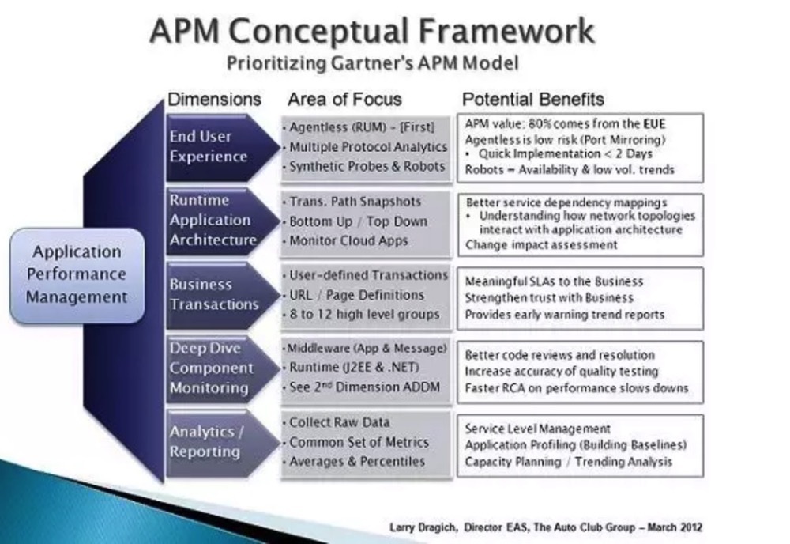
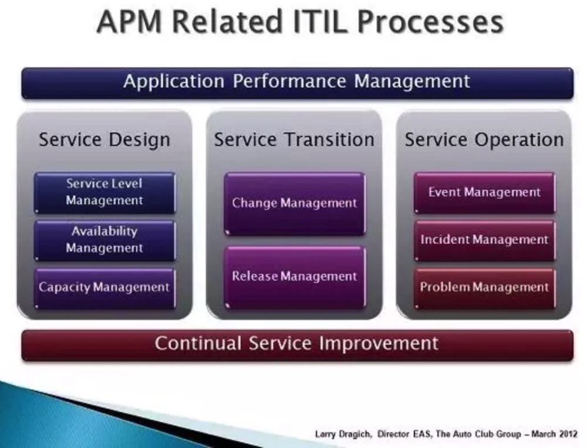

+++
title = "Gartner中APM模型的优先级"
date = "2019-11-29T15:33:36+08:00"
tags = ["apm"]
categories = ["linux 应用"]
banner = "img/banners/banner-2.jpg"
draft = false
author = "helight"
authorlink = "https://helight.cn"
summary = ""
keywords = ["apm"]
+++

前一段时间对APM的知识点做了一些梳理，对APM的基本概念也做了梳理，对于这个由Gartner提出的东西，在具体的应用落地场景上还是不免有很多不理解的地方。很多人直观的理解为APM就是一个监控，或者就是一个监控告警。就是我最早接触这个概念的时候也是这样认为的。
<!--more-->
不过随着对这部分东西不断的进行梳理才发现，这个概念涵盖的面太广了，而且早期这个定义也非常模糊，并没有那么清晰，导致目前市面上所谓的APM产品大多数还是停留在监控层面，较少深入到具体的应用中去做定义，分析和深度数据收集和综合分析。

这篇文章也是对Gartner第一版APM概念进行了一些简单说明，事实上Gartner在16年的时候对APM的概念进行了一次升级，但是我认为升级之后更抽象了，在理解和学习上会有更大的门槛。好了，以下是正文：

业务需要有配套的自动化告警，这也就催生了应用性能管理。APM如果正确的设计和实施了是有很多好处的。对管理应用运行正常与否，性能运行是否ok都非常关键。

Gartner对应用性能管理定义了5个维度，这篇文章讲述了自动化俱乐部对每个维度的认识和理解，都是我们对过去6年来为了更好的支持业务而不断对各种情况处理的经验总结。

对于不同开发者部署的应用所要关注的维度是不一样的，优先级也不同，理解这一点非常重要。在你实施的时候，我建议一些重点领域要优先处理。就是下面提到的“首要关注点“，低优先级的维度叫做“次要关注点”

从哪里开始说APM呢？看APM的概念框架来帮助你确定下一步行动的优先级。

## 终端用户体验（首要关注点）

实时应用监控是一种自顶向下的监控，也是对终端用户体验监控最基础的有效方式。根据我们的经验，实时用户监控技术为业务提供了至少80%可见的APM价值，并且为性能趋势和预测分析提供了基础。

要实现自顶向下的监控，有2种方式，被动方式和主动方式。被动监控是一种无代理方式，使用网络端口监控实现上比较低成本。通常这种方式可以在2天内搭建跑起来，并且可以提供详细的应用性能数据。在考虑使用无代理方式的时候，关键是要看支持多协议分析的能力（比如，XML，SAP，ABAP，SQL），因为大多数公司都不只是有web应用。

另一方面来说，主动监控是集成了自己写的探针和web机器人程序，它们可以上报系统的可用性和预先定义的业务事件。这是对被动方式的很好补充，和被动方式结合起来可以在应用低峰期提供更多的数据。

## 运行时应用架构（次要关注点）
这里的最小方案就是对你环境中的所有节点和服务确保进行全面监控。同时参考自底向上的监控，这会是实现全运行时架构解决的关键因素。

提供事务路径快照会帮助整合自顶向下和自底向上的监控。也会有较好的服务依赖拓扑图，理解应用架构的网络拓扑。记住运行时视图是你可以在使用用户体验，业务事务和上报分析维度的方式构建了一个可靠应用之后再重点关注的。

## 业务事务（主要）
使用一组业务事务的子集来说明，我们聚焦在对社区业务有意义的用户定义事务或者URL页面定义上。对任何给定的应用也许有200到300个不同的页面定义；我们会把他们分成8-12个高级业务事务分类中。这对描述清楚对服务的服务水平质量，并且在大多数用户感知到服务性能下降之前就能提前预测告警出来。

一旦你的APM方案成熟了，你可以在你另外的APM模型的时候发现业务事务的含义。保持简单一点，从粗犷面开始不断进行优化。

## 深入组件监控（次要）
这需要安装一个代理，一般是针对web，应用陈旭和消息服务的中间件的。它可以给你J2EE和.NET栈的运行时视图，和用户定义的业务事务联系起来。一个健壮的解决方案会给出从代码执行点到RUL执行，到用户请求的清晰路径。

由于这部分和APM模型中第二部分紧密相关，你会发现这一领域的很多产品会把提供应用程序的依赖图（ADDM）作为他们大解决方案的一部分。

## 分析/上报（主要）
从其它工具集中收集原始数据是一个比较好的实践方式，他可以让你应对各种出现的性能问题。大多数产品会总结或者汇总详细数据，以便进行上报和存档，但是这不足面对解决长期积累而出现的问题。产品能在自己的工具集上找到可以开放的数据接口也是可以的。这可以让别人较为灵活的创建报告，而且在面对回应性能问题时可以自给自足。

对每一个应用收集和上报而设置一套通用的度量指标是非常重要的。尽管每个应用可能运行在不同的技术和平台上，但是可以把如何以月度服务质量标准报告的方式来显示实时性能数据标准化出来。

你最好是使用5分钟的平均值作为实时性能告警，并且对整体的应用分析和服务级别管理进行百分比化。换句话来说就是，做的简单点：关注平均值，分析百分比。

下图是APM相关的ITIL流程。

## 结论

总的来说，你的APM策略和多个ITIL相关的流程相关联。我把APM和持续服务改进模型看作一个硬币的2个面。它们都和服务设计，服务事务处理和服务运营相关，而这些都是可以帮助提高IT部门的卓越运营水平。

看完本文有收获？请分享给更多人

关注「黑光技术」，关注大数据+微服务

