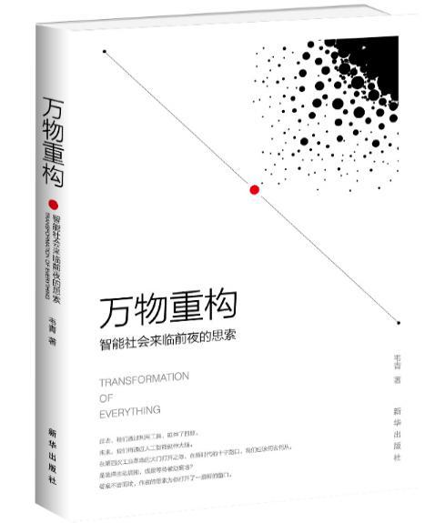
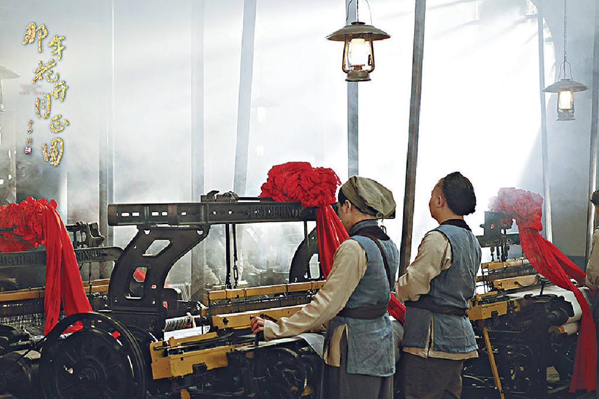
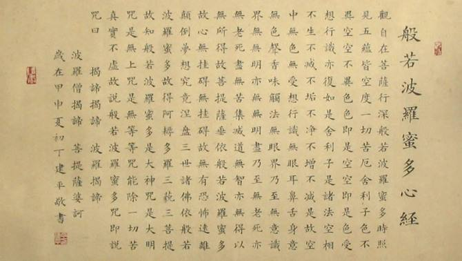
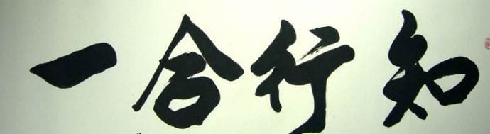

+++
title = "读《万物重构》"
date = "2019-05-18T13:47:08+02:00"
tags = ["5G", "cloud"]
categories = ["doc"]
banner = "img/banners/banner-2.jpg"
draft = false
author = "helight"
authorlink = "https://helight.cn"
summary = "Gartner整理的未来5年流行技术词。"
keywords = ["5G","data", "cloud"]
+++

# 买书看书
上上周趁着京东图书做活动，买了一堆书回来，主要还是小朋友的书了，不过媳妇也给我挑了几本。这几天每天晚上趁着在厕所泡脚的功夫读完了一本，叫《万物重构》，作者是微软中国区的CTO（首席技术官）。书不算厚，200多页，但是行间距比较大，所以看起来还是比较快的，只花了3个晚上，大概总共也就4个多小时看完。下面就介绍一下这本书的内容，还算是比较有意思的。

# 万物重构
这本书重点介绍目前非常热门的技术话题，按他的话来说就是“云- 物- 大- 智”（云计算- 物联网- 大数据- 人工智能）。从这几个技术发展的角度来看整个人类社会未来的发展趋势。从人类历史的发展过程来看，人类在每一次技术上的进步都会带来一次人类社会的重新分工和社会结构调整，从最远古的原始社会到奴隶社会，到封建社会，资本社会和目前的科技社会，都是技术的发展带来的生产力发展，从而带来了社会结构的变化。他认为现在的云计算，物联网，大数据和人工智能的发展必然会带来一次新的社会分工的重新调整以及社会结构的变化。

世界上唯一不变就的就是变化。他认为整个趋势不可阻挡，我们作为现代人只有去顺应，适应这个社会或者被遗弃。在这几种技术驱动下社会的发展和分工的重新洗牌不可避免。而且因为这次变革中物联网的发展，必然会影响到人类、机器设备和其它动植物等的变动，所以他认为这次的技术发展会带来所谓的：万物重构。

# 云计算，物联网，大数据，人工智能会像水和空气一样
在几次人类社会的变革中，他举了2个非常典型的例子，就是蒸汽机和电的使用。在蒸汽机出现之后，是的很多产品的生产效率比以前农业社会的手工作坊式的加工方式高了很多，在这种情况下，如果原来手工作坊的工人不学习新的机器生产方式就会很容易被淘汰，而在新技术出现的时候大多数认识比较抵抗的，这是人类的本性。我去年也看了一部电视剧《那年花开正圆》也讲到，主角家族以前都是手工方式生产土布，在看了机器生产的方式之后惊呆了，经过重重困难引入了机器织布机，效率确实非常高，而这时候以前的手工作坊的工人便集合起来去破坏工厂。最后的解决方式当然是部分手工作坊工人学习新的机器生产方式而得到了好的发展。另外一个例子就是交流电的发明，爱迪生和特斯拉都发明了电。大家都知道爱迪生发明了电灯，但是爱迪生发明的电灯是使用直流电的，而特斯拉发明的是交流电。因为爱迪生公司的支持，直流电在一段时间站主导地位，但是直流电有一些问题，就是长距离传输，而且传输能耗比较大，需要的传输介质也比较苛刻。而交流电则有较好的传输特性。但是爱迪生但是就是不接受交流电，而且为了阻止交流电发明了电刑器具，在各地表演交流电可以电死动物等方式。但是最终的接口大家都知道了，今天世界上主流的电力传输和使用都是交流电。

而且今天工业生产和电力都是我们生活中不可缺少的一部分，很难想象今天停电或者工业机器没有了，我们的生活会成为什么样子。对于工业机器刚刚出现的时候所谓的机器会把人弄伤，电不够安全会引起火灾等等问题的考虑，已经完全不足以阻挡我们继续使用机器生产和继续使用电。现在我们对工业生产和电力的需求就像对水和空气一样，已经非常习惯使用，人们已经默认这些就是应该是必须有的，如果缺了反而是不正常不合理。

所以目前云计算，物联网，大数据和人工智能以后也会像水和空气一样，成为我们认为非常合理的存在。

# 人们对大数据和人工智能的担忧
在16年google的AlphaGO战胜了围棋界的高手之后，整个技术界掀起了一整AI风，而且随之而来的也还有一整恐慌情绪。在技术界很多人随便拿一些计算算法甚至不是什么算法，再针对一个所谓的场景写几页ppt就开始到处寻求投资，宣传可以改变世界。在大公司也是类似，老板要求，那就拿一些算法和模型回来，进行调参，就对外说有成立AI实验室，而且有成果了。而且在一波人的推动下说AI来了，可以超越人、战胜人，未来人类有可能就会被机器人干掉。。。这类信息在17年18年初比较多，但是18年下半年以来少了很多，很多人开始冷静下来了，另外这几年AI除了在下围棋上大放光彩之外，好像没有什么大的动静，要落地真正的AI还是很难的，很多场景下的那些算法其实都不能叫AI，只能叫规则下的模型参数乱调。尤其之前还爆出科大讯飞的人工智能翻译靠人工的事情。

# 人类无需过分担忧，但必须自强
这本书中提出了2个结论性的观点：1.不用担心人工智能会把人干掉 2.人工智能势必会来，我们要不断学习自我提升，适应，使用，甚至用AI来创造。

我认为这两个结论还是比较靠谱的，首先就说人工智能是否会把人干掉，从历史发展和科学的角度来看，很难。AI（人工智能）要想干掉人类，首要条件就是它要有思维意识，要有感情，而要想进化到这个程度目前非常非常非常的困。但是不能否认的就是AI一定会非常大的提升生产效率，比蒸汽机，比电的发明提升效率更大。历来的发展我们已经可以清楚的看到，人从单个人的能力来说和机器工具比较是远远不如的，我们的心算能力能和一个手机比？力气能和一个最简单的拖拉机比？所以我们要把AI当作一种高效工具来试用，它可以帮助我们极大的提升我们的工作效率，是我们对外界改造能力和效率的升级。但这对人的要求也会更高，要驾驭这样高级的工具，当然需要更知识和能力。

而且每次的生产效率的大提升必然带来响应社会分工的变化。这里最直接的就是对生产工人的冲击，富士康使用机器人生产线，前几天还看到海底捞也开始使用机器人进行配菜和配送服务，工厂和餐厅只需要极少数的人就可以运营起来。相比AI干掉人类，这个才更应该引起我们的关注。在电视剧《那年花开正圆》也是一样的，使用机器生产之后效率大幅提升，原来的工人和老板都要被迫转型为新机器生产的工人，需要学习新知识新技能来适应这样的发展。

只要不断学习适应新的时代，那么被社会淘汰的机会就会比较低。因为现在这个社会不断在有新的需求产生，新的工作职位产生。所以就需要不断的学习寻找这些机会，在这些机会中找到合适自己的路子。

书中提到微软盖茨有句名言：我们的公司只有18月的生命力。其实这个话正对现在很多人都适用，毕竟唯有变化才是永恒不变的。每个人都需要在社会中不断学习进步才能适用社会的发展。

# 科学，宗教，哲学
另外这本书中还提到一个话题，也是比较有意思的，而且他的解说我认为很到位：科学，宗教和哲学的关系。在他看来这三者不对立的，都是相互协助发展。科学，哲学，宗教都是在寻找响应的方法来帮助人们去认识世界理解世界。

在心经中也有对世界理解的过程：声香味触法，在指导人们对事物的思考是从外部认识再到内在原理认识的过程。之前听一个法师见到心经和光波粒二象性的关系时我就惊呆了，因为他说佛法中早就知道了光的波粒二象性，因为心经中早就说了：色即是空，空即是色。那是我认为时胡扯，不过目前看来还是有那么点意思。

另外还提到心学，对世界的认识要执行合一，知的部分时思考之学，行的部分时实践之学。哲学为大家思考世界提供了必要的方法知道，而且哲学也不是一成不变的，也是在随着人们对世界认识的不断加深而不断发展的。对世界的认识和研究是要结合哲学和科学的，所以对世界的认识必须时科学和哲学的结合。这些观点还是非常有意思的，在我看来非常实在。

# 结论
这本书值得一读。
我这里梳理的内容也不是书的全部，从一个技术男的认识来预测未来的发展，同时指导未来人们该怎么学习提升自己，怎么更加适应未来的社会。

看完本文有收获？请分享给更多人

关注「黑光技术」，关注大数据+微服务

