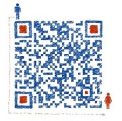

+++
title = "黑光技术公众号介绍"
date = "2019-01-17T13:47:08+02:00"
tags = ["flink"]
categories = ["doc"]
banner = "img/banners/banner-5.jpg"
draft = false
author = "helight"
authorlink = "https://helight.cn"
summary = "本号主要维护人helight ，毕业于西安邮电大学硕士研究生，现任职于腾讯游戏增值服务部数据中心，主要负责游戏大数据应用服务和游戏数据微服务的架构应用落地。"
keywords = ["flink","metrics"]
+++

# 简介

本号主要维护人helight ，毕业于西安邮电大学硕士研究生，现任职于腾讯游戏增值服务部数据中心，主要负责游戏大数据应用服务和游戏数据微服务的架构应用落地。个人博客：https://helight.cn。

# 宗旨

关注开源，关注linux技术，分布式技术，大数据技术，微服务技术，游戏大数据+服务应用。本号主要分享作者原创的技术文章以及在日常工作和学习中读过的好文，文章也会同步在个人博客上。希望是通过公众号上分享的方式不断梳理一些我认为在企业在大数据应用+微服务架构实践中非常实用的内容，同时欢迎大家多交流。

# 意见反馈

若本号内容有做得不到位的地方（比如：涉及版权或其他问题），请及时联系我们进行整改。

另外如果大家有好的文章想在这里投放也可以直接加下面微信联系。

长按一键关注

  
