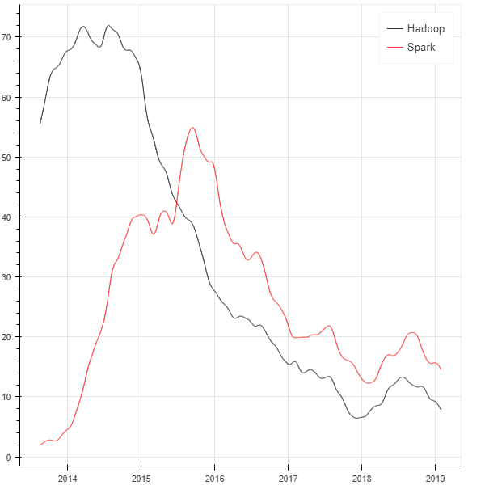
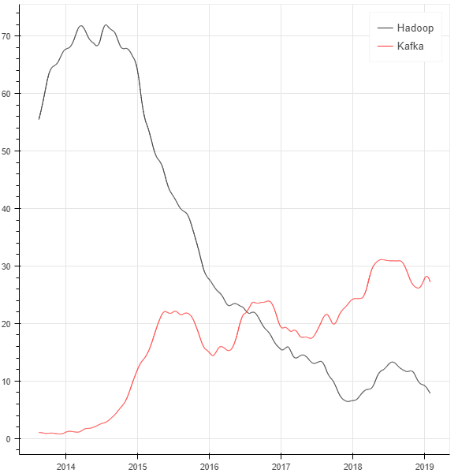
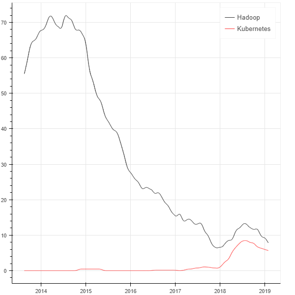
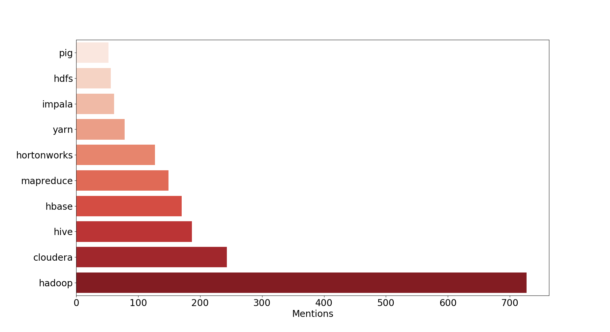
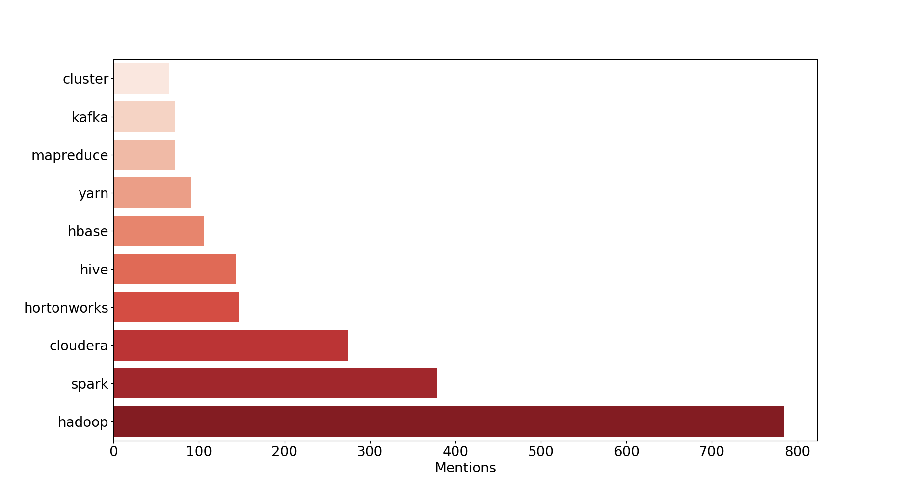
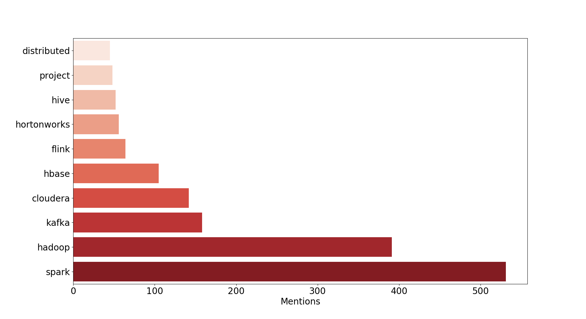
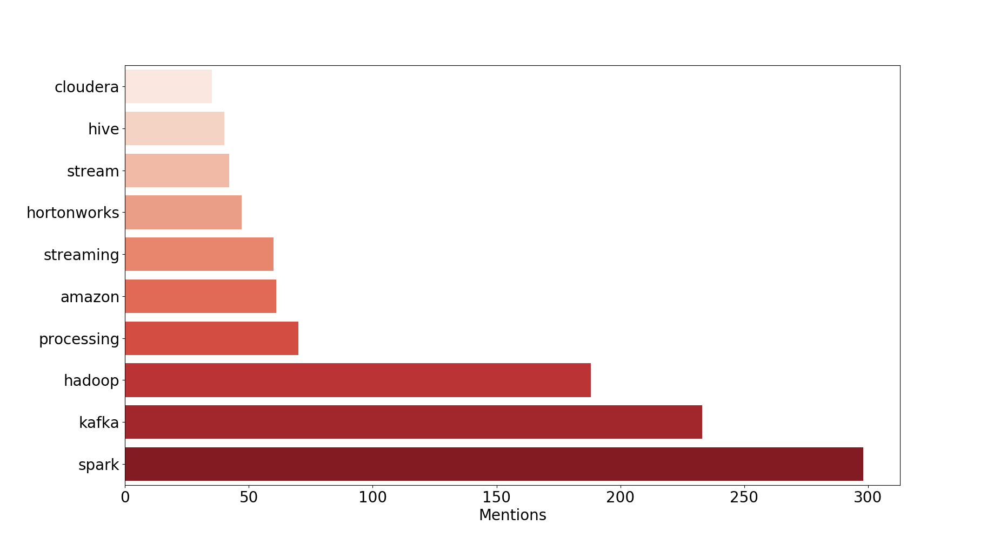
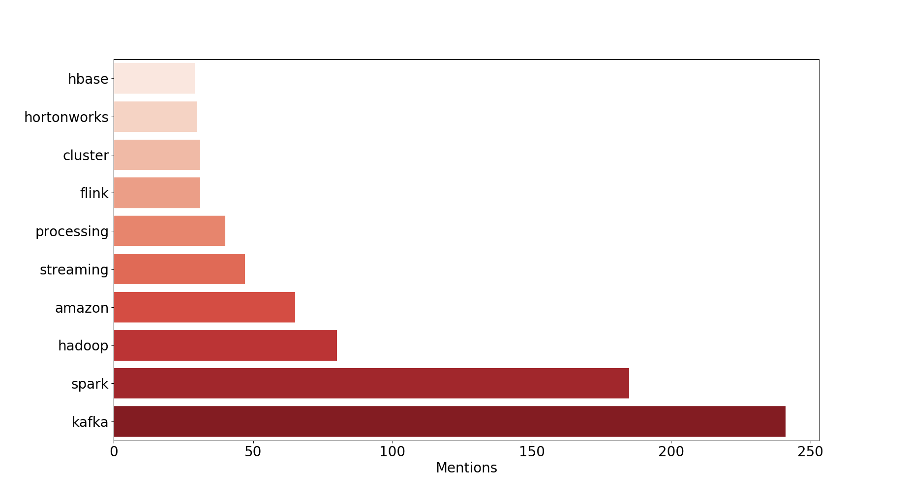
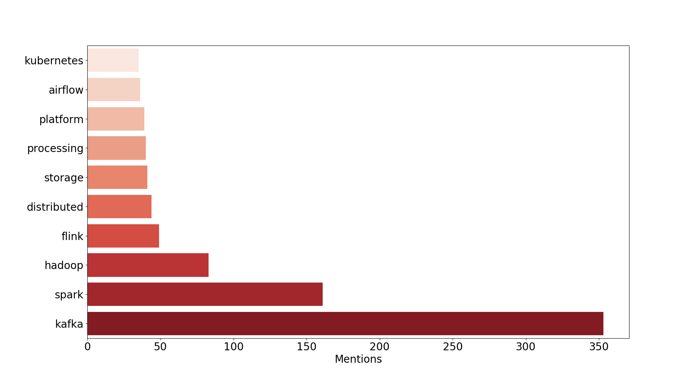
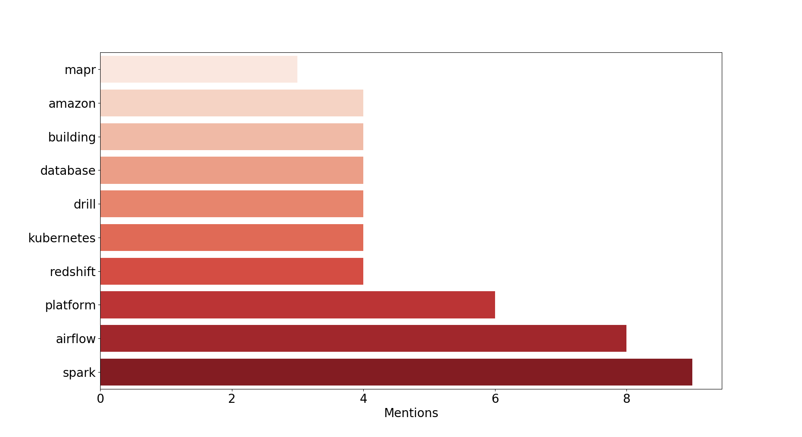

+++
title = "自2013到2019年大数据领域发生了什么变化"
date = "2019-05-18T13:47:08+02:00"
tags = ["5G", "cloud"]
categories = ["doc"]
banner = "img/banners/banner-2.jpg"
draft = false
author = "helight"
authorlink = "https://helight.cn"
summary = "自2013到2019年大数据领域发生了什么变化"
keywords = ["5G","data", "cloud"]
+++

# What changed in the Big data landscape from 2013 to 2019

# 自2013到2019年大数据领域发生了什么变化

作者：Abbass Marouni

翻译：helight

# 译者序

在网上看到这篇文章之后发现还挺有意思，文章也算比较简短，就试着联系了一下作者说：我想把他翻译成中文，不做商业用途只是练习和技术布道。作者的回应也非常快，当晚就给我回复，所以就有了这篇翻译，如果翻译有不准确的地方还请大家指出。

# 背景

I’ve been a loyal follower of [Data Eng Weekly newsletter](https://dataengweekly.com/index.html) (formerly Hadoop Weekly) for the past 6 years, the newsletter is a great source for everything related to Big data and data engineering in general with a wide selection of technical articles along with product announcements and industry news.

过去6年中我是Data Eng Weekly（前身是Hadoop Weekly）的忠实粉丝，它是一个与大数据和数据工程相关的所有消息的很好的来源，它包括了大量的技术文章以及产品公告和行业新闻。

For this year’s holidays side project I decided to analyze [Data Eng’s archives](https://dataengweekly.com/archive.html), that go back to January 2013, to try to analyze Big data trends and changes over the past 6 years.

在今年的假期项目中，我决定分析Data Eng的以往内容，追溯到2013年1月，尝试来分析过去这6年终大数据发展趋势和变化。

So I crawled and cleaned over 290 weekly issues (well python did !), I kept articles’ snippets from the technical, news and releases sections only. Next, I ran some basic natural language processing followed by some basic filtering to produce keywords mentions and all of the plots that follow.

所以我使用python抓取清洗了290多期的内容，只保留了和技术、新闻和发布相关的部分内容，接下来，我对这些内容使用一些基本自然语言处理，然后进行基本过滤生成下面的关键词和内容。

# Major trends over the last seven years

# 过去7年里主要的发展趋势

Let’s start with the major trends over the last seven years, here I’m plotting the monthly rolling mean of the number of mentions of specific keywords and plotting them together on the same graph. The following plots illustrate at what approximate time frames technologies become more popular (as a result of more reporting about these technologies) when compared together.

从过去7年的主要发展趋势开始，这里我把特殊关键词被提到的次数按照月滚动平均值绘制到一张图中。下面的图表展示了通过对技术报道的统计，对比显示出那些时间段那些技术变得更加流行。

## Hadoop vs. Spark

## Hadoop与Spark

Observations : We see the steady decline of Hadoop since 2013 and the moment Spark took over Hadoop (especially MapReduce).

可以看出从2013年开始Hadoop就开始稳步下滑了，而同时Spark在接替Hadoop（尤其是MapReduce）

## Hadoop vs. Kafka

## Hadoop与Kafka

Observations : The rise of Kafka as the main building block in all Big data stacks.

这6年中Kafka逐步成为所有大数据栈的主要组成部分了。

## Hadoop vs. Kubernetes

## Hadoop与Kubernetes

Observations : An interesting observation is the rise of Kubernestes, even though the Data Eng Weekly is not a Devops news letters, is a witness to the overall hype around Kubernetes in all domains starting from beginning of 2017.

一个有趣的现象是的是Kubernestes的增长，尽管Data Eng不是太关注DevOps，但是却也见证了从2017开始围绕Kubernetes在各个领域的大肆宣传。

## Yearly top keywords 

## 年度热门关键词

Here I’m simply plotting the top 10 keywords by total number of mentions in a give year.

这里我简单的画出了给定年份中被提及次数最多的10个关键词。

## 2013 : Hadoop’s golden year ! 

## 2013：Hadoop的黄金年代！

Observations : All of the original Hadoop projects are here : HDFS, YARN, MR, PIG, … With the 2 major distributions CDH & HDP and nothing else !

所有最初的Hadoop项目都在这里：HDFS，YARN，MR，PIG，。。。还有两个主要发行版本CDH和HDP，其它还真没什么。

## 2014 : The rise of Spark ! 

## 2014：Spark的崛起！

Observations : Hadoop in general continued its dominance but Spark made its debut with its first version this year was the hottest topic of 2014, e also got the first glimpse of Kafka !

这个时期Hadoop还继续占统治地位，但是这年Spark的第一个版本被亮相成为了2014年最热门的话题，同时看到Kafka的进入top话题。

## 2015 : Here comes Kafka ! 

## 2015：Kafka来了！

Observations : Spark takes ever the first spot from Hadoop and Kafka making it to the top 3. Most of the old regime projects (HDFS, YARN, MR, PIG, …) didn’t make to the top 10.

Spark取代了Hadoop老大的位子，Kafka进入了top3。大多数老旧项目（HDFS, YARN, MR, PIG, …）都没有进入top10.

## 2016 : Streaming is on fire ! 

## 2016：流式计算火了！

Observations : 2016 was the streaming year, Kafka took the second place from Hadoop with Spark (streaming) continuing its dominance.

2016年是流式计算年，Kafka取代了Hadoop老二的位子，但是Spark（Spark的流处理）继续占主导地位。

## 2017 : Stream everything ! 

## 2017：一切皆流计算！

Observations : The same lineup as 2016 with some Flink thrown in.

和2016年差不多，但是加入了Flink。

## 2018 : Back to basics ! 

## 2018：回归基础！

Observations : Kubernetes makes its debut and we’re back to basics trying to figure out the how to manages (K8S), schedule (airflow) and run (Spark, Kafka, Storage, …) our streams.

Kubernetes首次亮相top10，我们回归基础，并试图找到如何管理（K8S），如何调度（airflow）和运行（ Spark, Kafka, Storage, …）数据流。

## 2019 : …

Observations : It’s still too early to make any conclusions about 2019, but it looks like the year where K8s & co. go prod. mainstream !

现在对2019年做出任何结论还为时尚早，但是看起来K8S在2019年将会成为主流。

## Code and dataset 

## 代码和数据集

I’m working on cleaning up the code so that you can generate the dataset by yourself. I’ll also be posting the NLP python snippets along with Bokeh & Seaborn plot generating snippets, so stay tuned.

我正在整理代码，之后你就可以自己生成数据了。我还会发布NLP的python代码片段，连同用Bokeh和Seaborn画的图片，所以请持续关注。

文章原文地址：https://blog.marouni.fr/bidata-trends-analysis/

看完本文有收获？请分享给更多人

关注「黑光技术」，关注大数据+微服务

