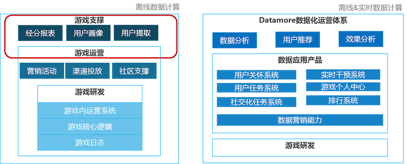

+++
title = "DataMore数据服务开发系统Xone在服务化的架构实践"
date = "2019-05-18T13:47:08+02:00"
tags = ["bigdata"]
categories = ["bigdata"]
banner = "img/banners/banner-2.jpg"
draft = false
author = "helight"
authorlink = "https://helight.cn"
summary = "DataMore数据服务开发系统Xone在服务化的架构实践"
keywords = ["bigdata","团队", "实时计算"]
+++

# DataMore服务体系介绍

大数据在游戏运营中扮演的角色越来越重要，“精细化”，“高效率”，“更好效果”已经成为数据的价值体现。随着数据计算从离线时代发展到实时计算时代，传统数据也从“数据分析报表”,“数据挖掘”等离线应用蜕变成游戏内外的实时数据应用。

DataMore是IEG增值服务部为游戏项目组提供的一站式智能游戏运营方案平台，基于游戏日志数据，利用实时与离线计算能力，打通数据营销和渠道，为业务提供以解决运营问题为目标的数据运营服务。

目标是为游戏能提供闭环的游戏数据化运营平台，从游戏数据发现问题，到分析出问题并且找到合适的干预方案，到对游戏进行数据方案干预，再到对游戏数据分析。而DataMore已经实现了从游戏数据报表发现问题，到数据分析，到运营干预方案的选择与实施，再到方案的效果评估与优化迭代的闭环式服务。

此外与传统的游戏运营体系不同，DataMore游戏数据运营平台具有脱离游戏版本，对研发侧依赖小，计算能力与精细化运营能力强的特点，可以为游戏业务带来更低成本、更快速高效的精细化运营，并提供丰富的游戏运营方案。

DataMore可以具有这些优势得益于运用了微服务的理念，采用服务型开发架构，将数据营销服务拆分成独立、通用的服务能力，同时构建了应用和服务中台，能够通过组合这些通用服务快速而轻松的构建专属应用服务。

# DataMore数据服务开发系统Xone介绍
DataMore的基础能力是对游戏日志数据进行实时和离线的计算能力，以及提供高可用的数据规则访问接口服务。比如游戏任务系统，游戏实时营销，实时排行，发奖，用户实时干预，新手引导等这些常规运营方案都离不开对数据的支持，而在大量数据需求之下，之前的手工作坊式的数据开发已经没法满足游戏对数据服务的需求了。之前的做法在开发门槛，效率上都有很大的问题，而且数据指标无法复用，算法重复开发，且不易沉淀系统。在这种场景之下xone应运而生。Xone一体化系统的目的就是要要开发一个系统能够统一的提供数据指标开发，算法管理，流程管理和数据服务接口支持。让数据开发和应用更规范，更自动化，也更体系化。

Xone是一站式的游戏大数据业务应用开发系统，一体化系统聚焦于游戏应用数据指标开发的配置管理、任务调度、应用数据接口开发管理，以及基本的游戏数据应用产品的开发。

# 数据服务服务化建设
一切皆服务。

这是一体化系统的目标，把数据配置和使用根据具体的使用场景产品化，让大家看到一体化中的都是数据服务，可以配置算法去生产数据，可以配置规则去生成接口。所有的对外提供的能力都抽象设计为具体的服务产品。让大家以产品服务的方式来使用大数据。

这里一定要要结合DevOps的思想，一体化从项目的创建，到资源申请流程管理，服务开发，服务测试，服务发布，服务监控，服务下线资源归还都比较完备。实现了真正的一站式数据服务开发。

目标在于提供简单的配置化方式就可以提供大数据的计算服务，通过简单的配置或者在线闭环的web化编程就可以提供数据应用接口服务，并且在这些功能的基础上可以逐步积累一些基础的产品化应用，比如实时用户干预这样的服务。

下面列出了一体化系统目前已经抽象设计出来的服务，这些都是一体化能力根据不同的业务场景设计出来的。在一体化系统可以申请直接使用。

# Xone数据开发服务架构设计
那么从实际实现的角度来看，我们怎么来抽象服务呢？

## 业务架构设计：
主要是对整个系统的业务进行合理拆分，对具体的领域模型进行设计，把业务转化为抽象对象。

在DataMore的实际应用中，我们的业务主要流程和输出能力有这么几个方面：
1. 项目接入管理，对项目的生命周期，项目下的数据生命周期，接口服务生命周期管理，也包括对资源的分配回收管理。
2. 数据的开发加工处理
3. 对数据访问接口的开发
4. 数据流转处理和事件触发处理
5. 一些基础的通用场景化应用套件
6. 基于底层能力构建的更为复杂或者定制化的场景应用

在DataMore基础数据服务系统的设计上也是重点针对这几个功能点来设计，把数据的加工处理、数据接口的开发和数据的调度管理作为基础能力，在这些能力的基础之上再去构建通用的场景应用，在这些能力的基础再构建复杂的场景应用。

## 技术架构设计：
是考虑从硬件到实际应用服务的抽象，包含了具体实现模块和编程接口，技术架构必须服务于业务架构，反过来业务架构很多时候也会受限于技术的架构。
作为DataMore基础的数据服务系统，一体化系统
下图所示，一体化系统位于中间部分，对下对接统一的数据队列，数据计算服务，数据存储服务，这部分一体化不做，直接使用其它现有的系统和服务，不重复建设。对上对接DataMore服务模块，也可以是其它游戏服务系统。

## 数据架构设计：
数据的存储流转架构，数据结构的设计等，是技术和业务架构的基础。

我们是数据服务应用开发系统，所以数据是最关键的。DataMore使用的数据大多数都是游戏日志数据，从游戏再到游戏应用有一下几个过程：
1. 消息队列服务，从游戏GameServer使用可靠UDP传输到TGlogServer，再实时传输到TDBank，Kafka等消息队列；
2. 数据计算服务，开发同学在Xone系统配置sql或者开发jar包再提交到Xone，由Xone根据业务需求调度到具体的集群中运行，底层计算集群Xone不做直接管理和运维，而是直接对接，比如Oceanus对接了Flink计算，和TDW对接了lz任务的计算，还有部分对接了运维管理的Storm和Flink集群。
3. 结果存储服务，计算结果也是直接保存到DBA分配管理的Tredis，TSpider，HDFS等存储服务上。
4. 接口开发发同学在Xone上根据已经生产的数据配置数据访问规则，并生成独立的服务接口API给到上层DataMore服务，潘多拉，数据推荐等服务调用
5. 这里还涉及到一些辅助的数据信息管理：
    1. 数据表元信息：表转态，表字段，表来源，表访问信息
    2. 开发同学配置的数据指标信息：指标计算算法，纬度，周期等等
    3. 开发同学配置的接口信息：接口可以访问那些数据，数据要经过什么规则计算，接口的生存周期，负责人，自动生成的API文档等等。
    4. 项目管理信息，

## 部署架构设计：
拓扑架构，包括了系统部署了几个节点，节点之间的关系，服务系统类型、高可用、容错性等，决定了应用如何运行、运行的性能、可维护可扩展性等，是所有架构的基础。

## 组织架构设计：
团队架构，包括项目的组织形式，人员构成、职责等，是上面所有架构的保障设施，良好的组织架构能偶保证其它架构的有效实施和推进。

那在Xone系统建设的过程中有没有组织架构的设计呢？有，一定是有的。

目前xone团队人员还是比较多的，团队成员一方面基于DataMore的实际需求在沉淀建设我们所需要的系统，同时也承担了大部分DataMore业务的开发任务。人员较多，系统涉及的周边系统和功能也非常多。所在这样的团队一定要有合理的组织架构管理，才能高效运作。这里虽然不是本文的重点，但是还是要简单介绍一下。我们采用FT团队模式，每个小团队2~3个人组成，承担里面独立的系统模块开发工作。在迭代开发上分为小FT迭代和主干迭代管理，每日小团队晨会，每周大团队周例会，基本每双周一个迭代周期。

FT是Feature Team（特性团队）的缩写，一般指横跨多个职能角色，相对独立和闭环，有清晰稳定目标的工作团队

## 架构演进
架构随着业务、负载的变化需要不断的梳理和重构，推进架构向更优的方向演进。
一个系统的架构设计，我们认为有这样3个核心要素：
1. 稳定新
2. 实用性
3. 易用性

# 总结
DataMore通过建设标准化的数据营销能力，利用微服务化理念进行服务改造，通过应用开发者平台，为业务提供各种标准化的数据应用产品。

看完本文有收获？请分享给更多人

关注「黑光技术」，关注大数据+微服务

