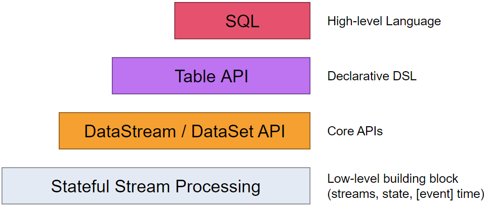
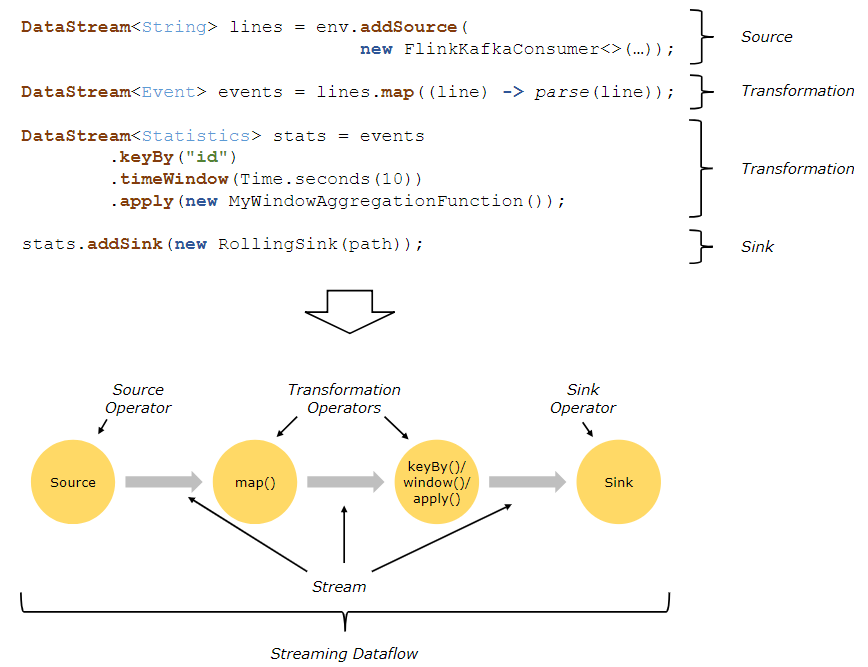
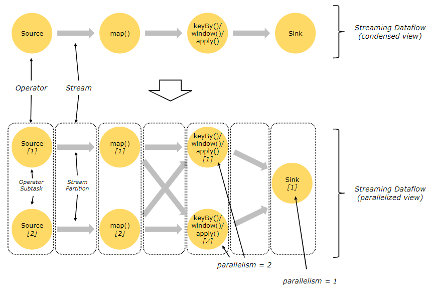
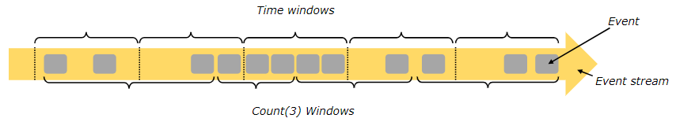
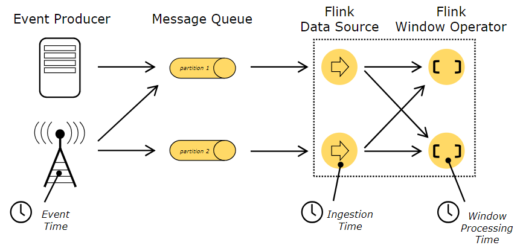
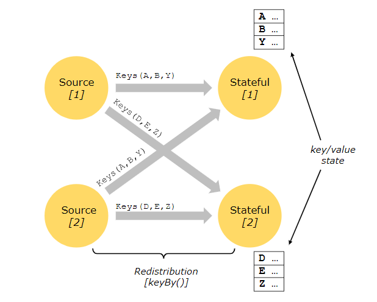

+++
title = "Flink数据流编程模型"
date = "2019-02-18T13:47:08+02:00"
tags = ["bigdata", "flink"]
categories = ["flink"]
banner = "img/banners/flink.jpg"
draft = false
author = "helight"
authorlink = "https://helight.cn"
summary = "Flink数据流编程模型介绍"
keywords = ["flink","Streaming", "Dataflows"]
+++

# Dataflow Programming Model

#  数据流编程模型

* Levels of Abstraction ：数据处理层抽象
* Programs and Dataflows  编程和数据流
* Parallel Dataflows 并行数据流
* Windows 窗口
* Time 时间
* Stateful Operations 带状态的操作
* Checkpoints for Fault Tolerance 容错检查点
* Batch on Streaming 基于流的批处理

# Levels of Abstraction 数据处理层抽象
  Flink提供了不同的数据处理抽象层来开发流、批处理应用。

  

* 最底的抽象层提是简单的提供了**带状态的流处理**，它可以使用[处理函数](https://ci.apache.org/projects/flink/flink-docs-release-1.7/dev/stream/operators/process_function.html)嵌入到[[DataStream API](https://ci.apache.org/projects/flink/flink-docs-release-1.7/dev/datastream_api.html)中，它允许使用者自由的处理一个和多个数据流中的事件，并且保持一致的容错状态，另外，使用者可以注册事件时间和处理时间回调函数，也可以编程来实现复杂的计算。

* 实践中，大多数应是不需要上面提到的低抽象层的，而是使用像[DataStream API](https://ci.apache.org/projects/flink/flink-docs-release-1.7/dev/datastream_api.html) (有限/无限数据流)和  [DataSet API](https://ci.apache.org/projects/flink/flink-docs-release-1.7/dev/batch/index.html) (有限数据集)这样的**核心API**。这类流API为数据处理提供了公共的模块，例如像各种形式的用户指定的转换、连接、聚合、窗口、状态等。 在这些API中处理的数据类型被表示为各自编程语言中的类。

低级*处理函数*集成了*DataStream API*，使得它可以在某些特定操作中进入低级抽象层。*DataSet API*在有限数据集上提供了额外的原语，比如循环/迭代（loops/iterations ）。

* **Table API**是为可能动态变化的表（当有流数据的时候）为中心的声明式DSL。Table API 遵循（扩展的）关系模型：表都有模式（和关系型数据库中的表类似）并且它的API提供了和表类似的操作，例如select， project，join，group-by，aggregate等。[Table API](https://ci.apache.org/projects/flink/flink-docs-release-1.7/dev/table_api.html)编程定义申明了什么是逻辑操作，而不是明确操作的代码。 虽然Table API是通过各种用户定义的函数进行扩展的，但是它比Core API来说缺少一些表达力。
Table和DataStream/DataSet之间可以无缝转换，可以混合Table API与DataStream和DataSet APIs进行编程。

* Flink提供的高级抽象层是**SQL**，这种抽象类似于Table API的语义和表达，但是编写SQL程序需要更好的表达。[SQL](https://ci.apache.org/projects/flink/flink-docs-release-1.7/dev/table_api.html#sql) 的抽象和Table API紧密相关，并且SQL查询可以在定义了Table API的表上执行。

# Programs and Dataflows 编程和数据流

Flink编程的基本模块是流**streams**和转换**transformations**，（注意：在Flink中DataSets使用DataSet API在本质上也是流处理，详细见后面）。概念上来说，流就是一个连续不断的数据记录流（没有终点），而一个转换transformation是把一个多个流作为输入并且处理产生一个或者多个输出流作为结果的一种操作。

在执行的时候，Flink程序被映射到**数据流**上去，持续的**数据流**和**转换操作**。每一个数据流有一个和多个**源**作为起点，终止于一个或多个**接收器**。数据流类似于一个**有限无环图**（DAGs ），虽然可以通过迭代结构来构造特殊的特殊形式的环路，但是大多数时候为了简化我们还是把它作为无环图来处理。

在程序的转换和数据流的操作之间通常是一对一的通信。 有时候一个转换操作也会由多个转换操作组成。

关于源和接收器在流连接器[streaming connectors](https://ci.apache.org/projects/flink/flink-docs-release-1.7/dev/connectors/index.html) 和批处理连接器[batch connectors](https://ci.apache.org/projects/flink/flink-docs-release-1.7/dev/batch/connectors.html) 的文档中有说明。转换操作的说明在[DataStream operators](https://ci.apache.org/projects/flink/flink-docs-release-1.7/dev/stream/operators/index.html)和[DataSet transformations](https://ci.apache.org/projects/flink/flink-docs-release-1.7/dev/batch/dataset_transformations.html)的文档中。

# Parallel Dataflows并行数据流

Flink的程序本身就是并行和分布式的。在执行时一个数据流有一个或多个**数据流分块**，并且每个操作有一个或者多个**操作子任务**。操作子任务是相互独立的，并且在不同的线程中执行，也有可能是在不同的机器或者容器中执行。

操作子任务的数量就是这个指定操作的**并行度**。流计算的并行度就是它自己的生产操作。相同程序的不同操作有可能有不同级别的并行度。

数据流可以一对一（或转发）的模式或者以重分配的模式在2个不同的操作间传输。

* **一对一**数据流（例如：上面提到的在Source操作和map操作之间）保留了数据的分区和排序。这意味着map操作的子任务会像Source操作的子任务一样以同样的顺序处理同样的数据。
* **重分配**数据流（像上面提到的 map和keyBy/window操作之间，也像keyBy/wondow和Sink之间）改变了数据流的分区。每个操作的子任务根据所选的转换操作发送数据到不同的目标操作的子任务。例如：keyBy()（以哈希key的方式来重分区）,broadcast(),或者rebalance()(这个是随机重分区的)。在重分配中交换中，元素之间的顺序只在每个发送接收对之间保持。（例如，map的子任务和keyBy/window之间）。所以在这个例子中，每个key中的顺序是保持的，但是并行执行对不同key的聚合到达接收器的顺序引入了不确定性。
[parallel execution](https://ci.apache.org/projects/flink/flink-docs-release-1.7/dev/parallel.html)这里有关于并行配置和控制的详细文档。
# Windows窗口
在数据流上进行聚合事件（比如，counts，sums）和批处理是不一样的。例如，在数据流上去计算所有的元素是不行的，因为数据流一般是无限制的（无界限）。取而代之在数据流上进行聚合是基**于窗口**的，比如“最后5分钟的计数”或者“对最后100个元素进行求和”。

窗口是可以时间驱动（例如：每30秒）或者数据驱动的（例如，每100个元素）。可以通过一些明显的特点要区别不同的窗口，例如翻滚窗口（没有重叠），滑动窗口（有重叠）和会话窗口（ 不时会有一段不活跃的间隙）。

[blog post](https://flink.apache.org/news/2015/12/04/Introducing-windows.html)有更多窗口示例，[window docs](https://ci.apache.org/projects/flink/flink-docs-release-1.7/dev/stream/operators/windows.html)这里有更详细的说明文档。
# Time 时间
当提到数据流编程中的时间（例如定义窗口）的时候，我们可以参考下面不同的时间定义。

* **事件时间**是一个事件被创建的时间，它通常被描述为事件的时间戳，例如由生产者传感器或者生产服务追加。Flink通过[时间戳分配器](https://ci.apache.org/projects/flink/flink-docs-release-1.7/dev/event_timestamps_watermarks.html)来访问事件时间戳。

* **摄取时间** 是事件进入Flink的数据流在数据源操作的时间。

* **处理时间**是基于时间操作的操作方法的本地时间

  

关于时间操作的更多详情看这里的文档事件时间文档[event time docs](https://ci.apache.org/projects/flink/flink-docs-release-1.7/dev/event_time.html).
# Stateful Operations 带状态的操作
虽然数据流中的许多操作一次只查看一个独立的事件（例如一个事件解析），有些操作在多个事件上会记录信息（例如窗口操作）。这类操作叫做**带状态操作**。

我们用可以认为是嵌入式的kv存储来维护状态类操作的状态。带状态操作读取数据流的状态，而数据流的这些状态被严格的分区并且被分发。因此， 因此，只有在keyBy（）函数之后，才可以访问键/值状态，并且仅限于与当前事件的键相关联的值。对齐数据流key和状态，可以保证所有状态的更新都是本地操作，在不需要事务开销的情况下保证一致性。这种对齐同时也允许Flink透明的进行重新分发状态和数据流分块的调整。

更多信息，可以看这个[文档state](https://ci.apache.org/projects/flink/flink-docs-release-1.7/dev/stream/state/index.html).
# Checkpoints for Fault Tolerance 容错的检查点
Flink用**数据流回放**和**检查点**的组合来实现容错。一个检查点和每一个输入数据流的特定点相关，以及和每个操作的对应状态。一个数据流处理可以从一个检查点恢复，同时通过从检查点的位置开始恢复操作状态和重播时间来保持一致性（精确一次的处理语义）。

检查点的间隔是一种方法，可以衡量在执行过程中容错的开销。（需要被回放事件的数量）

[容错间隔](https://ci.apache.org/projects/flink/flink-docs-release-1.7/internals/stream_checkpointing.html)的描述提供了更多关于Flink管理检查点和相关话题的资料。关于启用和配置检查点的详细信息都在这个文档中[checkpointing API docs](https://ci.apache.org/projects/flink/flink-docs-release-1.7/dev/stream/state/checkpointing.html).

# Batch on Streaming基于流的批处理

Flink以一种特殊的的[流处理程序](https://ci.apache.org/projects/flink/flink-docs-release-1.7/dev/batch/index.html)来执行批处理程序，这种批处理的数据流是有界数据流（有限梳理的元素）。一个DataSet被看作是一个有限的流数据集。上面的思路就是像流处理程序一样的处理批处理程序，只有少许例外。

* 对[批处理程序的容错](https://ci.apache.org/projects/flink/flink-docs-release-1.7/dev/batch/fault_tolerance.html)是不用检查点的，通过全部回放数据流的方式来恢复。因为输出是有限的所以可行。这样增大了恢复的成本，但是对常规处理跟方便，因为没有了检查点。
* DataSet API中带状态的操作使用简化的的内存/核心数据结构，而不是kv索引。
* DataSet API引入了特殊的同步迭代器（基于超级步骤），这写方法只可以用在有限数据流中，更多详细信息，请看[迭代器文档iteration docs](https://ci.apache.org/projects/flink/flink-docs-release-1.7/dev/batch/iterations.html).

# Next Steps下一步
可以在Flink的[Distributed Runtime](https://ci.apache.org/projects/flink/flink-docs-release-1.7/concepts/runtime.html).分布式运行时一文中继续了解基本概念。

看完本文有收获？请分享给更多人

关注「黑光技术」，关注大数据+微服务

