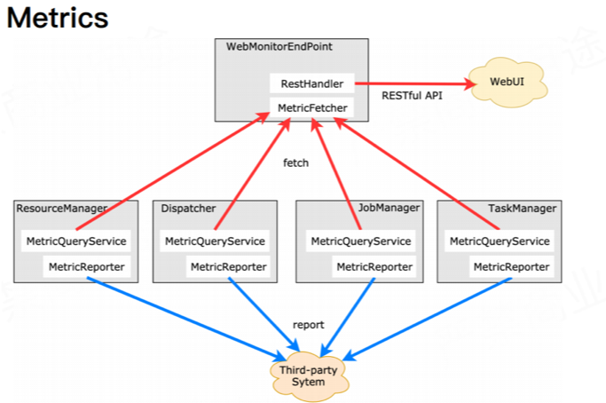

+++
title = "Flink状态监控介绍"
date = "2019-09-17T13:47:08+02:00"
tags = ["flink"]
categories = ["flink"]
banner = "img/banners/flink.jpg"
draft = false
author = "helight"
authorlink = "https://helight.cn"
summary = "对于需要 7 * 24 小时不间断运行的流式计算程序来说，能实时监控程序运行状况、出现异常告警能立即响应并快速定位问题是必须具备的能力。"
keywords = ["flink","metrics"]
+++

# Flink状态监控介绍
`本文整理自小组实习生的一篇组内分享`

## 监控机制的必要性：

对于需要 7 * 24 小时不间断运行的流式计算程序来说，能实时监控程序运行状况、出现异常告警能立即响应并快速定位问题是必须具备的能力。

所以在对监控的设计上Flink也是下了一定功夫的，在其官网也是有非常多的介绍。

## Flink Metric内置的监控涵盖面丰富，支持：
    1 系统级别的监控：CPU状态信息、内存状态信息等（默认关闭，需要更改配置文件打开，且lib目录下需要添加相关依赖jar包）
    2 JVM级别的监控：CPU占用率、堆内存使用情况、线程数量、GC已经类加载数量。
    3 Flink job/Task/Operator级别的监控：checkPoint相关（耗时、大小、数量）、算子吞吐量、水位线。内置Connector监控，若使用FlinkKafkaConsumer，可以监控job消费kafka速度、offset的LAG值。这一级别的监控也支持自定义。
## 监控方式


上图是Flink的支持的2中监控数据收集方式：Fetch和Report。

### Fetch方式：
WebMonitorEndPoint终端会定期从Flink其余组件处fetch来监控指标信息，并且该终端会提供一个RestHandler向外部开放一个监控指标查询接口。像Flink Web UI就是通过该终端提供的RESTful接口获取相应指标监控信息。

Flink 中，客户端向 Flink 集群发起 REST 请求均是通过 WebMonitorEndpoint 来处理的。顾名思义，WebMonitorEndpoint 接听来自 web 的所有请求并作出对应的响应。

https://ci.apache.org/projects/flink/flink-docs-release-1.8/monitoring/rest_api.html

比如：
``` sh
/jobmanager/metrics
/jobs/metrics
/jobs/:jobid/metrics
/jobs/:jobid/vertices/:vertexid/metrics
/taskmanagers/metrics
/taskmanagers/:taskmanagerid/metrics
```
以上这些方法都是flink开放的webapi，我们可以通过这些api去主动抓取监控信息。
### Report方式：
同时Flink也提供了往外Report监控指标的方式，及常见的通过在flink-conf.yaml配置Metric Reporter将flink的监控指标定期发送至第三方系统。

这里大家可以想一下Prometheus的工作原理即可，Flink也实现了Prometheus的Report，可以直接通过配置就可以启用，再通过Prometheus去采集集群监控数据。

## Flink中的自定义监控指标
### Counter
    进行计数类型的统计，支持类型仅支持int和long型。使用Counter接口中的inc（）/ inc（long n）或dec（）/ dec（long n）可以输入或减少当前值
### Gauge

    可以实现Counter的功能，并且支持监控任何类型的数据。

### Meter

    计算平均吞吐量，使用markEvent（）表示监控事件发生，markEvent（long n）方法表示多个事件同时发生,核心方法getRate()负责计算每秒的吞吐量

### Histogram

    用于计算Long类型监控指标的分布情况，并以直方图的形式展示。
    getStatistic()方法返回的HistogramStatistics可以计算监控值的分位数，平均值，标准偏差，最小值和最大值

## Metric Group
Metric在Flink中的实现是以Group来组织的，支持了多层的结构，在Flink中Metric Group和Metric Name的组合作为Metrics的唯一标示。比如在Flink中常见的分组有jobmanager，job，taskmanagers等
比如上面讲到的：
``` sh
/jobmanager/metrics
/jobs/metrics
/jobs/:jobid/metrics
/jobs/:jobid/vertices/:vertexid/metrics
/taskmanagers/metrics
/taskmanagers/:taskmanagerid/metrics
```

## System Metric
Flink的Metrics提供了内置的一些Metrics，并且提供了扩展接口，大家可以通过扩展接口来扩展自定义的Metrics。这里介绍一下内置的一些Metrics。系统Metric就是内置Metric的一种。
一般用到的metrics有这些：
 * cpu
 * Memory
 * Threads
 * Garbage Collection
 * Network
 * Classloader
 * Cluster
 * Availability
 * CheckPointing
 * StateBackend
 * IO

更多介绍可以看这里。
https://ci.apache.org/projects/flink/flink-docs-release-1.8/monitoring/metrics.html#system-metrics

## 用户自定义的Metrics
Flink除了上面介绍的Metrics外，还提供了接口可以自定义开发Metrics。实现上只要继承RichFunction类即可，在定义之后，我们可以使用注册Metrics了。
一般首先是注册Group，然后在Group下面在注册Metrics，具体方法可以参考下面
``` java
// 注册Group
getRuntimeContext().getMetricGroup().addGroup()
//  注册自定义的Metrics
getRuntimeContext().getMetricGroup().addGroup("MyMetrics").counter("myCounter");
// 这里注册到MyMetrics组下面的一个counter项：myCounter，
```
这里metrics注册可以是counter，gauge，histogram，meter。方法和上面类似即可。

具体可以参考https://ci.apache.org/projects/flink/flink-docs-stable/monitoring/metrics.html

## 监控和使用
### 收集监控数据，
这里无论是采取API主动抓取Metrics信息，还是通过Reporter收集Metrics信息。要想做监控就首先要收集Metrics。在实际使用建议使用Prometheus来收集Metrics，Prometheus可以较好的和infexdb和Gafana结合，完成数据收集和报表展示，而且还可以扩展Prometheus的告警模块进行下一步的告警。
### 定制监控规则
这一步就可以对关键指标进行规则配置，比如：每分钟错误码数量大于多少需要告警，告警收敛策略是什么等等

### 告警通知
在内部我们使用企业微信，钉钉，短信，邮件等方式进行告警，不同的公司估计有不同的告警方式。

### 报表使用
这里就不用多说了，使用Prometheus的话，结合Grafana可以做到一站式的报表开发。如果没有的话，那自己采集到数据库中就需要自己再结合报表系统进行报表开发了，比如supperset等。

<center>
看完本文有收获？请分享给更多人

关注「黑光技术」，关注大数据+微服务


</center>