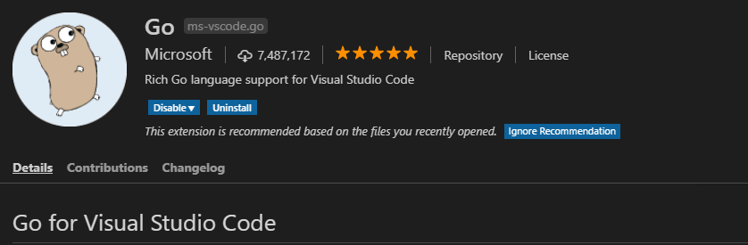
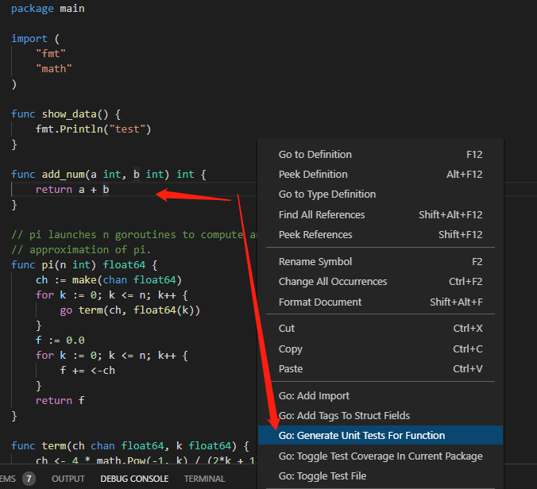

+++
title = "Golang UnitTest单元测试"
date = "2019-05-18T13:47:08+02:00"
tags = ["golang", "test"]
categories = ["golang"]
banner = "img/banners/golang.jpg"
draft = false
author = "helight"
authorlink = "https://helight.cn"
summary = "Golang UnitTest单元测试"
keywords = ["golang", "UnitTest"]
+++

# Golang UnitTest单元测试

单元测试是程序开发者适用一段代码来验证另外一段代码写的是否符合预期的一种相对高效的自我测试方法。

对于程序开发来说，经过长期的积累和方法总结，单元测试是一种比较好的开发程序验证方式，但是单元测试却是在正真的软件开发之外要写的额外的代码，而且编写和管理维护都有比较大的成本。但是单元测试确实能够提高程序开发的质量，所以基本上各种语言都有相应的单元测试框架来支持更为方便编写和管理单元测试。

golang也是一样，不过golang的测试框架的支持是自生就提供了，不像C/C++，php等语言的单元测试框架需要第三方提供和安装。golang你在安装了其开发编译环境之后就自然包含了单元测试的框架。今天这里就来简单说明一下golang的单元测试框架的适用。

## golang UnitTest的书写规范和简单适用
### 规范
Golang单元测试对文件名和方法名，参数都有很严格的要求。

　　例如：

    1. 单元测试文件名必须以xxx_test.go命名
    2. 方法必须是TestXxx开头
    3. 方法参数必须 t *testing.T
    4. 测试文件和被测试文件必须在一个包中
### 示例
这是我在我的小项目[设计模式golang实现](https://github.com/helight/go-patterns)中的一个[例子](https://github.com/helight/go-patterns/blob/master/src/creational/01_factory)，另外这里说明一下：一般情况下单元测试文件和被测试文件是放到同一个目录的。
``` go
import (
	"fmt"
	"testing"
)

func TestFactory(t *testing.T) {
	shapeFactory := ShapeFactory{}

	rectangle := shapeFactory.Produce("rectangle")
	if rectangle != nil {
		rectangle.Draw()
	}

	errshape := shapeFactory.Produce("cricle")
	if errshape == nil {
		fmt.Println("errshape")
	}
}
```
这样的来编写单元测试是不是很方便呀！
### 运行单元测试
这里也可以参考一下我的小项目[设计模式golang实现](https://github.com/helight/go-patterns)中的[Makefile](https://github.com/helight/go-patterns/blob/master/makefile) 运行非常简单。
``` sh
go test -v creational/01_factory/ 
```
这里加v参数是为了输出更多的信息,  可以把print的信息和一些测试信息都能比较详细的输出


## golang单元测试进阶
### go test参数帮助
这里给大家介绍与喜爱go test的帮助适用，golang这方面做的还是非常不错的，主要涉及两个命令：
#### 命令1：go help test
``` sh
$ go help test
usage: go test [build/test flags] [packages] [build/test flags & test binary flags]

'Go test' automates testing the packages named by the import paths.
It prints a summary of the test results in the format:

        ok   archive/tar   0.011s
        FAIL archive/zip   0.022s
        ok   compress/gzip 0.033s
        ...
...
```
#### 命令2: go help packages
一般情况下整个命令用的比较少。
```
$ go help packages
Many commands apply to a set of packages:

        go action [packages]

Usually, [packages] is a list of import paths.
```
#### 命令3：go help testflag
```
$ go help testflag
The 'go test' command takes both flags that apply to 'go test' itself
and flags that apply to the resulting test binary.
...
```
下面是常用的一些flags
-test.v : 是否输出全部的单元测试用例（不管成功或者失败），默认没有加上，所以只输出失败的单元测试用例。

-test.run pattern: 只跑哪些单元测试用例

-test.bench patten: 只跑那些性能测试用例

-test.benchmem : 是否在性能测试的时候输出内存情况

-test.benchtime t : 性能测试运行的时间，默认是1s

-test.cpuprofile cpu.out : 是否输出cpu性能分析文件

-test.memprofile mem.out : 是否输出内存性能分析文件

-test.blockprofile block.out : 是否输出内部goroutine阻塞的性能分析文件

# golang & vs code

使用过那么多编辑器之后发现只有vim和vs code最好用，vs code在图形化编码工具中目前我认为是最好的，vim是命令行编辑器中最好的。目前也是使用vs code来编写markdown文件的。这里不是重点，重点看下面的。

## 安装go插件 
启动vscode选择插件->搜go选择Go for Visual Studio Code插件点击安装即可。如图： 

## 配置vscode

settins.json 基本上不需要配置，用默认值就可以了。如需调整 文件 -->首选项 -->设置 输入go即可查看go相关配置，以下是我的配置，不过一般情况下无需修改配置，也可以自己多设置一点
``` ini
    "go.goroot": "C:\\Go",
    "go.gopath": "${workspaceRoot};D:\\go4\\go_thirdpaty",
    "go.buildFlags": [],
    "go.lintFlags": [],
    "go.coverOnSave": false,
    "go.useCodeSnippetsOnFunctionSuggest": false,
    "go.formatTool": "goreturns",
    "go.gocodeAutoBuild": false,
    "go.toolsGopath": "D:\\go4\\tools",
```
## vscode中怎么开发单元测试
### 自动生成ut文件
``` go
// datacal.go
package main

func add_num(a int, b int) int {
	return a + b
}
```
例如有上面的文件，在vs安装了go工具之后，我们在add_num整个函数内点击右键，选择为该函数生成单元测试即可，如下图

第一次适用的时候会安装相应的一个小组件，安装之后既可以适用了，上面的代码用该方式自动生成的单元测试文件如下：
``` go
// datacal.go

package main

import "testing"

func Test_add_num(t *testing.T) {
	type args struct {
		a int
		b int
	}
	tests := []struct {
		name string
		args args
		want int
	}{
                // TODO: Add test cases.
                {"1 + 1", args{1, 1}, 2}, // 自己添加的测试用例数据
		{"1 + 2", args{1, 2}, 3}, // 自己添加的测试用例数据
		{"1 + 3", args{1, 3}, 4}, // 自己添加的测试用例数据
	}
	for _, tt := range tests {
		t.Run(tt.name, func(t *testing.T) {
			if got := add_num(tt.args.a, tt.args.b); got != tt.want {
				t.Errorf("add_num() = %v, want %v", got, tt.want)
			}
		})
	}
}
```
### 运行测试
``` sh
helightxu@helightxu-NB0 MINGW64 /d/code_dev/heliht_github/helight_code/go_code/go_test2 (master)
$ go test -v
=== RUN   Test_add_num
=== RUN   Test_add_num/1_+_1
=== RUN   Test_add_num/1_+_2
=== RUN   Test_add_num/1_+_3
--- PASS: Test_add_num (0.00s)
    --- PASS: Test_add_num/1_+_1 (0.00s)
    --- PASS: Test_add_num/1_+_2 (0.00s)
    --- PASS: Test_add_num/1_+_3 (0.00s)
PASS
ok      _/d_/code_dev/heliht_github/helight_code/go_code/go_test2       0.315s
```
这里我们也可以这样来跑：指定函数执行，很多时候测试用例多的时候修改了一个就想执行这一个，这个就很有用了。
``` sh
$ go test -run add_num -v
=== RUN   Test_add_num
=== RUN   Test_add_num/1_+_1
=== RUN   Test_add_num/1_+_2
=== RUN   Test_add_num/1_+_3
--- PASS: Test_add_num (0.00s)
    --- PASS: Test_add_num/1_+_1 (0.00s)
    --- PASS: Test_add_num/1_+_2 (0.00s)
    --- PASS: Test_add_num/1_+_3 (0.00s)
PASS
ok      _/d_/code_dev/heliht_github/helight_code/go_code/go_test2       0.265s
```

## 单元测试关键点
### 测试数据构造
单元测试的一个重点就是测试数据的构造，在测试数据构造时要考虑这样几个方面：

1. 正常输入，整个必不可少，至少验证函数的正常逻辑是否通过
2. 边界输入，这个主要验证在极端情况下的输入，函数是否在有相应的容错处理
3. 非法输入，对于一些非正常输入，我们要看函数是否处理，会不引起函数的奔溃和数据泄露等问题
4. 白盒覆盖，白盒覆盖就要设计了，要设计一些用力，能够覆盖到函数的所有代码，这里主要考虑：语句覆盖、条件覆盖、分支覆盖、分支/条件覆盖、条件组合覆盖。

### 编写原则
单元测试是要写额外的代码的，这对开发同学的也是一个不小的工作负担，在一些项目中，我们合理的评估单元测试的编写，我认为我们不能走极端，当然理论上来说全写肯定时好的，但是从成本，效率上来说我们必须做出权衡。所以这里给出一些衡量的原则
1. 优先编写核心组件和逻辑模块的测试用例
2. 逻辑类似的组件如果存在多个，优先编写其中一种逻辑组件的测试用例
3. 发现Bug时一定先编写测试用例进行Debug
4. 关键util工具类要编写测试用例，这些util工具适用的很频繁，所以这个原则也叫做热点原则，和第1点相呼应。
5. 测试用户应该独立，一个文件对应一个，而且不同的测试用例之间不要互相依赖。
6. 测试用例的保持更新。

## Benchmark测试
### 介绍
最后这里简单也说以下go中benchmark的测试，这个先对比较简单，主要针对cpu类型或者内存类型的计算进行性能测试的一种方式，有时也用在io上，但是io在单元测试中是比较敏感的，一般磁盘io和远程网络io很少做benchmark测试。

benchmark的测试函数形式时这样的:
1. 函数是以Benchmark开头
2. 参数是*testing.B和普通单元测试的不一样哈（t *testing.T)）。
```
func BenchmarkXxx(b *testing.B)
```
### 测试用例示例
在上面的例子基础上增加一个benchmark的测试：
```
func Benchmark_add_num(b *testing.B) {
	sum := 0
	for i := 0; i < b.N; i++ {
        sum = add_num(1343, 434)
	}
	b.Log(sum)
}
```
这里可以看到b.N这个参数，这个数据是go自己预测的一个值，目标是有足够的测试来观察。
### 运行benchmark测试
``` sh
$ go test -v -run="none" -bench=. -benchmem
goos: windows
goarch: 386
Benchmark_add_num-4     2000000000               0.90 ns/op            0 B/op          0 allocs/op
--- BENCH: Benchmark_add_num-4
    datacal_test.go:37: 1777
    datacal_test.go:37: 1777
    datacal_test.go:37: 1777
    datacal_test.go:37: 1777
    datacal_test.go:37: 1777
    datacal_test.go:37: 1777
PASS
ok      _/d_/code_dev/heliht_github/helight_code/go_code/go_test2       3.870s
```
这不允许单元测试，运行所有的基准测试，-bench可以指定函数名，支持正则。

-benchmem 表示分配内存的次数和字节数
## 其它
这里没有介绍golang的cover，内存，cpu分析，还有mock等测试方式，留作以后再介绍。想在下一篇中写写mock测试，尤其golang开发中的。

## 参考链接
go testing: http://docs.studygolang.com/pkg/testing/
https://github.com/golang/go/wiki

<center>
看完本文有收获？请分享给更多人

关注「黑光技术」，关注大数据+微服务


</center>