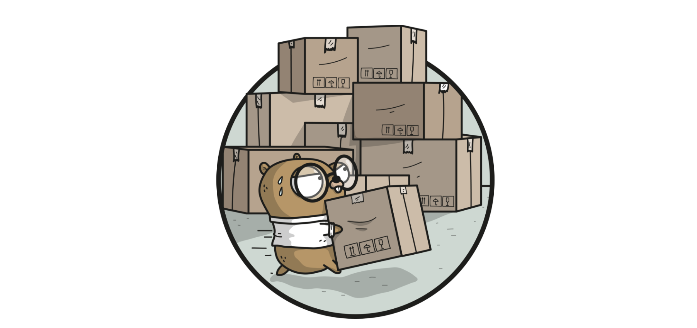

+++
title = "Golang官方依赖管理工具：dep"
date = "2019-05-18T13:47:08+02:00"
tags = ["golang"]
categories = ["golang"]
banner = "img/banners/golang.jpg"
draft = false
author = "helight"
authorlink = "https://helight.cn"
summary = "Golang官方依赖管理工具：dep"
keywords = ["golang","dep", "godep"]
+++

# Golang官方依赖管理工具：dep

今天在看一个内部项目的时候发现内部一个项目的体积非常大，一看原来是vendor占了很大空间。里面的库都是静态提交到git库的，更新和管理都很不方便，想想java开发中的maven多好用啊。之前也知道golang一直在开发类似的东西，借这个机会了解了一下，golang也已经有了这样的工具了：godep。所以赶紧拿来研究一下看看怎么用起来，用了之后发现，哎，还挺好用的。管理起来非常便捷，不过要吐槽的还是公司的网络环境，好蛋疼啊！

godep是Golang官方的库依赖管理工具，用来管理和下载项目中依赖的库，从目前使用来说，还是比较好的，在分支，版本的控制上都还不错，就是它的配置文件感觉有点原始。下面是是官方对这个工具的介绍。
```
dep is a prototype dependency management tool for Go. It requires Go 1.9 or newer to compile. dep is safe for production use.
```
接下来我们就看看怎么使用这个工具，先从简单的来。
## 安装dep
``` sh
go get -u github.com/golang/dep/cmd/dep
```
一般是安装在这个地方：
```
# $GOPATH/bin/dep.exe
```
## 测试
```sh
$ dep
Dep is a tool for managing dependencies for Go projects

Usage: "dep [command]"

Commands:

  init     Set up a new Go project, or migrate an existing one
  status   Report the status of the project's dependencies
  ensure   Ensure a dependency is safely vendored in the project
  version  Show the dep version information
  check    Check if imports, Gopkg.toml, and Gopkg.lock are in sync

Examples:
  dep init                               set up a new project
  dep ensure                             install the project's dependencies
  dep ensure -update                     update the locked versions of all dependencies
  dep ensure -add github.com/pkg/errors  add a dependency to the project

Use "dep help [command]" for more information about a command.

helightxu@helightxu-NB0 MINGW64 /d/code_dev/src/godepmod
```
## 使用
在$GOPATH/src下创建项目，比如godepdemo，进入文件夹
``` sh
cd $GOPATH/src/godepdemo
```
### 初始化目录
``` sh
helightxu@helightxu-NB0 MINGW64 /d/code_dev/src/godepdemo
$ dep init

helightxu@helightxu-NB0 MINGW64 /d/code_dev/src/godepdemo
$ ls
Gopkg.lock  Gopkg.toml  vendor
```
这里生成了2个文件和一个文件夹。

vendor应该都不陌生了,vendor 目录是 golang1.5 以后依赖管理目录，类似node中的node_module目录。其实在最新版本的go中已经可以废弃了，尤其适用了dep管理依赖之后，不过也兼容，目前还是优先使用vendor目录中的依赖库，这个目录的依赖代码是优先加载的。

Gopkg.toml简单讲是依赖库的清单文件，Gopkg.lock是校验描述文件。Gopkg.toml 是依赖管理的核心文件，可以生成也可以手动修改，[Gopkg.toml 官方文档](https://golang.github.io/dep/docs/Gopkg.toml.html)
Gopkg.lock 是生成的文件，不要手工修改 [Gopkg.lock 官方文档](https://golang.github.io/dep/docs/Gopkg.lock.html)

下面我们在Gopkg.toml文件中添加依赖库测试一下，这里以试用gin库为例来做一个测试。
Gopkg.toml的内容
```
# Gopkg.toml example
#
# Refer to https://golang.github.io/dep/docs/Gopkg.toml.html
# for detailed Gopkg.toml documentation.
#
# required = ["github.com/user/thing/cmd/thing"]
# ignored = ["github.com/user/project/pkgX", "bitbucket.org/user/project/pkgA/pkgY"]
#
# [[constraint]]
#   name = "github.com/user/project"
#   version = "1.0.0"
#
# [[constraint]]
#   name = "github.com/user/project2"
#   branch = "dev"
#   source = "github.com/myfork/project2"
#
# [[override]]
#   name = "github.com/x/y"
#   version = "2.4.0"
#
# [prune]
#   non-go = false
#   go-tests = true
#   unused-packages = true

[[constraint]]
  name = "github.com/gin-gonic/gin"
  version = "v1.3.0"

[[constraint]]
  name = "github.com/cihub/seelog"
  version = "v2.6"

[prune]
  go-tests = true
  unused-packages = true
```
### 再来写一个测试程序
main.go
``` go
package main

import ( 
	"github.com/gin-gonic/gin"
	"github.com/cihub/seelog"
)

func main() {
	r := gin.Default()
	r.GET("/ping", func(c *gin.Context) {
		c.JSON(200, gin.H{
			"message": "pong",
		})
	})
	seelog.Info("app run ")
	r.Run() // listen and serve on 0.0.0.0:8080
	seelog.Info("app over")
}
```
### 更新试用
``` sh
helightxu@helightxu-NB0 MINGW64 /d/code_dev/src/godepdemo
$ dep ensure

helightxu@helightxu-NB0 MINGW64 /d/code_dev/src/godepdemo
$ go run main.go
```
## 常用命令和一些问题
### dep init
初始化项目，主要是生成Gopkg.lock，Gopkg.toml，vendor这三个文件。
### dep status
用来查看项目依赖的详细信息和状态，非常清晰,
```
$ dep status
PROJECT                              CONSTRAINT     VERSION        REVISION  LATEST   PKGS USED
github.com/cihub/seelog              ^2.6.0         v2.6           d2c6e5a   v2.6     1
github.com/gin-contrib/sse           branch master  branch master  22d885f   22d885f  1
github.com/gin-gonic/gin             ^1.3.0         v1.3.0         b869fe1   v1.3.0   4
github.com/golang/protobuf           v1.2.0         v1.2.0         aa810b6   v1.2.0   1
github.com/json-iterator/go          v1.1.5         v1.1.5         1624edc   v1.1.5   1
github.com/mattn/go-isatty           v0.0.4         v0.0.4         6ca4dbf   v0.0.4   1
github.com/modern-go/concurrent      1.0.3          1.0.3          bacd9c7   1.0.3    1
github.com/modern-go/reflect2        1.0.1          1.0.1          4b7aa43   1.0.1    1
github.com/ugorji/go                 v1.1.1         v1.1.1         b4c50a2   v1.1.1   1
```
CONSTRAINT为Gopkg.toml中限定的版本；
VERSION为当前vendor中的版本；
REVISION为当前vendor中的修订号；
LATEST为CONSTRAINT限定下github中能满足要求的最新版本。

### dep ensure
用来同步包的配置文件和引入的包，建议使用的时候加上'-v'参数
```
dep ensure -v
```
尝试确保所有的依赖库都已经安装，如果没有即下载，相当于对依赖库做增量更新。修改Gopkg.toml中的CONSTRAINT，若使得LATEST低于当前vendor中的版本，则运行dep ensure后，vendor中的版本降低到能满足要求的最新版本；若使得LATEST高于vendor中的版本，则运行dep ensure后，vendor中的版本不变，可使用dep ensure -update更新vendor到LATEST版本。
### dep prune -v
删除没有用到的 package
### dep help ensure
依赖管理帮助
### dep ensure -add github.com/cihub/seelog
添加一条依赖
### dep ensure -add github.com/cihub/seelog@=2.6.0
这里 @= 参数指定的是 某个 tag
### dep ensure
添加后一定记住执行 确保 同步
### dep ensure -update -v
更新依赖
### 本地缓存
当然dep不会每次都去下载，其工作原理和Mevan一样，会优先在本地仓库搜索，本地仓库未找到即在网络上下载，并添加到本地仓库。下面是dep保存本地库的路劲。
```
$GOPATH/pkg/dep/sources
```
## 总结
这种方式来管理依赖包，还是比较方便的。在我测试的过程中一气呵成，没有任何阻碍，整体感觉非常流畅也很好用，和maven的管理比较类似。

<center>
看完本文有收获？请分享给更多人

关注「黑光技术」，关注大数据+微服务


</center>