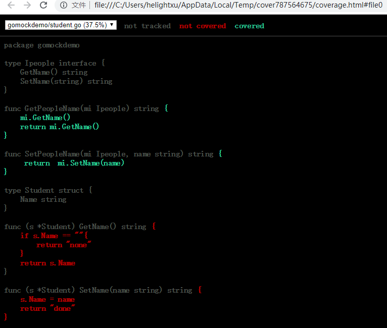

+++
title = "golang单元测试之mock "
date = "2019-05-18T13:47:08+02:00"
tags = ["golang", "test"]
categories = ["golang"]
banner = "img/banners/golang.jpg"
draft = false
author = "helight"
authorlink = "https://helight.cn"
summary = "golang单元测试之mock "
keywords = ["golang","mock", "UnitTest"]
+++

# golang单元测试之mock 

# 序言
前面介绍了golang的一般单元测试，以及如何使用vscode进行高效的go单元测试开发。同时也说过一般单元测试重点在于cpu和内存类型的测试，而对io类型的测试是比较敏感的。那么针对这类测试就没法做单元测试了吗？有的，肯定是有的，这就是mock技术。

mock测试不但可以支持io类型的测试，比如：数据库，网络API请求，文件访问等。mock测试还可以做为未开发服务的模拟、服务压力测试支持、对未知复杂的服务进行模拟，比如开发阶段我们依赖的服务还没有开发好，那么就可以使用mock方法来模拟一个服务，模拟的这个服务接收的参数和返回的参数和规划设计的服务是一致的，那我们就可以直接使用这个模拟的服务来协助开发测试了；再比如要对服务进行压力测试，这个时候我们就要把服务依赖的网络，数据等服务进行模拟，不然得到的结果不纯粹。总结一下，有以下几种情况下使用mock会比较好：
1. IO类型的，本地文件，数据库，网络API，RPC等
2. 依赖的服务还没有开发好，这时候我们自己可以模拟一个服务，加快开发进度提升开发效率
3. 压力性能测试的时候屏蔽外部依赖，专注测试本模块
4. 依赖的内部函数非常复杂，要构造数据非常不方便，这也是一种

mock测试，简单来说就是通过对服务或者函数发送设计好的参数，并且通过构造注入期望返回的数据来方便以上几种测试开发。

一般情况自己写mock服务是比较费事的事情，而且如果风格不统一，那么后期的管理维护将是软件开发的一个巨大坑，是开发给自己挖的一个坑。所以在就有了很多mock测试框架的出现，框架的出现首先提升了编写mock测试服务的效率，而且编写风格得到了比较好的统一。c/c++也有很多mock框架，Google Mock就是一个比较经典了，java也有很多mock框架，这里就不列举了，今天我们要介绍的是针对golang的mock测试框架。

GoMock是由Golang官方开发维护的测试框架，实现了较为完整的基于interface的Mock功能，能够与Golang内置的testing包良好集成，也能用于其它的测试环境中。GoMock测试框架包含了GoMock包和mockgen工具两部分，其中GoMock包完成对桩对象生命周期的管理，mockgen工具用来生成interface对应的Mock类源文件。

# 安装
## GoMock官网：
https://github.com/golang/mock

## GoMock安装：
```
go get github.com/golang/mock/gomock
```
## mockgen代码生成工具安装：
```
go get github.com/golang/mock/mockgen
```
安装好之后，在$GOPATH/src目录下有了github.com/golang/mock子目录，且在该子目录下有GoMock包和mockgen工具。

```
cd $GOPATH/src/github.com/golang/mock/mockgen
go build
```
编译后在这个目录下会生成了一个可执行程序mockgen。将mockgen程序移动到$PATH可以找到的目录中：
下面我是在window下的路径，使用了git的shell环境，可以直接看PATH，找到合适的或者新加入进去都ok。
```
echo $PATH
.....
cp mockgen.exe C:\Users\helightxu\go\bin\
```
安装之后就可以在命令行直接运行了：mockgen
```
$ mockgen
mockgen has two modes of operation: source and reflect.

Source mode generates mock interfaces from a source file.
It is enabled by using the -source flag. Other flags that
may be useful in this mode are -imports and -aux_files.
Example:
        mockgen -source=foo.go [other options]
......
```
这里暂时先不细说。
## GoMock文档：

GoMock框架安装完成后，可以使用go doc命令来获取文档：
```
go doc github.com/golang/mock/gomock
```
这个文件比较简短，但给出了核心的使用说明。
在GoPkgDoc上也有一个[网页版的文档](https://godoc.org/github.com/golang/mock/gomock)

# 使用方式介绍
## mockgen模式介绍
mockgen有两种操作模式：source和reflect。

Source模式下会从源文件产生mock的interfaces文件。 使用-source参数即可。和这个模式配套使用的参数常有-imports和-aux_files。
```
mockgen -source=foo.go [other options]
```
Reflect模式是通过反射的方式来生成mock interfaces。它只需要两个非标志性参数：import路径和需要mock的interface列表，列表使用逗号分割。

例如：
```
mockgen database/sql/driver Conn,Driver
```
## 基本参数介绍
mockgen命令可以把一个包含要Mock的interface的源文件生成一个mock类的源文件。mockgen支持的参数有以下几种：

* -source: 需要mock的文件，这个文件中有需要mock的接口
* -destination: 生成mock代码的文件名。如果你没有设置，生成的代码会被打印到标准输出
* -package: 指定生成的mock文件的包名。如果你没有设置，则包名由mock_和输入文件的包名级拼接而成
* -imports: 生成代码中需要import的包名，形式如foo=bar/baz，并且用逗号分隔。bar/baz是要import的包，foo这个生成的源文件中包的标识。
* -aux_files: 参看附加的文件列表是为了解析类似嵌套的定义在不同文件中的interface。指定元素列表以逗号分隔，元素形式为* foo=bar/baz.go，其中bar/baz.go是源文件，foo是-source选项指定的源文件用到的包名
* -build_flags: 这个参数只在reflect模式下使用，用于go build的时候使用
* -imports: 依赖的需要import的包
* -mock_names：自定义生成mock文件的列表，使用逗号分割。如Repository=MockSensorRepository,Endpoint=MockSensorEndpoint。
Repository、Endpoint为接口，MockSensorRepository，MockSensorEndpoint为相应的mock文件。

在简单的场景下，你将只需使用-source选项。在复杂的情况下，比如一个文件定义了多个interface而你只想对部分interface进行mock，或者interface存在嵌套，这时你需要用反射模式。由于 -destination 选项输入太长，笔者一般不使用该标识符，而使用重定向符号 >，并且mock类代码的输出文件的路径必须是绝对路径。

想了解更多的指令符，可参见[官方文档](https://github.com/golang/mock#running-mockgen)

## mockgen工作模式适用场景
mockgen工作模式适用场景如下：
1. 对于简单场景，只需使用-source选项。
2. 对于复杂场景，如一个源文件定义了多个interface而只想对部分interface进行mock，或者interface存在嵌套，则需要使用反射模式。

# 测试示例
## 目录结构
```
D:\CODE_DEV\SRC\GOMOCKDEMO
│  student.go
│  student_test.go
│
└─mock
        mock_people.go
```
## 定义一个接口

我们先定义一个打算mock的接口Repository:
``` go
package gomockdemo

type Ipeople interface {
    GetName() string
    SetName(string) string
}

func GetPeopleName(mi Ipeople) string {
    mi.GetName()
    return mi.GetName()
}

func SetPeopleName(mi Ipeople, name string) string {
     return  mi.SetName(name)
}
```
## 生成mock类文件
```
$ mockgen gomockdemo Ipeople > mock/mock_people.go
```
这里需要注意几点：
1. mock_people.go文件的mock文件夹，必须先创建好，否则会失败
2. go_mock一定在$GOPATH/src/的目录下
生成后的文件如下：
``` go
// Code generated by MockGen. DO NOT EDIT.
// Source: gomockdemo (interfaces: Ipeople)

// Package mock_gomockdemo is a generated GoMock package.
package mock_gomockdemo

import (
	gomock "github.com/golang/mock/gomock"
	reflect "reflect"
)

// MockIpeople is a mock of Ipeople interface
type MockIpeople struct {
	ctrl     *gomock.Controller
	recorder *MockIpeopleMockRecorder
}

// MockIpeopleMockRecorder is the mock recorder for MockIpeople
type MockIpeopleMockRecorder struct {
	mock *MockIpeople
}

// NewMockIpeople creates a new mock instance
func NewMockIpeople(ctrl *gomock.Controller) *MockIpeople {
	mock := &MockIpeople{ctrl: ctrl}
	mock.recorder = &MockIpeopleMockRecorder{mock}
	return mock
}

// EXPECT returns an object that allows the caller to indicate expected use
func (m *MockIpeople) EXPECT() *MockIpeopleMockRecorder {
	return m.recorder
}

// GetName mocks base method
func (m *MockIpeople) GetName() string {
	m.ctrl.T.Helper()
	ret := m.ctrl.Call(m, "GetName")
	ret0, _ := ret[0].(string)
	return ret0
}

// GetName indicates an expected call of GetName
func (mr *MockIpeopleMockRecorder) GetName() *gomock.Call {
	mr.mock.ctrl.T.Helper()
	return mr.mock.ctrl.RecordCallWithMethodType(mr.mock, "GetName", reflect.TypeOf((*MockIpeople)(nil).GetName))
}

// SetName mocks base method
func (m *MockIpeople) SetName(arg0 string) string {
	m.ctrl.T.Helper()
	ret := m.ctrl.Call(m, "SetName", arg0)
	ret0, _ := ret[0].(string)
	return ret0
}

// SetName indicates an expected call of SetName
func (mr *MockIpeopleMockRecorder) SetName(arg0 interface{}) *gomock.Call {
	mr.mock.ctrl.T.Helper()
	return mr.mock.ctrl.RecordCallWithMethodType(mr.mock, "SetName", reflect.TypeOf((*MockIpeople)(nil).SetName), arg0)
}
```

## 测试用例
编写测试用例有一些基本原则，我们一起回顾一下：

1. 每个测试用例只关注一个问题，不要写大而全的测试用例
2. 测试用例是黑盒的
3. 测试用例之间彼此独立，每个用例要保证自己的前置和后置完备
4. 测试用例要对产品代码非入侵
``` go
package gomockdemo

import (
	"fmt"
	"testing"
	"github.com/golang/mock/gomock"
	"gomockdemo/mock"
)

func TestGetPeopleName(t *testing.T) {
	mockCtl := gomock.NewController(t)
    defer mockCtl.Finish()
    // 构造mock类， mock_gomockdemo就是生成的mock代码，以包的形式存在
    mockpeople := mock_gomockdemo.NewMockIpeople(mockCtl)   
    //注入期望的返回值
    mockpeople.EXPECT().GetName().Return("helight")
    mockpeople.EXPECT().GetName().Return("helight")
	
    mockedName := GetPeopleName(mockpeople)
    if "helight" != mockedName {
        t.Error("Get wrong name1: ", mockedName)
    }

    //指定输入参数，返回指定结果
	mockpeople.EXPECT().SetName(gomock.Eq("he")).Return("ok")
    //输出参不做指定，但是指定返回结果
    mockpeople.EXPECT().SetName(gomock.Any()).Do(func(format string) {    
        fmt.Println("recv param2 :", format)
    }).Return("ok1")

    mockedSetName := SetPeopleName(mockpeople,"he")
    fmt.Println("mockedSetName: ", mockedSetName)
    if "ok" != mockedSetName{
        t.Error("Set wrong name2: ", mockedSetName)
    }

    mockedSetName = SetPeopleName(mockpeople,"al222")
    fmt.Println("mockedSetName: ", mockedSetName)
    if "ok1" != mockedSetName{
        t.Error("Set wrong name2: ", mockedSetName)
    }    
}
```
* gomock.NewController：返回gomock.Controller，它代表 mock 生态系统中的顶级控件。定义了 mock 对象的范围、生命周期和* 期待值。另外它在多个 goroutine 中是安全的
* mockpeople := mock_gomockdemo.NewMockIpeople(mockCtl) // 构造mock实例， mock_gomockdemo就是生成的mock代码，以包的形式存在     
* defer mockCtl.Finish() 关闭mock测试
* mockpeople.EXPECT().GetName().Return("helight") ：EXPECT()是期望拿到返回值，调用的方法是GetName，设定的返回值是“helight”，调用函数也可以指定参数，比如下面的mockpeople.EXPECT().SetName(gomock.Eq("he")).Return("ok")
* mockedSetName := SetPeopleName(mockpeople,"he")，这里SetPeopleName函数是调用people类的函数，这时候我们传递mockpeople给SetPeopleName就可以测试了，SetPeopleName内部调用的mockpeople和调用真实的people的方式是一模一样的。

## 测试结果
``` sh
$ go test -v
=== RUN   TestGetPeopleName
gomock.Any:  is anything
gomock.Eq:  is equal to he
gomock.Any:  is anything
mockedSetName:  ok
recv param2 : al222
mockedSetName:  ok1
--- PASS: TestGetPeopleName (0.00s)
PASS
ok      gomockdemo      0.485s
```
到此，我们的mock测试就算是ok了，可以再增加一些测试用例和测试值。
## 测试覆盖率 
这里在介绍一下另外一个简单的测试功能，测试覆盖率的测试cover，只要在go test后面加上-cover就可以了，如下面的例子，这里还加了一个参数-coverprofile=cover.out，这个参数是把覆盖率测试数据导出到cover.out这个文件，然后我们可以使用图形化的方式来看具体的测试覆盖情况。
```
$ go test -v  -cover -coverprofile=cover.out
=== RUN   TestGetPeopleName
gomock.Any:  is anything
gomock.Eq:  is equal to he
gomock.Any:  is anything
mockedSetName:  ok
recv param2 : al222
mockedSetName:  ok1
--- PASS: TestGetPeopleName (0.00s)
PASS
coverage: 100.0% of statements
ok      gomockdemo      0.403s
```
运行下面这个工具就可以直接把覆盖率以网页的形式打开来看了。
```
go tool cover -html=cover.out
```


# gomock的其它用法
## 常用 mock 方法
### 调用方法
* Call.Do()：声明在匹配时要运行的操作
* Call.DoAndReturn()：声明在匹配调用时要运行的操作，并且模拟返回该函* 数的返回值
* Call.MaxTimes()：设置最大的调用次数为 n 次
* Call.MinTimes()：设置最小的调用次数为 n 次
* Call.AnyTimes()：允许调用次数为 0 次或更多次
* Call.Times()：设置调用次数为 n 次
这里我展开分析了一下，其实gomock的实现上是这样的，以这个为例：
``` go
 mockpeople.EXPECT().GetName().Return("helight")
```
mockpeople的EXPECT方法如下：都在生成的mock文件中。
``` go
// EXPECT returns an object that allows the caller to indicate expected use
func (m *MockIpeople) EXPECT() *MockIpeopleMockRecorder {
	return m.recorder
}
```
m.recorder是这个
``` go
// NewMockIpeople creates a new mock instance
func NewMockIpeople(ctrl *gomock.Controller) *MockIpeople {
	mock := &MockIpeople{ctrl: ctrl}
	mock.recorder = &MockIpeopleMockRecorder{mock}
	return mock
}
```
所以这里调用的就是MockIpeopleMockRecorder的GetName方法。这个函数如下：
``` go
func (mr *MockIpeopleMockRecorder) GetName() *gomock.Call {
	mr.mock.ctrl.T.Helper()
	return mr.mock.ctrl.RecordCallWithMethodType(mr.mock, "GetName", reflect.TypeOf((*MockIpeople)(nil).GetName))
}

```
RecordCallWithMethodType是mock.ctrl的方法，这个方法是在gomock库里面的controller.go文件中，在看一下这个函数的实现：
``` go
// RecordCallWithMethodType is called by a mock. It should not be called by user code.
func (ctrl *Controller) RecordCallWithMethodType(receiver interface{}, method string, methodType reflect.Type, args ...interface{}) *Call {
	ctrl.T.Helper()

	call := newCall(ctrl.T, receiver, method, methodType, args...)

	ctrl.mu.Lock()
	defer ctrl.mu.Unlock()
	ctrl.expectedCalls.Add(call)

	return call
}
```
这里看到，其实就是在ctrl.expectedCalls中把新生成函数按照函数名，参数等生成一个call，在call.go中就有Return、Do、Times等函数。这里看一些简单的例子，有兴趣的同学可以继续深入看看call.go这个文件。
``` go
// AnyTimes allows the expectation to be called 0 or more times
func (c *Call) AnyTimes() *Call {
	c.minCalls, c.maxCalls = 0, 1e8 // close enough to infinity
	return c
}

// MinTimes requires the call to occur at least n times. If AnyTimes or MaxTimes have not been called, MinTimes also
// sets the maximum number of calls to infinity.
func (c *Call) MinTimes(n int) *Call {
	c.minCalls = n
	if c.maxCalls == 1 {
		c.maxCalls = 1e8
	}
	return c
}

// MaxTimes limits the number of calls to n times. If AnyTimes or MinTimes have not been called, MaxTimes also
// sets the minimum number of calls to 0.
func (c *Call) MaxTimes(n int) *Call {
	c.maxCalls = n
	if c.minCalls == 1 {
		c.minCalls = 0
	}
	return c
}
```
### 参数匹配
* gomock.Any()：匹配任意参数值
* gomock.Eq()：指定参数
* gomock.Nil()：返回nil

### 行为调用的保序
* gomock.InOrder：声明指定了调用顺序
默认情况下，行为调用顺序可以和mock对象行为注入顺序不一致，即不保序。如果要保序，有两种方法：
1. 通过After关键字来实现保序
2. 通过InOrder关键字来实现保序
``` go
	// call := mockpeople.EXPECT().GetName().Return("helight1")
    // mockpeople.EXPECT().GetName().Return("helight").After(call)   
    // gomock.InOrder(
        mockpeople.EXPECT().GetName().Return("helight")
        mockpeople.EXPECT().GetName().Return("helight")
    // )
```
### 建议更多的方法可参见 官方文档
参见[官方文档](https://github.com/golang/mock#running-mockgen)

# 总结
gomock是单元测试的升级，帮助我们可以把之前无法做单元测试又非常重要的模块能够进行单元测试。gomock整体功能还是非常强大的，更多的功能可以在实际使用中不断熟悉，另外也可以多看看官方文档和gomock的源码。

# 参考
1. https://github.com/golang/mock


本文详细阐述了GoMock框架的使用方法，不但结合例子给出了标准用法，而且列出了很多要点，最后通过一个简单的测试Demo说明了GoConvey + GoStub + GoMock组合使用的正确姿势。希望读者举一反三，同时将前面三篇的核心内容融入进来，写出高质量的测试代码，最终提升产品质量。

至此，我们已经知道：

1. 全局变量可通过GoStub框架打桩
2. 过程可通过GoStub框架打桩
3. 函数可通过GoStub框架打桩
4. interface可通过GoMock框架打桩

于是问题来了，方法通过神马打桩？
或许有好的解决方案，但由于笔者才疏学浅，目前还没有想到成熟的解决方案，只能尽量弱化方法调用对单元测试的影响。如果方法的调用层次很深，而且中间层都是方法，则可能导致打桩的复杂度比较高，这时需要在适当的层次引入interface，以便单元测试时通过对interface打桩将调用链从中间截断，从而有效降低打桩的复杂度。


<center>
看完本文有收获？请分享给更多人

关注「黑光技术」，关注大数据+微服务


</center>