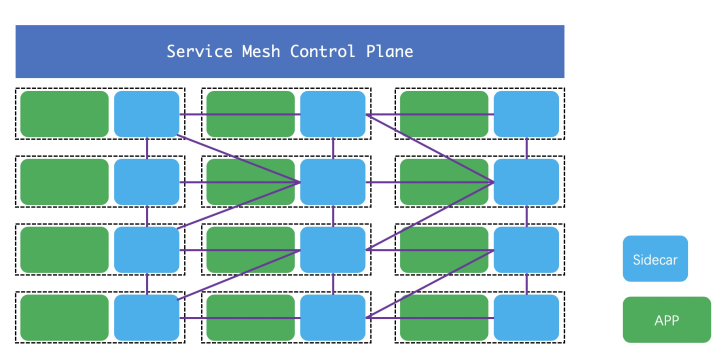
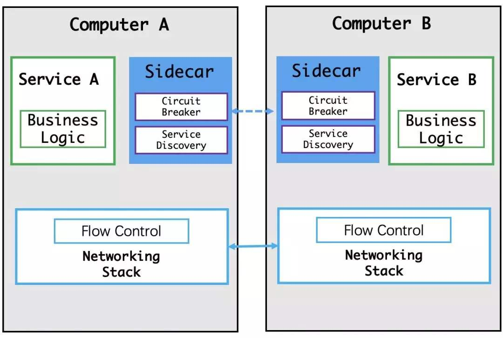
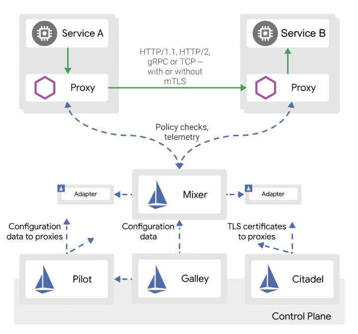

+++
title = "什么是ServiceMesh"
date = "2019-12-07T13:47:08+02:00"
tags = ["sevicemesh", "开源", "istio"]
categories = ["sevicemesh", "microservices"]
banner = "img/banners/istio2.png"
draft = false
author = "helight"
authorlink = "https://helight.cn"
summary = "说到istio就要先说什么是ServiceMesh，从英文直译过来就就叫做“服务网格”，这个技术大概是在10多年前就被提出来的，但是最近2年被炒的异常火热。那什么叫做ServiceMesh呢？"
keywords = ["sevicemesh", "开源", "istio", "envoy", "sidecar"]
+++

# 什么是ServiceMesh
说到istio就要先说什么是ServiceMesh，从英文直译过来就就叫做“服务网格”，这个技术大概是在10多年前就被提出来的，但是最近2年被炒的异常火热。那什么叫做ServiceMesh呢？看下图：



图是从百度直接搜的，现在这个概念很火，随便搜图一大把。
简单解释一下，这个图分为2部分，上面一个叫控制面，下面是服务集群。首先看服务机器中的服务，可以看出每个服务节点上必然有2个服务：

1. 真实的服务，这个图中就是绿色的APP，它提供正真的业务服务，所有的业务逻辑它来实现，并提供服务
2. 一个代理服务，也叫边车，英文一般叫做Sidecar，它作为APP的代理，负责所有进入和出APP流量的管理，所有的经过APP的访问都必须经过Sidecar。可以做流量管控，服务发现，返回值改写，服务容错，服务鉴权，访问统计等等等。代理在 service mesh 中被称为数据平面（data plane），数据层截获不同服务之间的调用并对其进行“处理”；

另外为了管理这些APP和这些Sidecar，还需要一个所谓的控制平面（control plane），它主要直接管理Sidecar，间接管理APP。主要是收集Sidecar的信息，下发控制信息到Sidecar，为Sidercar提供一些必要的服务支持。控制平面协调代理的行为，并且为你（也就是操作者）提供 API，使你能够操控和测量整个网格。
最初从我的角度来看，这玩意是什么呀，服务拆分成这样链接要多很多跳，服务性能必然成渣呀。。。想想看，我一个小服务需要什么管控，app和Sidecar之间的数据交互是要经过内核和用户态的多次拷贝，在我们早期做后台服务开发中就必然会提到设法减少系统调用，设法减少用户态到内核态的数据拷贝，这些规则在这个所谓的ServiceMesh中完全不受用啊。看下图

所以在最开始我是最反对这样的架构的，什么东西呀。不过在后来的日子里我逐渐发现了它的好，目前也主要在公司内推广这个技术（不但是在部门内，部门内的这快技术就是我在主导）。
那为什么我会转变呢？任何的技术变革都是由业务需求来推动的，我的这个转变也是一样，作为部门的技术小组，是有责任为部门提供基数技术设施的，为了能让部门内由统一的开发框架我们就基于grpc研发了一个微服务框架，并且配备了配置中心，微服务治理平台。但是接下来的问题让我们陷入泥潭了。
原来部门内的业务场景复杂，使用的语言种类非常多，c++，c#，c，js，ts，golang，php，lua，python，java。。。我们要为每种语言都实现框架，我感觉我们组的小伙伴就要哭了。而且我们的服务还是需要分布式，大流量，高可靠性保障。内部常常为了流量突增，链路放大评估问题头大，也为此背负了多次的事故。当我们再次看到ServiceMesh，我们眼睛亮了。不过这里也有另外的原因，服务分的越细，服务的管控难度也就越大，这也是ServiceMesh虽然提出了很多年但是始终无法大规模流行的原因之一。目前来说ServiceMesh的管控做的相对比较成熟了，至少在企业内是可以上了。现阶段做ServiceMesh管控比较成熟的开源方案主要有2种，一种是一个google，IBM支持的istio，也是今天介绍的主角；另一个就是linkerd目前也比较流行，但是由于google，IBM所以istio风头更胜一筹。
 
# 什么是istio
Istio为希腊文，意思是“启航”，和“kubernetes（舵手）”遥相呼应，是一个开源的微服务管理、保护、监控的基础设施。Istio发音“意丝帝欧”，重音在“意”上。
Istio是一个开放式平台，可用于连接、管理和保护微服务。 它为您提供了一种简单的方法来创建已部署服务（包括负载均衡、服务到服务认证、监视等等）的网络，而无需对服务代码进行任何更改。 要对服务添加 Istio 支持，您必须在整个环境中部署一个特殊的侧柜代理，该代理通过使用 Istio 中提供的控制平面功能来拦截微服务（已配置的微服务和受管微服务）之间的所有网络通信。
Istio是逻辑上分为数据平面（Data Plane）和控制平面（Control Plane）。

数据平面的含义是什么？官网是这么描述的：
    The data plane is composed of a set of intelligent proxies (Envoy) deployed as sidecars that mediate and control all network communication between microservices.

数据平面由一组作为sidecar智能代理（Envoy）和它掌控网络通信的的微服务实例组成。sidecar的意思是边三轮，一个Envoy实例掌控一个微服务实例的入口和出口流量，像边三轮一样。

Istio 使用 Envoy代理的扩展版本，Envoy 是以 C++ 开发的高性能代理，用于调解服务网格中所有服务的所有入站和出站流量。Envoy 的许多内置功能被 istio 发扬光大，例如：
* 动态服务发现
* 负载均衡
* TLS 终止
* HTTP/2 & gRPC 代理
* 熔断器
* 健康检查、基于百分比流量拆分的灰度发布
* 故障注入
* 丰富的度量指标

Envoy 被部署为 sidecar，和对应服务在同一个 Kubernetes pod 中。这允许 Istio 将大量关于流量行为的信号作为属性提取出来，而这些属性又可以在 Mixer 中用于执行策略决策，并发送给监控系统，以提供整个网格行为的信息。

Sidecar 代理模型还可以将 Istio 的功能添加到现有部署中，而无需重新构建或重写代码。可以阅读更多来了解为什么我们在设计目标中选择这种方式。

对于控制平面，官网给出的定义是：
    The control plane is responsible for managing and configuring proxies to route traffic, as well as enforcing policies at runtime.
控制平面负责管理和配置代理的路由流量以及运行时服务治理策略的执行。

# istio组件说明
galley：istio 配置的验证、处理、下发，是 istio 的对外接口。

mixer: 进行访问控制管理、验证请求信息、收集 envoy 状态数据，分为 mixc 和 mixs 两个命令。翻译过来是混音器，Mixer负责在整个Service Mesh中实施访问控制和使用策略。Mixer是一个可扩展组件，内部提供了多个模块化的适配器(adapter)。通过各种适配器。Envoy提供request级别的属性（attributes）数据。这些数据交由Mixer进行评估和处理，Mixer中的各种适配器(adapter)基于这些属性数据，来实现日志记录、监控指标采集展示、配额管理、ACL检查等功能。

pilot: 翻译过来是领航员，Pliot对Envoy的生命周期进行管理，同时提供了智能路由（如A/B测试、金丝雀部署）、流量管理（超时、重试、熔断）功能。Pliot接收用户指定的高级路由规则配置，转换成Envoy的配置，使这些规则生效。

citadel：管理服务与服务之间、终端用户与服务之间的认证。

istioctl: istio 的管理命令行


# istio代码结构
Istio源码托管于Github，项目使用Go开发。代码目录比较清晰，每个组件一个目录，都是 cmd 目录 + pkg 目录的方式.
部分包\文件\文件夹功能列表如下：

| Package/Directory/File  | Introduction |
| - | - |
| Common* | 公共的配置文件，脚本，protos文件 |
| bin | 存放初始化依赖、编译、插件证书检查、代码生成的脚本 |
| galley | 提供了Istio的配置管理功能。 |
| install | 生成各环境（ansible、consul、ereka、kubernetes等）安装istio时需要yaml配置清单。  |
| istioctl | istio终端控制工具（类似kubectl之于kubernetes），用户通过istioctl来修改istio运行时配置，执行服务治理策略。 |
| mixer | “混音器”，参与到tracffic处理流程。通过对envoy上报的attributes进行处理，结合内部的adapters实现日志记录、监控指标采集展示、配额管理、ACL检查等功能。  |
| pilot | “领航员”，pliot对Envoy的生命周期进行管理，同时提供了智能路由（如A/B测试、金丝雀部署）、流量管理（超时、重试、熔断）功能。  |
| pkg | 顶级公共包，包含istio版本处理、tracing、日志记录、缓存管理等。 |
| release | 包含Istio在各平台上进行编译的脚本。 |
| samples | Istio提供的微服务样例，比如bookinfo。 |
| security | Istio用户身份验证、服务间认证。  |
| tests | 测试用例、脚本等。  |
| sidecar-injector | sidecar的注入工具 |
| Makefile* | Istio Makefile，编译docker镜像时会引用tools/istio-docker.mk这个Makefile。  |

# istio代码编译
最新的istio使用go mod 来管理依赖代码，直接用 make 目标组件名，即可进行构建：
```sh
make galley
make mixs
make mixc
make pilot-agent
make istioctl
```
在 Makefile.core.mk 中有哪些可以编译的组件。
```sh
# List of binaries included in releases      
RELEASE_BINARIES:=pilot-discovery pilot-agent sidecar-injector mixc mixs mixgen node_agent node_agent_k8s istio_ca istioctl galley sdsclient
```
编译后的文件位于 $ISTIO_OUT 目录中：
```sh
export ISTIO_OUT:=$(GO_TOP)/out/$(GOOS)_$(GOARCH)/$(BUILDTYPE_DIR)
ls ../../../out/darwin_amd64/release/
client			hyperistio		mixc			pilot-discovery
envoy			istio-clean-iptables	mixgen			policybackend
envoy-1.0.2		istio-iptables		mixs			sdsclient
galley			istio_ca		node_agent		server
helm			istio_is_init		node_agent_k8s		sidecar-injector
helm-v2.10.0		istioctl		pilot-agent		version.helm.v2.10.0
HELIGHTXU-MB0:istio helightxu$ 
```
参考
1. istio: Preparing for Development


<center>
看完本文有收获？请分享给更多人

关注「黑光技术」，关注大数据+微服务


</center>