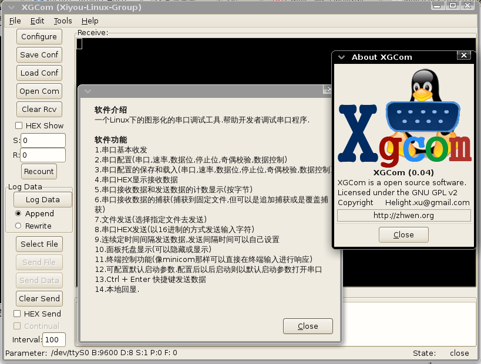
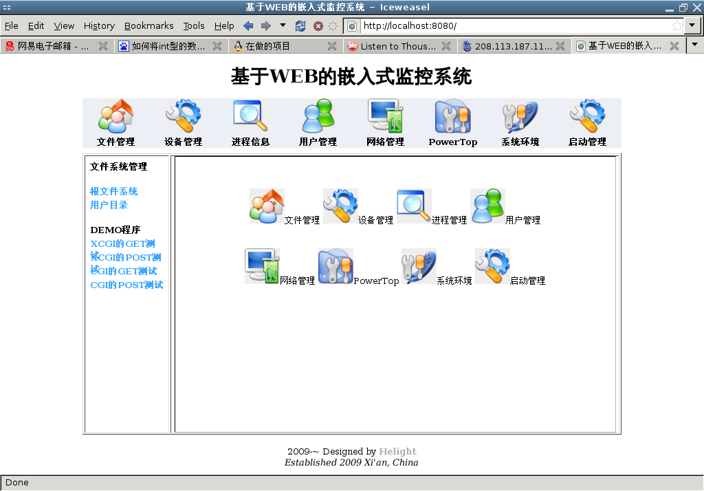
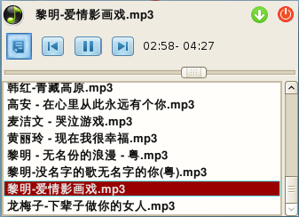

+++
title = "helight的github项目"
date = "2019-05-18T13:47:08+02:00"
tags = ["golang", "cloud"]
categories = ["programming"]
banner = "img/banners/banner-2.jpg"
draft = false
author = "helight"
authorlink = "https://helight.cn"
summary = "helight的github项目"
keywords = ["oneflow","golang", "cloud"]
+++

# github项目
## oneflow
项目简介：可视化分布式流程控制系统，数据流和业务流控制系统。使用golang开发，调度端采用了lua虚拟机，在web端可以创建串行流程，并且在每个流程中写lua脚本，发送到制定或者自动选择对远端机器进行任务执行。是之前项目openflow的升级版本。

项目地址：[https://github.com/helight/oneflow](https://github.com/helight/oneflow)

## 设计模式golang实现
项目简介：用golang实现设计模式的测试程序，还在持续积累。

项目地址：[https://github.com/helight/go-patterns](https://github.com/helight/go-patterns)

## XGCom串口调试工具
项目简介：一个Linux下的图形化的串口调试工具，帮助开发者调试串口程序。

项目地址：[https://github.com/helight/xgcom](https://github.com/helight/xgcom)

## xrpc
项目简介：rpc server  implemented in c++ json, libev, easy to use，简单的一个rpc服务框架，使用了libev。

项目地址：[https://github.com/helight/xrpc](https://github.com/helight/xrpc)

## Xcut
项目简介：xcut 是一个针对c的单元测试框架，是lcut的一个分支项目，加入了一些新特性。

项目地址：[https://github.com/helight/xcut/](https://github.com/helight/xcut/)

## Linux嵌入式轻量级http服务器
项目简介：编写一个可以在linux嵌入式下轻量级的http服务器软件，能够支持简单的静态页面的传输和cgi技术.目标是可以移植任意操作系统，但是主要针对于嵌入式linux。主要针对于嵌入式系统的web管理的实现。

项目地址：[https://github.com/helight/xhttpd](https://github.com/helight/xhttpd)

## Xnotebook文本资料管理软件
项目简介：Xnotebook是一款用gtk＋开发的文本资料管理软件，它主要用于个人文本资料的分类管理。

项目地址：[https://github.com/helight/xnotebook](https://github.com/helight/xnotebook)

## 小丁音乐
项目简介：一个Linux下的音乐播放软件，有基本的音乐列表管理和播放管理，相对简单，只是做来玩的，目前较少维护。Music player for linux, Has the basic music player function，just for fun.

项目地址：[https://github.com/helight/xdmusic](https://github.com/helight/xdmusic)

# 其它项目
## 个人测试代码
介绍：主要是为了测试，顺便也把这些代码收集起来，方便查看和直接使用。

[https://github.com/helight/helight_code](https://github.com/helight/helight_code)

## Linux ARM开发文档
项目简介：编写一个关于linux在arm上比较实用的开发文档，当前使用开发芯片有pxa270和S3C2410.

项目地址：[查看项目当前版本]/coding/arm-linux-compile.pdf)

## 2.6.22下基于Netfilter的网络监听器
在2.6.22中skbuff发生了变化，使得我以前的防火墙程序在新内核中无法使用了，主要是可以当作一个网络数据监视，当然还是不完善的。目前只能监听数据报的源ip和目的ip，还有tcp报的原端口和目的端口。 这里是程序：[sniffnet.c](/coding/sniffnet.c)

## Tools—收集或是自己做的一些小工具。。。
C 函数库
是学习c编程的一个小助手，我将它收录到了这里。
[C 函数库](/tools/clib/clib.html)

# 欢迎加入
欢迎有兴趣的小伙伴试用，提问题，提需求，fork，或者一起来开发。

# 欢迎关注

看完本文有收获？请分享给更多人

关注「黑光技术」，关注大数据+微服务

