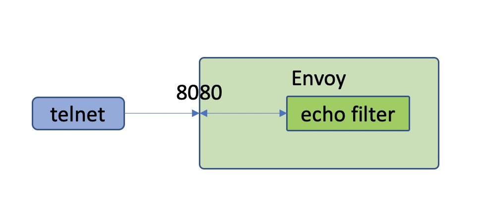

## 1. 前言
早就想写一个 envoy filter 开发的文章了，本来在我的 issue 中列了一篇 Venil Noronha 写的文章，想翻译来的，但是感觉那篇文章太简单了，而且没有实际操作过程，让我这种更愿意动手的人来说是一种折磨。

所以想还是自己写一个系列开始，打算是写 4～5 篇文章，具体的大纲如下：
1. 官网 echo 示例编译测试
2. 官网 http filter 示例编译测试
3. envoy filte 源码剖析（基于 echo 和 http filter）
4. 自定义协议的 filter 开发
5. （待定）

这是第一篇文章，主要介绍官网 github 上的例子中 echo 这个例子的编译测试过程。这篇文章主要介绍操作过程，具体原理想下次文章再介绍。

## 2. 编译环境介绍
采用的是官网推荐的 Ubuntu 18.04，也曾想在自己的 mac 上编译，但是在开发机上编译之后放弃了，因为编译后的零时文件 10 多个 G。采用 8 核 16 G 内存的机器，磁盘空间 300G，磁盘空间还是要大一点，负责多编译几个版本之后空间就很吃紧了。

## 3. 安装 bazel
这部分按照官网的指引安装就可以了。[https://github.com/envoyproxy/envoy/blob/master/bazel/README.md](https://github.com/envoyproxy/envoy/blob/master/bazel/README.md).
```sh
sudo wget -O /usr/local/bin/bazel https://github.com/bazelbuild/bazelisk/releases/latest/download/bazelisk-linux-amd64
sudo chmod +x /usr/local/bin/bazel
```
## 4. 安装编译环境（这里我选择了gcc编译）
```sh
sudo apt-get install \
   libtool \
   cmake \
   automake \
   autoconf \
   make \
   ninja-build \
   curl \
   unzip \
   virtualenv
```
gcc 要求是 7 以上的版本，所以安装后要检查一下。
```sh
ubuntu@ubuntu:/data/mesh/envoy-filter-example$ gcc --version
gcc (Ubuntu 7.5.0-3ubuntu1~18.04) 7.5.0
Copyright (C) 2017 Free Software Foundation, Inc.
This is free software; see the source for copying conditions.  There is NO
warranty; not even for MERCHANTABILITY or FITNESS FOR A PARTICULAR PURPOSE.

ubuntu@ubuntu:/data/mesh/envoy-filter-example$
```
## 5. clone 代码编译测试例子
编译这里有点小技巧，反正我直接 clone 官方的例子之后没有编译通过，而是把 envoy 的版本设置到 1.14 和 1.15 才编译过的。

所以这里可以看一下，在 clone 了之后，要 checkout 到一个稳定版本，我是 checkout 到 1.14 和 1.15 都编译过的。

编译过程非常简单，按照 readme 中的编译命令就可以直接编译过:`bazel build //:envoy`。不过编译非常耗时，8 核 cpu 编译了 20 多分钟才编译完成。

```sh
ubuntu@ubuntu:/data/mesh$ git clone https://github.com/envoyproxy/envoy-filter-example
ubuntu@ubuntu:/data/mesh$ cd envoy-filter-example
ubuntu@ubuntu:/data/mesh/envoy-filter-example$ git submodule update --init
ubuntu@ubuntu:/data/mesh/envoy-filter-example/envoy$ git checkout 50ef0945fa2c5da4bff7627c3abf41fdd3b7cffd
HEAD is now at 50ef0945f release: cutting 1.15 (#11898)
ubuntu@ubuntu:/data/mesh/envoy-filter-example/envoy$ cd ../
ubuntu@ubuntu:/data/mesh/envoy-filter-example$ bazel build //:envoy
```
## 6. 测试编译后的例子
### 6.1 测试流程
先说一下基本的测试流程，`echo` 这个例子非常好测试，因为它是一个拦截 filter，就是说请求到这个 filter 这里就终止了，不会继续向下游传。而且是正对 tcp 协议的一个 filter，没有使用私有协议，所以测试工具也不用找了，直接使用 telnet 进行测试就好了。如下图所示：


所以测试流程也就非常简单了，罗列如下：
1. 准备启动配置文件 test.yaml。
2. 使用配置文件启动 envoy。
3. 使用 telnet 工具进行测试。
4. 验证测试结果
### 6.2 启动 envoy 命令
编译好的二进制就在当前目录的 `bazel-bin` 目录下，可以直接运行。不过还要修改一下启动配置文件，默认的配置文件端口配置都是 `8080`，也就是是说启动的时候会随机启动端口，不好测试。所以我调整了一下 yaml 文件中监听的端口，比如下面的 `test.yaml` 文件中我修改为了 `8080`。另外为了完整看到调用过程，并且配合 `echo` 这个插件中的 `trace` 日志，我把启动后的日志级别设置为了 `trace`。下面是完整的启动命令。
```sh
ubuntu@ubuntu:/data/mesh/envoy-filter-example$ ./bazel-bin/envoy --config-path ./test.yaml -l trace
```

### 6.3 trace 日志和插件代码解读
envoy 的日志级别有一下几种，默认是 `info`。
```
Log levels: [trace][debug][info][warning|warn][error][critical][off]
```
在 `echo` 这个插件的代码中是有一行 trace 日志的，如下面的代码。这段代码是 `envoy` 在收到信息后转给这个插件，在收到数据后，直接回写数据给客户端。并且终止把数据继续发往下游。这里返回了 `StopIteration`。
```c++
// echo2.cc 
Network::FilterStatus Echo2::onData(Buffer::Instance& data, bool) {
  ENVOY_CONN_LOG(trace, "echo: got {} bytes", read_callbacks_->connection(), data.length());
  read_callbacks_->connection().write(data, false);
  return Network::FilterStatus::StopIteration;
}
```
### 6.4 配置文件
这里是完整的 `test.yaml` 文件内容。因为 `echo` 这个例子的特殊性，就不需要启动后端服务，所以这里的 `endpoints` 可以不用管。
```ymal
admin:                                                                                              
  access_log_path: /dev/null                                                                        
  address:                                                                                          
    socket_address:                                                                                 
      address: 127.0.0.1                                                                            
      port_value: 0                                                                                 
static_resources:                                                                                   
  clusters:                                                                                         
    name: cluster_0                                                                                 
    connect_timeout: 0.25s                                                                          
    load_assignment:                                                                                
      cluster_name: cluster_0                                                                       
      endpoints:                                                                                    
      - lb_endpoints:                                                                               
        - endpoint:                                                                                 
            address:                                                                                
              socket_address:                                                                       
                address: 127.0.0.1                                                                  
                port_value: 0                                                                       
  listeners:                                                                                        
  - name: listener_0                                                                                
    address:                                                                                        
      socket_address:                                                                               
        address: 127.0.0.1                                                                          
        port_value: 8080                                                                            
    filter_chains:                                                                                  
    - filters:                                                                                      
      - name: echo2                                                                                 
        config:   

```
### 6.5 测试客户端
因为 `echo` 这个例子是一个 `tcp` 插件，所以这里可以直接使用 `telnet` 来测试。连接之后直接发送信息过去就可以看到回响信息了。
```sh
ubuntu@ubuntu:/data/mesh/envoy-filter-example/test/client$ telnet 127.0.0.1 8080
Trying 127.0.0.1...
Connected to 127.0.0.1.
Escape character is '^]'.
112312
112312
12312312
12312312
^]
telnet> quit
Connection closed.
ubuntu@ubuntu:/data/mesh/envoy-filter-example/test/client$ 
```

### 6.6 测试日志

```log
[2020-09-27 20:38:33.905][21762][debug][main] [external/envoy/source/server/server.cc:189] flushing stats
[2020-09-27 20:38:36.371][21771][debug][conn_handler] [external/envoy/source/server/connection_handler_impl.cc:422] [C0] new connection
[2020-09-27 20:38:36.371][21771][trace][connection] [external/envoy/source/common/network/connection_impl.cc:506] [C0] socket event: 2
[2020-09-27 20:38:36.371][21771][trace][connection] [external/envoy/source/common/network/connection_impl.cc:607] [C0] write ready
[2020-09-27 20:38:38.908][21762][debug][main] [external/envoy/source/server/server.cc:189] flushing stats
[2020-09-27 20:38:39.917][21771][trace][connection] [external/envoy/source/common/network/connection_impl.cc:506] [C0] socket event: 3
[2020-09-27 20:38:39.917][21771][trace][connection] [external/envoy/source/common/network/connection_impl.cc:607] [C0] write ready
[2020-09-27 20:38:39.917][21771][trace][connection] [external/envoy/source/common/network/connection_impl.cc:544] [C0] read ready. dispatch_buffered_data=false
[2020-09-27 20:38:39.917][21771][trace][connection] [external/envoy/source/common/network/raw_buffer_socket.cc:25] [C0] read returns: 8
[2020-09-27 20:38:39.917][21771][trace][connection] [external/envoy/source/common/network/raw_buffer_socket.cc:39] [C0] read error: Resource temporarily unavailable
[2020-09-27 20:38:39.917][21771][trace][filter] [echo2.cc:12] [C0] echo: got 8 bytes
[2020-09-27 20:38:39.917][21771][trace][connection] [external/envoy/source/common/network/connection_impl.cc:427] [C0] writing 8 bytes, end_stream false
```

## 7. 总结
我直接 clone 官网的代码下来编译是没有编译过的，主要是 envoy 中有报错，最后吧 envoy checkout 到 1.14 和 1.15 才编译过，所以感觉 envoy 的master 分支还是有些随意，没有编译通过的版本都能合并。目前我主要使用 1.15 来编译，看 1.16 有不少很实用的特性，但是目前看才完成了 24%，还有 41 个计划需求还没有完成，按我估计要到年底了才能发布 1.16。不过 1.16还是比较期待的，主要是 wasm。

整个测试流程我感觉还是比较清晰的，echo 是一个 tcp 的 filter，我们不用写单独的客户端，而且这个 filter 是接受到请求就直接返回了，相当于是一个返回改写的 filter，所以不需要下游服务支持，所以这个测试也非常简单，只要有配置文件就可以了。


<center>
看完本文有收获？请分享给更多人

关注「黑光技术」，关注大数据+微服务


</center>