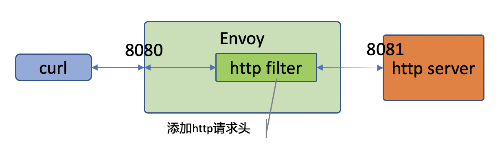

## 1.前言
这篇文章开始来介绍官网中 `http filter `的编译和测试过程，让大家能够知道怎么测试跑通这个例子，虽然官网已经给了代码，但是对于新手来说，这个例子虽然可以按照 `readme` 可以编译通过，但是测试还是有问题的，因为 `envoy` 的启动配置文件也是比较复杂的，要自己写一个完整能够跑通的配置文件也不容易。

所以在我这篇文章中，我会补充一个 `envoy` 的配置文件，一个用于可以测试这个 `filter` 的 `http server`。昨天也把这个这些代码提交了一个 `pr`，今天我有补充了一些测试启动脚本和 `verify` 脚本。

好接下来我们继续看怎么测试。

## 2.编译环境介绍
环境这里还是继续上次的，但是这里因为 `http server` 是 `python3` 写的，所以环境这里要准备一下 `python3` 的支持。

## 3.编译 http filter
在 `BUILD`文件中 `envoy` 中的 `deps` 字段中加入 `"//http-filter-example:http_filter_config",`，再从新编译即可。这个编译是把 `echo` 和 `http` 这两个 filter 都编译进一个 `envoy` 中了。
```sh
ubuntu@ubuntu:/data/mesh/envoy-filter-example$ vim BUILD 
```
添加后的内容如下：
```sh
envoy_cc_binary(
    name = "envoy",
    repository = "@envoy",  
    deps = [    
        ":echo2_config",    
        "//http-filter-example:http_filter_config",     
        "@envoy//source/exe:envoy_main_entry_lib",      
    ],          
)               
```
也可以直接使用下面的命令，单独编译 http-filter。
```sh
bazel build //http-filter-example:envoy
```
## 4.测试流程
### 4.1 流程介绍
整体的测试流程如下：
1. 启动一个 web 服务器
2. 编写 envoy 启动配置文件
3. 使用配置文件启动 envoy
4. 使用命令行 curl 测试

测试示意


官网这个 http filter 功能非常简单，其目的就是在 http 请求头中加入一个 kv 健值对，并且是把 key 转换为小写字母。
```c++
const LowerCaseString HttpSampleDecoderFilter::headerKey() const {
  return LowerCaseString(config_->key()); // 这里转大写为小写
}

const std::string HttpSampleDecoderFilter::headerValue() const {
  return config_->val(); // 获取配置中的val值
}

FilterHeadersStatus HttpSampleDecoderFilter::decodeHeaders(RequestHeaderMap& headers, bool) {
  // add a header
  headers.addCopy(headerKey(), headerValue()); // 添加到 http 的请求头中

  return FilterHeadersStatus::Continue;
}
```
### 4.2 web 服务
为了简单就直接使用 python 起一个 web server 来测试，在 web server 中打印接收到的 http header。下面是根据网上的例子修改而来的一个简单的 web 服务程序。

这个测试程序中有个一非常特别的地方，可以看到在 `do_GET` 方法中除了给客户端返回一个字符串 `Hello World !\r\n` 外，还要把自己接收到的 `http header` 返回给客户端。

```py
#!/usr/bin/python3
from http.server import BaseHTTPRequestHandler,HTTPServer

HTTP_PORT = 8081

# This class will handles any incoming request
class doHandler(BaseHTTPRequestHandler):

    # Handler for the GET requests
    def do_GET(self):
        self.send_response(200)
        self.send_header('Content-type','text/html')
        self.end_headers()
        print(self.headers)
        # Send the message
        self.wfile.write(b"Hello World !\r\n")
        self.wfile.write(self.headers.as_bytes()) # 把接收到的 http header 返回给客户端。
        return

try:
    # Create a http server and define the handler to manage the request
    server = HTTPServer(('', HTTP_PORT), doHandler)
    print('Started httpserver on port ' , HTTP_PORT)

    # Wait forever for incoming http requests
    server.serve_forever()

except KeyboardInterrupt:
    print('^C received, shutting down the web server')
    server.socket.close()
~
```
### 4.3 测试配置文件
配置文件继承上面一个配置文件，所以大家可以看到大部分内容都是一样。修改内容有 2 点：
1. 在后端服务端口这里修改为了 `8081`。
2. filter 配置增加 http filter 的管理。
3. 添加 http_filters，我们测试的 http_filters 名字是 sample。

config.yaml
```yaml
admin:  
  access_log_path: /dev/null
  address:      
    socket_address:
      address: 127.0.0.1    
      port_value: 0
static_resources:  
  clusters:     
    name: cluster_0
    connect_timeout: 0.25s  
    load_assignment:
      cluster_name: cluster_0       
      endpoints:
      - lb_endpoints:       
        - endpoint:
            address:
              socket_address:       
                address: 127.0.0.1  
                port_value: 8080    
  listeners:    
  - name: listener_0
    address:    
      socket_address:       
        address: 127.0.0.1  
        port_value: 80      
    filter_chains: 
    - filters:  
      - name: envoy.http_connection_manager   
        typed_config:       
          "@type": type.googleapis.com/envoy.config.filter.network.http_connection_manager.v2.HttpConnectionManager
          stat_prefix: ingress_http 
          codec_type: auto  
          route_config:     
            name: local_route       
            virtual_hosts:  
            - name: local_service   
              domains:      
              - "*" 
              routes:
              - match:
                  prefix: "/"
                route: 
                  cluster: cluster_0    
          http_filters:       
          - name: sample  # before envoy.router because order matters!    
            typed_config: 
              "@type": type.googleapis.com/sample.Decoder
              key: Via    
              val: sample-filter      
          - name: envoy.router
            typed_config: {}  

```
### 启动 web & envoy 服务
下面这个脚本就是启动 http 服务和使用上面的配置文件启动 `envoy`。
```sh
#!/bin/sh
python3 ./http-filter-example/httpserver.py&
./bazel-bin/envoy --config-path ./http-filter-example/config.yaml

```
### 测试
测试过程比较简单，在 http 服务中已经把它接收到的 header 发反给客户端，所以可以直接在客户端中看到传递到 http 服务的请求 header。下面的测试中可以看到 `header` 中有 `via: sample-filter`，而且 `via` 都是小写的（我们在配置中是配置的是 `Via`）。
```sh
$ curl http://127.0.0.1:8080
Hello World !
host: 127.0.0.1:8080
user-agent: curl/7.58.0
accept: */*
x-forwarded-proto: http
x-request-id: 3ee226cc-4e88-4ead-84e7-511406b95748
via: sample-filter
x-envoy-expected-rq-timeout-ms: 15000
content-length: 0
```
## 总结
`http filter` 的这个例子比 `echo` 的例子要复杂一点，配置文件也复杂，还需要额外的写测试服务程序。但是这个例子是一个非常完整的例子。让我们完整的从客户端到 `envoy`，到后端服务，整个流程都已经走过了。我认为走过了这个例子，大家都知道了 `filter` 的开发测试流程，尤其目前 `http` 仍然作为主要的通信协议，在 web 时代中还处于主导位置。而且实际上我们在企业使用开发的 `http filter` 是最多的，目前我们在内部积累了超过 40 个各种场景下的 `http filter`。所以我认为学会了这个，大家的 `http filter` 开发就算是入门了。

下一篇，我会根据这两篇文章来从原理上介绍一下 envoy 的 filter。

上一篇：[envoy filter 开发实践系列 1：官网 echo filter 示例编译测试](http://www.helight.cn/blog/2020/build-envoy-filter-echo/)。


<center>
看完本文有收获？请分享给更多人

关注「黑光技术」，关注大数据+微服务


</center>