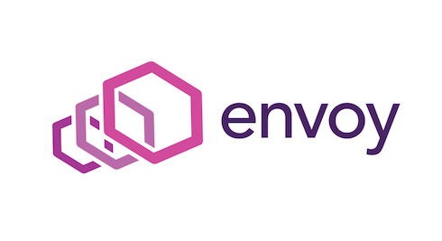
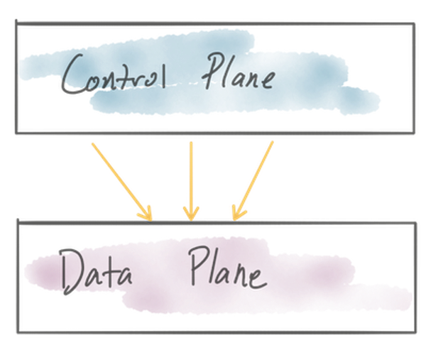
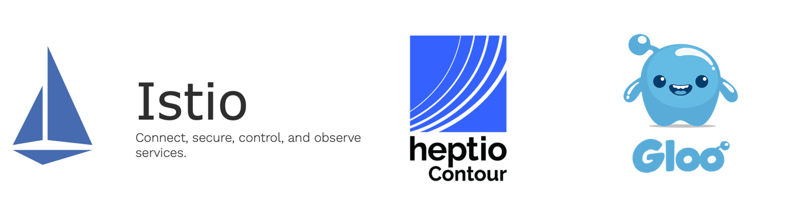
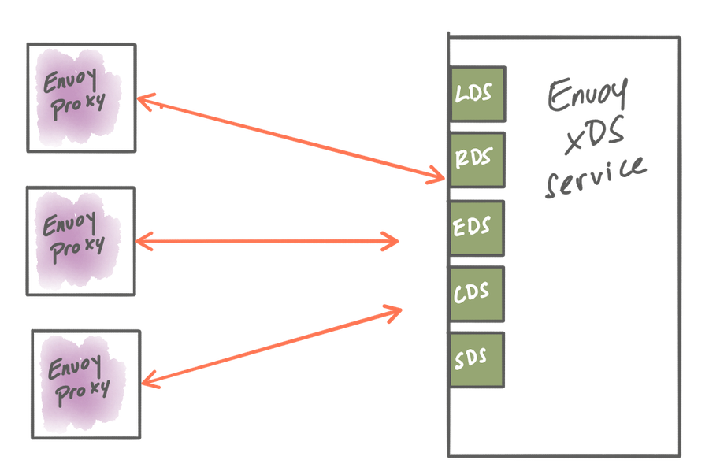

## 前言
这篇文章我看了之后非常想翻译，为什么呢？一方面我也在学习envoy，并且在公司的实际项目中使用envoy，另一方面，我确实在在设计一个控制管理端来统一管控多个集群的所有流量，我说的是所有的流量管控，目前这个管理系统在内部已经在逐步使用起来了。所以翻译这篇文章，即时学习envoy技术，也是想做一个参考，印证我的想法是是 OK 的，取长补短。

## 指导在服务边缘构建控制面来管理 Envoy Proxy，让它作为服务网关或者在服务网格中使用
Envoy 已经成为了一个非常流行的网络组件了。Matt Klein [几年前写过一篇博文](https://blog.envoyproxy.io/the-universal-data-plane-api-d15cec7a)，可就是在讨论 Envoy 的动态配置 API 和他如何成为 Envoy 采用路线上升的原因之一。他在博文中说这是“统一数据面板 API”（UDPA）。随着很多其它项目都采用 Envoy 作为其核心组件，可以毫不夸张的说 Envoy 不仅仅建立了标准 API，而且对于应用 7 层的网络解决方案来说：“在云原生架构下 Envoy 已经变成了统一数据平面”。

而且，由于 Envoy 的统一数据平面 API，我们可以看到业界开发了很多针对基于 Envoy 技术设施进行配置管理的管理系统。本文将会深入讨论为 Envoy 构建一个控制平面需要什么，大家可以通过这些信息来评估什么样的基础设施最适合你的组织和场景。因为这个是一个很大的话题，作者会出一个系列文章来对此进行详细说明。后面我也会挑一些我感兴趣的文章进行翻译。

在 [EnvoyCon/KubeCon 论坛有很多非常好的讨论](https://blog.envoyproxy.io/envoycon-recap-579d53576511)，这里好多组织都分享了它们采用 Envoy 的经验，也包括了如何构建它们自己的控制平面。下面试一些它们为什么选择自己来构建控制平面的原因：

1. 现有的解决方案构建在不同的数据平面上，而且已经有了控制平面，需要在这里兼容 Envoy。
2. 为不包含任何开源基础设施来构建，或者使用其它的 Envoy 控制平面（比如：VMs， AWS，ECS 等）
3. 不需要使用所有 Envoy 的特性，只是需要一部分
4. 为了更好适配自己的工作流和工作视图而需要为 Envoy 配置开发专属领域的 API/对象模型。
5.  要线上使用，但是发现其它的控制平面并不够成熟。

然而，仅仅因为有些早期使用者构建了他们自己的控制平面，这并不意味着你就应该也要做这样的事情。首先在去年中很多为 Envoy开发的控制平面已经相当成熟了，所以你应该在决定要重新开发另外一个控制平面之前先来研究一下这些已经存在的。其次，正如 Datawire 的人们发现，并且 Daniel Bryant 最近也发文章说，为 Envoy 构建一个控制平面并不是那么容易的。

我参与开发几个给 Enovy 构建控制平面的开源项目。比如，Gloo 是一个功能性网关，它可以作为强大的 Kubernetes 接入服务，API 网关，或者作为从单体服务到微服务过度的功能网关。Gloo 又一个针对 Envoy 的控制平面，它可以作为我这个系列文章的例子，来说明如何在控制平面上按照需求来抽象设计实现插件管理和扩张性管理。其它可以参考的已经实现的控制平面如 istio 和 [Heptio Contour](https://github.com/heptio/contour)也是贯穿我这个系列文章的好例子。如果你确定要自己开发控制平面，那么除了这些，你还可以其它已经存在的一些控制平面来指导。

在这个系列文章中，我们将会关注一下一些点：

1. 采用一种机制可以动态的更新 Envoy 的路由，服务发现和其它配置。
2. 识别使用哪些组件来构成你的控制平面，包括了后端存储，服务发现 API，安全组件等等。
3. 根据场景和组织以最合适的方式建立任意制定区域的配置对象和 API。
4.  思考如何在需要的地方以最好方式嵌入将控制平面。
5.  部署各种控制平面组件的方式。
6.  思考如何测试控制平面。

要开始这一系列的讨论，我们首先来看看如何在运行时使用 Envoy 的动态配置 API 来更新 Envoy，以处理拓扑和部署中的变更。

## 使用 Envoy 的 xDS API 动态配置 Envoy
在 Envoy 之上构建构建控制平面的主要优势在与它的数据平面 API。有了数据平面 API，我们可就可以动态的配置 Envoy 的大多数重要运行时设置。通过 xDS API 进行的 Envoy 配置是被设计为最终一致的，没有一种方法可以对集群中的所有代理进行原子性的更新。当控制平面上有配置更新时，它就通过 xDS API 让数据平面代理都可以获取到，每个代理都是相互独立的来应用这些配置。

下面是我们可以通过 xDS 动态配置 Envoy 的部分运行时模型：
1. [监听发现服务（LDS）API](https://www.envoyproxy.io/docs/envoy/v1.9.0/configuration/listeners/lds#config-listeners-lds) - LDS 用于下发服务监听的端口。
2. [终端发现服务（EDS）API](https://www.envoyproxy.io/docs/envoy/v1.9.0/api-v2/api/v2/eds.proto#envoy-api-file-envoy-api-v2-eds-proto)- EDS 用户服务发现。
3. [路由发现服务（RDS）API](https://www.envoyproxy.io/docs/envoy/v1.9.0/configuration/http_conn_man/rds#config-http-conn-man-rds)- RDS 用于流量路由决策。
4. [集群发现服务（CDS）](https://www.envoyproxy.io/docs/envoy/v1.9.0/configuration/cluster_manager/cds#config-cluster-manager-cds)- CDS 用于可以路由流量过去的后端服务。
5. [密钥发现服务（SDS）](https://www.envoyproxy.io/docs/envoy/v1.9.0/configuration/secret) - SDS 用户分发密钥（证书和密钥）。

这些 API 使用 proto3 的 Protocol Buffer 来定义的，并且已经有一些相关实现了，可以提供大家在构建自己的控制平面时参考：

1. [go-control-plane](https://github.com/envoyproxy/go-control-plane)
2. [java-control-plane](https://github.com/envoyproxy/java-control-plane)

虽然每个 xDS（LDS/EDS/RDS/CDS/SDS，这些统称xDS）都是动态可配置的，但是这并不意味着你必须动态配置所有内容。你可以组合一下，区分静态配置部分和动态配置服务。例如，要实现配置实现一种类型的服务发现：希望终端是动态的，但是集群在部署的时候就是已经知道路由信息了，所以你可以使用 Envoy 中的 [Endpoint Discovery Service](https://www.envoyproxy.io/docs/envoy/v1.9.0/api-v2/api/v2/eds.proto#envoy-api-file-envoy-api-v2-eds-proto) 来静态的定义集群的配置。如果在部署的时候你不确定是那个上游集群，那你可以使用[Cluster Discovery Service](https://www.envoyproxy.io/docs/envoy/v1.9.0/configuration/cluster_manager/cds#config-cluster-manager-cds)来动态的配置发现上游。关键是你可以构建一个工作流和处理流程来静态的配置你需要的部分，而且可以使用动态 xDS 服务在运行时发现你需要的部分。为什么有不同的控制平面实现的其中一个原因就是不是所有人都有一个完全动态和可替代的环境（这个环境下所有的配置都应该是动态的），这点几乎不可能。根据现有条件的约束和可用工作流，要为你的系统采取合适级别的动态配置，而不是全动态配置。

In the case of Gloo, we use a control plane based on go-control-plane to implement the xDS APIs to serve Envoy’s dynamic configuration. Istio uses this implementation also as does Heptio Contour. This control plane API leverages [gRPC streaming](https://grpc.io/docs/guides/concepts.html#server-streaming-rpc) calls and stubs out the API so you can fill it with an implementation. Another project, which is unfortunately deprecated but can be used to learn a lot, is Turbine Labs’ Rotor project. This is a highly efficient way to integrate Envoy’s data plane API with the control plane.

gRPC streaming is not the only way to update Envoy’s configuration. In [previous versions of the Envoy xDS API](https://www.envoyproxy.io/docs/envoy/v1.5.0/api-v1/api), polling was the only option to determine whether new configuration was available. Although this was acceptable, and met the criteria for “eventually-consistent” configuration updates, it was less efficient in both network and compute usage. It can also be difficult to properly tune the polling configurations to reduce wasted resources.

Lastly, some Envoy management implementations opt to generate [static Envoy configuration files](https://www.envoyproxy.io/docs/envoy/latest/configuration/overview/v2_overview#static) and periodically replace the configuration files on disk for Envoy and then perform a [hot reload of the Envoy process](https://blog.envoyproxy.io/envoy-hot-restart-1d16b14555b5). In a highly dynamic environment (like Kubernetes, but really any ephemeral-compute based platform) the management of this file generation, delivery, hot-restart, etc can get unwieldy. Envoy was originally operated in an environment that performed updates like this (Lyft, where it was created) but they are incrementally moving toward using the xDS APIs.

## Takeaway
The Gloo team believes using gRPC streaming and the xDS APIs is the ideal way to implement dynamic configuration and control for Envoy. Again, not all of the Envoy configurations should be served dynamically if you don’t need that, however if you’re operating in a highly dynamic environment (e.g., Kubernetes), the option to configure Envoy dynamically is critical. Other environments may not have this need. Either way, gRPC streaming API for the dynamic parts is ideal. Some benefits to this approach:

1. event-driven configuration updates; configuration is pushed to Envoy when it becomes available in the control plane
2. no need to poll for changes
3. no need to hot-reload Envoy
4. no disruption to traffic

## What’s next
In this first part, we established some basic context on how to build a control plane for Envoy by covering the xDS APIs and the different options you have for serving dynamic configuration to Envoy. In the next sections, to be released in a few days, will cover breaking your control plane into deployable components, identifying which pieces you need, what a domain-specific configuration object model could look like, and how to think about pluggability of the control plane. Follow along on twitter (@christianposta, @soloio_inc) or blog (https://blog.christianposta.com https://medium.com/solo-io)

