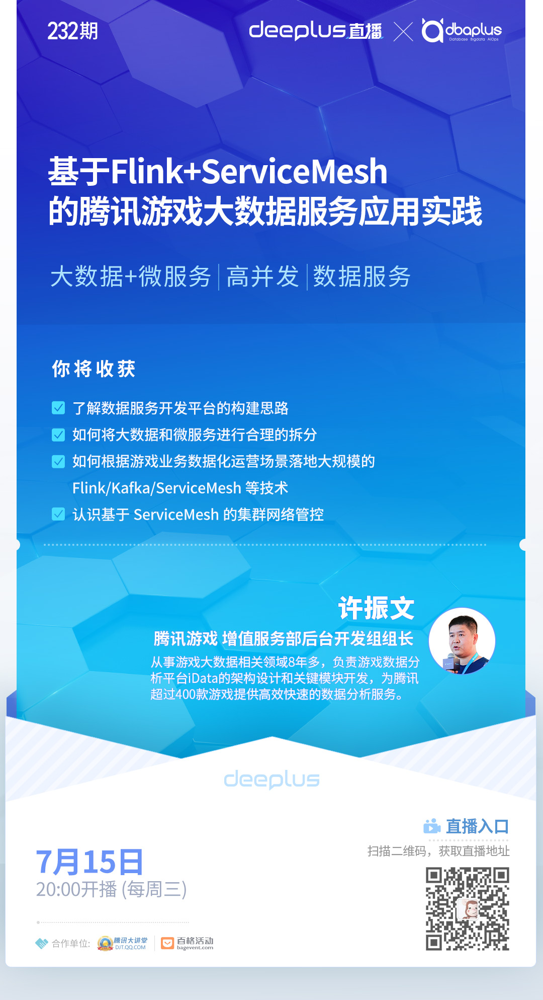

## 前言
  前段时间本号作为【dbaplus社群】的合作媒体，和他们做了一次大数据领域的话题宣传活动。聊了之后就邀请我来分享一下游戏数据领域内的相关应用实践，所以就有了这个分享话题。

## 
内容是基于大数据+微服务的，游戏数据的应用必然涉及到大数据的计算处理和高并发的在线服务，我这几年也都在探索这块领域。

如何能高效的开发大数据？并且如何能把大数据的能力通过微服务实现输出？

在大数据和微服务技术的浪潮中，我们应如何通过利用这些技术来提效，赋能游戏运营，让游戏运营更具创新能力呢?

本次分享将介绍针对这一技术趋势而构建的腾讯游戏数据服务开发平台，讲述如何将大数据和微服务进行合理有效的架构来为游戏业务提供多样化的数据营销服务能力，并大规模的落地Flink，ServiceMesh等技术。

同时为大家揭示丰富的数据与游戏结合的应用场景，以及游戏领域内数据基础设施建设和技术平台的架构，并与大家探讨未来数据技术与游戏结合的更多可能性。

希望和大家多多交流，相互学习。

## 关键字:
大数据+微服务、高并发、数据服务

## 关键内容
1、了解数据服务开发平台的构建思路
2、如何将大数据和微服务进行合理的拆分
3、如何根据游戏业务数据化运营场景落地大规模的Flink/Kafka/ServiceMesh等技术
4、认识基于ServiceMesh的集群网络管控

看完本文有收获？请分享给更多人

关注「黑光技术」，关注大数据+微服务

