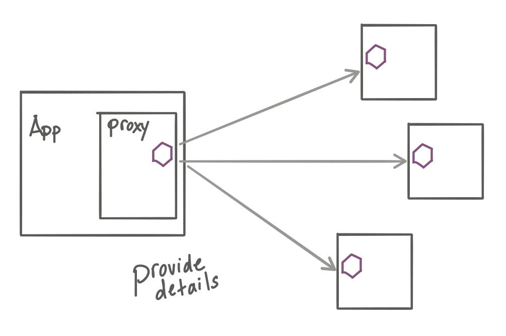
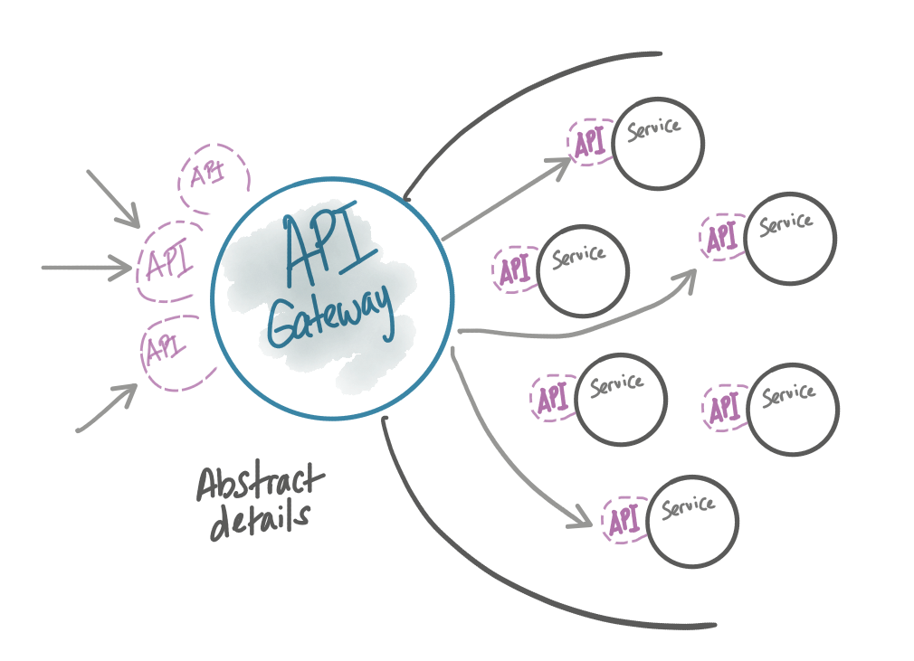
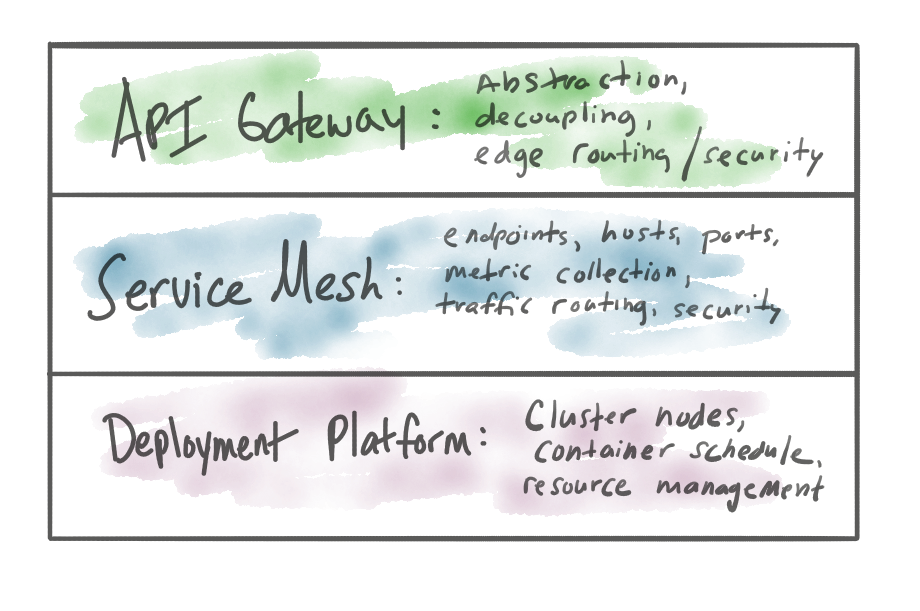

+++
title = "【译】有了Service Mesh，还需要 API 网关吗？"
date = "2020-02-07T13:47:08+02:00"
tags = ["istio", "microservices"]
categories = ["sevicemesh", "microservices"]
banner = "img/banners/istio.png"
draft = false
author = "helight"
authorlink = "http://helight.cn"
summary="这篇博文还是围绕 API 网关和服务网格的。虽然现在2020年了，围绕这个话题依然有大量的困惑"
keywords = ["istio","proxy", "gateway"]
+++

这篇博文还是围绕 API 网关和服务网格的。虽然现在2020年了，围绕这个话题依然有大量的困惑。我之所以选择写这个话题是，为了帮助大家带来真正具体的解释，有助于澄清分歧，重合的地方以及何时使用哪一种方式。如果感觉我解释不清楚，或者不认可我说的，亦或者要请我喝啤酒（或者都有），请随时联系我（我的twwiter：@christianposta）。

    作者介绍1:作者目前在 Solo.io 工作，主要就是微服务相关的工作。关于微服务大家都有各自的见解。作者在 Solo.io 就是为了实践微服务，并且推向市场，这也是验证各种微服务理论的最佳方式。
    作者介绍2:作者同时也是[Istio in Action”](https://www.manning.com/books/istio-in-action)一书的作者，这本书中介绍他重点投入的服务网格技术。这篇文章中的服务网格技术也主要是是从 Istio 的角度来的，但是也会讲更普遍的服务网格技术。

## Why another blog on this topic? 这个话题相关的其它文章
关于这个话题作者写了一些列的文章，比如：[“API 网关负责南北流量，服务网格负责东西流量”](https://aspenmesh.io/api-gateway-vs-service-mesh/)，[“API 网关管理业务函数，而服务网格管理服务和服务之间的通信”](https://medium.com/microservices-in-practice/service-mesh-vs-api-gateway-a6d814b9bf56)，[“从功能角度看哪些是 API 应该做的，哪些是服务网格应该做的”](https://blog.getambassador.io/api-gateway-vs-service-mesh-104c01fa4784)，[“服务网格和 API 网关对比”](https://developer.ibm.com/apiconnect/2018/11/13/service-mesh-vs-api-management/)。
    
    我在后面也计划逐步翻译这个系列的文章。

从目前看这个领域还是有很多的让人疑惑的地方。

    我还是想看到一些关于不同实现之间取舍的严肃规范的讨论。例如服务网格和 API 网关之间的职责/说明还是有重叠的地方。人们在选择时感到困惑和不知所措。

    — Andrew Clay Shafer 雷启理 (@littleidea) June 12, 2019
## What’s the confusion 有哪些困惑
大概一年前我写了关于 [API 网关认证危机](https://blog.christianposta.com/microservices/api-gateways-are-going-through-an-identity-crisis/)的一篇文章，主要是评估 API 管理，Kubernetes Ingresses 和 API 网关（有相关的定义）的不同之处。在那篇文章最后，我试着解释为服务网格如何应对这种平衡，但是缺乏这些技术的详细对比，亦或缺少什么时候该用那种技术的足够说明。我也强烈建议大家去读一下那篇文章，那算是这个话题的第一部分了，本文是是第二部分。

我认为困惑主要是以下一些原因：

* 技术使用上是有重合的（各种代理）
* 在能力上也有重合（流量控制，路由，度量收集，安全/策略执行等等）
* 用服务网格替换 API 管理的想法
* 对服务网格能力的错误理解
* 有些服务网格有他们自己的网关

最后一项最容易让人困惑。

如果服务网格只是处理东西流量（边界内），那么为什么有些服务网格技术实现又有一个针对南北流量的 `Ingress` 网关（它也是网格的一部分）呢？典型的就是 `Istio`。看看 `stio Ingress` 网关的文档中怎么说：

    网关是在网格边界上的一个负载均衡器，处理进入网格或者出网格去的 `HTTP/TCP` 连接。

我们的 API 不是 HTTP吗？如果使用 `Istio` 网关把 HTTP 请求发到集群/网格内（这个网关是从 `Envoy Proxy` 项目构建的），这样是不是就够了呢？

## Assumptions 假设
在这篇文章的后面我们提到的服务网格都是指 `Istio` 和 `Istio` 网关。选择这个设想的场景是因为这是最能展示重合和困惑的一个场景。其它的服务[网格技术也有网关](https://www.consul.io/docs/connect/mesh_gateway.html)，但是[有些还没有明确的网关](https://linkerd.io/2/tasks/using-ingress/)。

## Where they overlap 哪些地方重合了？
首先我们要识别的就是服务网格和 API 网格的能力上哪些地方重合了。它们都处理应用程序流量，所以重合部分应该不会想不到。以下就是列出的一些重合能力：

* 遥测收集
* 分布式追踪
* 服务发现
* 负载均衡
* TLS 终止/发起
* JWT 验证
* 请求欲呕
* 流量切分
* 金丝雀发布
* 流量影子（不好翻译，目标是把流量复制出来到其它服务上）
* 限频

这些功能都会重合，所以你是用其中一个还是所有还是一个都没有用过呢？

## Where they diverge 哪里又有不一样呢？
服务网格是运行在比 API 网关低的一层上，而且运行在架构的单个服务上。服务网格给服务调用客户端更多的信息：架构拓扑相关（客户端的负载均衡，服务发现，请求路由），应该实现的弹性机制（超时，重试，熔断），应该收集的遥测信息（度量、追踪），还有应用的安全流程（mTLS，RBAC）。所有的这些实现详情通常都通过 sidecar 进程（考虑下 Envoy）来提供，虽然也它们也可以不需要必须。看我在  ServiceMeshCon 上做的演讲：[服务网格数据平面的演进](https://www.slideshare.net/ceposta/the-truth-about-the-service-mesh-data-plane)。

在这篇文章中 [API Identity Crisis](https://blog.christianposta.com/microservices/api-gateways-are-going-through-an-identity-crisis/)：

    服务网格的目标是针对普遍的任何服务/应用程序在L7透明地解决这些问题【上面列出的那些问题】。换句话说，就是服务网格希望是融入到服务中（而不是实际在服务代码中写代码）。

**底线：** 服务网格为服务/客户端提供了更多关于体系结构其余部分实现的细节。

API 网关是以另外一种方式来提供服务的：抛去了细节并且分离了实现。API 网关提供了一种集中式的抽象，对一个应用程序架构中的所有服务来说它是一个整体，通过代理指定的 API 来解决系统边界问题。

不论是否有服务网格存在，API 网关是存在于应用程序/服务之上的一层，它对其它系统提供了一个访问内部系统的抽象层。看起来有点像是聚集 API、抽象 API 并且把它们暴露出去，这种暴露不同于 API 的实现，并根据用户在边缘添加更复杂的零信任安全策略。在应用程序架构边界上的问题和其内部的问题是不一样的，所以要有 API 网关这样的东西出现来处理这部分问题。

## Edge issues are not the same as service-to-service challenges 边界问题和服务与服务之间的挑战是不一样的
在微服务/云原生架构的边界上，API 网关提供了 3 个主要的能力，这 3 个能力服务网格解决的程度不一样。

* Boundary decoupling 边界解耦
* Tight control over data are allowed in and out 对数据进出的严格控制
* Bridging security trust domains 桥接安全信任域

接下来详细看看：

## Boundary decoupling 边界解耦
API 网关的核心功能就是给外界客户端提供一个稳定的 API 接口。从 Chris Richardson 写的[微服务模式](https://microservices.io/book)一书中，我们可以将 `API 网关模式` 解释为：

    明确简化对一组 API/微服务的调用
    给指定的使用者，客户端或者消费者模拟一个应用程序的一组 API
    这里关键是 API 网关，应用 API 网关之后，它会变成了客户端访问应用程序体系 API 的一个单一入口点

在 [API 网关认证危机](https://blog.christianposta.com/microservices/api-gateways-are-going-through-an-identity-crisis/)一文中提到的 API 网关实现例子：

* [Solo.io Gloo](https://gloo.solo.io/)
* [Spring Cloud Gateway](http://spring.io/projects/spring-cloud-gateway)
* [Netflix Zuul](https://github.com/Netflix/zuul)
* [IBM-Strongloop Loopback/Microgateway](https://strongloop.com/)

从功能角度来看，API 网关要支持哪些功能呢？那么企业对 API 网关的真实需求是什么呢？而且这些需求是服务网格不能很好支持的：

* 请求/相应转换
* 应用程序协议转换，比如：REST/SOAP/XSLT
* 自定义对错误/限速的响应
* 直接响应
* 精确控制 api/proxy 流水线
* API 组合/分组

下面来逐个看。
### Request / response transformation 请求/相应转换
暴露 API 给外部是 API 网关的功能之一，你可能想隐藏 API 的真实实现而只暴露接口出去。这可能是多种方式的组合，包括改变请求的形式、删除/添加头、把头加入到正文中或是反之。这就提供了一种很好的客户端和服务端的解耦方式：无论服务端对 API 做了改变或是客户端无法随之更新，有了 API 网关，就在这一层可以做一些适配和转换。

### Application protocol transformations 应用程序协议转换
许多企业投身于这些技术像基于 HTTP 的 XML 通信、SOAP、或者基于 HTTP 的 JSON 通信。他们可能希望通过更紧靠、特定于客户端的 API 使用这些技术，并继续具有互操作性。此外，服务提供商可能希望采用新的 RPC 机制（像 gRPC）或者流式协议（像 rSocket）。

### Error / Rate limit custom responses 自定义对错误/限速的响应
转换来自上游服务的请求是 API 网关的一项关键能力，但是定制来自网关的响应也是很关键的。采用了 API 网关的虚拟 API 来处理请求/响应/错误的客户端，也希望在网关这边能够自定义它的响应内容，以便适配这种协议模式。

### Direct responses 直接响应
当客户端（可信的或者恶意的）请求一个不可用的资源，或者因为某些原因受阻止而无法返回上游，最好是可以终止代理，并且返回一个预设的响应。

### Precise control over Proxy pipeline 精确控制 api/proxy 流水线
没有一边倒的代理。一个 API 网关应该有改变功能（比如限频，认证，路由，转换等）应用顺序的能力，并在出现问题时提供调试方法。

### API composition API 组合
在多个服务上暴露一个组合功能，通常需要把多个 API 组合成一个 API。像 GraphQL 就可以满足这类需求。

如你所见，在服务提供者和客户端之间提供一个强大的解耦层，涉及的东西远不止是允许 HTTP 流量进入集群。

## Tight control over what’s allowed in/out of services 严格控制进出服务的请求
API 网关的另外一个重要的功能是管理哪些数据/请求可以进入应用程序体系，哪些数据/响应可以流出去。这意味着网关需要深入理解进入系统的请求或出去的请求。例如，一个普通的场景就是 WEB 应用程序防火墙阻止 SQL 注入攻击。另外就是`防止数据丢失`技术来防止请求中返回 SSN 或者 PII，因为这些规范或者标准的要求：PCI-DSS/HIPPA/GDPR。网关是实现这些策略的天然场所。

    SSN：在美国，社会安全号码（Social Security number，SSN）是发给公民、永久居民、临时（工作）居民的一组九位数字号码，是依据美国社会安全法案（Social Security Act）205条C2中社会安全卡的记载。这组数字由联邦政府社会安全局针对个人发行。社会安全号码主要的目的是为了追踪个人的赋税资料，但近年来已经成为实际上（De facto）的国民辨识号码。

    PII：个人验证信息（PII，personally identifiable information）是有关一个人的任何数据，这些数据能帮助识别这个人，如姓名、指纹或其他生物特征资料、电子邮件地址、住址、电话号码或社会安全号码。个人验证信息的一个子集是个人识别财务信息（PIFI，personally identifiable financial information）。

    PCI-DSS：全称Payment Card Industry (PCI) Data Security Standard,第三方支付行业(支付卡行业PCI DSS)数据安全标准

    HIPPA：HIPAA全称为：Health Insurance Portability and Accountability

    GDPR：《通用数据保护条例》（General Data Protection Regulation，简称GDPR）为欧洲联盟的条例，前身是欧盟在1995年制定的《计算机数据保护法》。

同样，定义和执行这些功能并不像只允许 HTTP 流量进入集群那么简单。

## Custom security / bridging trust domains 自定义安全/桥接信任域
API 网关提供的最后一个主要功能就是边界安全。这包括验证外部应用体系的用户和服务提供身份信息和范围策略，这样可以限制访问指定服务和业务功能。这也和前面一段介绍的功能有关系。

一个通用的例子是可以和 OAuth/SSO 认证流绑定，包括 Open ID Connect。对这些标准的挑战在于网关有可能没有完全实现这些功能，或者是实现的不正确。API 网关需要一种方式能够灵活的适配这些环境，同时还要提供自定义能力。

在很多企业都已经有身份/信任/授权机制，所以 API 网关的很大一部分就是能够为这些后端能力进行本地化集成。虽然新的像 SPIFEE 标准已经出现了，但是企业还是需要一段时间来研究使用，在这段时间内 API 网关还是一个强需求（甚至在下一代的应用程序架构中都可能是）。同样，你可以撇一眼上面的内容，这部分也上面提到的转换/解耦有点关系。

    说明：SPIFFE（Secure Production Identity Framework For Everyone）以特制的X.509证书形式为现代生产环境中的每个工作负载提供安全标识。SPIFFE消除了对应用程序级身份验证和复杂网络级ACL配置的需求。SPIFFE标准是许多CNCF参与者和其他相关方，聚集在一起提出的共同方法，使便服务彼此呈现和授权他们的身份。SPIFFE仍处于早期实施阶段，尚未准备好进行生产部署 - 您可以通过贡献来提供帮助。SPIFFE和SPIRE的工作由Scytale的员工协调。
    网站/代码：https://spiffe.io/   https://github.com/spiffe

## How to go about adopting one/other/both/neither? 如何着手采用一种/另一种/两者/两者都不采用
我之前的一篇博客中，我已经列出了一些[采用 API 网关和服务网格的挑战点](https://blog.christianposta.com/challenges-of-adopting-service-mesh-in-enterprise-organizations/)，并且关于如何选择给了一些建议。

再次重申：从系统服务边界开始。这是架构系统中比较熟悉的一部分。选择最合适的也是要考虑的。自从我们引入云基础设施和云本机应用程序体系结构以来，预设的场景就变了。例如，如果你选择使用 Kubernetes，则强烈建议考虑使用它的生态中的技术来从头构建应用程序网络。比如签出 Evnoy Proxy 对其进行二次修改开发。例如，在 Solo.io，我们就利用 Envoy 构建了一个叫 Gloo 的开源项目来解决这类问题。

你需要服务网格吗？如果你在云平台上部署，在系统中有多种语言/框架的实现需要，并且使用微服务架构构建，那么你需要服务网格。有很多选择的。在我之前的博客中讨论并做过各种比较，比如最近 [OSCON 上的演讲](https://www.slideshare.net/ceposta/navigating-the-service-mesh-landscape-with-istio-consul-connect-and-linkerd)，可以随时联系我寻求对你最合适的指导。

## Wrapping up 收尾
API 网关在一些功能点上和服务网格是重合的。它们在使用的一些技术上也有重合（比如 Envoy）。但是它们的定位是有不同的，所以理解这些可以让你在部署微服务系统的时候少很多痛苦，让你在架构使用过程中发现一些意想不到的场景和用法。

原文：[https://blog.christianposta.com/microservices/do-i-need-an-api-gateway-if-i-have-a-service-mesh/](https://blog.christianposta.com/microservices/do-i-need-an-api-gateway-if-i-have-a-service-mesh/)

看完本文有收获？请分享给更多人

关注「黑光技术」，关注大数据+微服务

