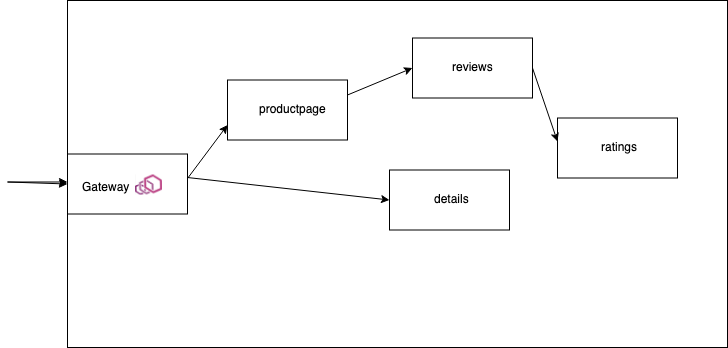
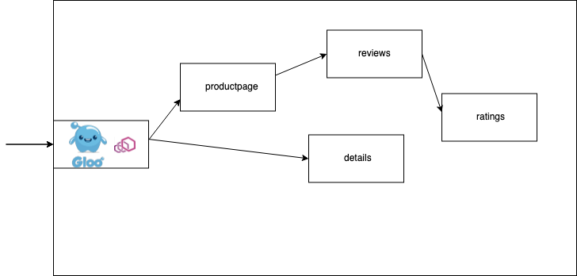
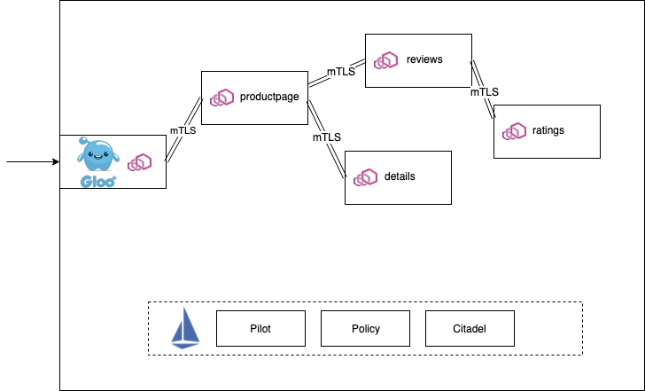

本文是在看了国外 Solo 公司 CTO 的博客之后整理的，本来是想按原文翻译，但是考虑到我自己在公司实践的思路，还是想把他的思路和我自己的思路做一些结合。所以本文中有部分内容是来自这位高手的思考，也有有我在公司实践中的思考。

作者是从 Red Hat 跳到 Solo 公司的，这家公司现在主要产品就是基于 Envoy 和 Istio 的网络治理工具的研发，包括了微服务网关和服务网格上的产品。

他也是很早之前就在思考服务网格虽然很好（至少是思路和理念非常好），而且现在结合 K8S 也有了很好的实现和落地方式。但是人们对这个东西的认知和信心还是不足的，我看到的主要表现在这样一些方面：
1. Istio 等相关服务网格的产品还不够成熟，目前我重点关注 Istio 社区，也是社区 Member。目前看来 Istio 的代码都还在大幅度的变化，很多设计在不同的大版本中是不断调整的，这一点就不多说了。刚好这几天也发布了 1.6，不过我感觉 1.6 应该会好很多。
2. 大家直观的感觉是加了 sidecar 之后，网络调用多了一跳，性能会变差，甚至变得很差。
3. 大家对把服务网格作为基础设施这种想法还是比较抗拒，认为妨碍了他定位问题和提升应用性能。
4. 大家对于微服务框架开发的热情超过服务网格，很多人认为服务网格是一种微服务架构实现，所以自然的把微服务框架作为了服务网格的竞争对手。对于开发同学来说开发微服务框架的成就感要不直接使用服务网格这样的基础设施强很多。

以上这几个点就不展开讲了，大家应该能理解我的意思。这也是我这几年研究和落地服务网格中的一些难点，我认为这些难点随着时间的发展将不会成为问题，尤其我认为服务网格未来一定会作为操作系统一样的基础设施为大家提供服务。

但是在目前这个阶段我们应该怎么办呢？技术不成熟，大家不太接受。我将奈何？

Solo CTO 的文章让我更坚定了我们目前的思路和做法。下面几点是他总结的，如何在公司中逐步落地服务网格的方法。

这一次，我开发了这种方法，以便在生产环境中很好的采用服务网格：
1. 深入了解最终的服务网格数据面技术。
2. 采用小部分流量使用数据面理想的情况下，首先共享服务网关。
3. 选择一部分应用，启用边车模式的网络。
4. 慢慢启用服务网格中最有价值的功能。
5. 重复第 2 步 到 第 4 步。

目前我们基本也是这个思路，重点在使用 Envoy 作为微服务网关，开发集成了公司内部的相关基础组件和业务组件，作为我们微服务平台的核心组件。并且在使用中也是按照多集群部署服务网关，然后在一些可控业务上尝试启用服务网格能力。这个能力我们做成了 web 页面一个按钮就可以启用，在实现上其实就是注入一段代码在业务 pod 中自动注入 istio-proxy。再配合页面化的配置管理来控制策略实施，或通过页面进行服务状态信息可视化等。

## 再来介绍一下什么是 Envoy Proxy
[Envoy](https://www.envoyproxy.io/) 已经变成大多数服务网格技术中基础的数据面了。像 Istio，Consul Connect，AWS App Mesh，Grey Matter（和其它已经存在的 API 管理提供商也在逐步采用）都是基于 Envoy 的。

也许大家认为作为一个协议代理或者服务网关在技术实现上没有什么难度，但是作为通用的服务代理组件，在实际实现中却是绝对没有大家想的那样简单。要有可以用户自己来扩展的机制，遥测信息收集和监控实现，要可以有静态和动态的配置的方式，对可配置内容的设计抽象，兼顾性能问题等等。如果可以建议大家在实际环境中来真正安装部署运行测试体验一下。

总体来说 Envoy 目前是一个非常功能强大，支持多种使用方式和实现复杂的技术组件。在服务网关，服务网格技术中目前是最佳的选择。

## 从基于 Envoy 构建一个服务网关开始

如果你想在组织内使用落地服务网格，那么采用基于 Envoy 作为微服务网关是非常好的一个开始。作者在他之前写的一本书《Istio in Action》中就极力介绍 Istio 的[服务网关资源](https://istio.io/docs/tasks/traffic-management/ingress/ingress-control/)。因为把 Envoy 作为入口网关是使用 Istio 的最好的开始方式，这样你在不断熟悉 Isito 和推广服务网格文化，让内部逐步接受，并且探索服务网格的最佳使用方式是非常好的，不用一上来就推动大家都必须启用边车。

使用基于 Envoy 的服务网关这意味着你不但可以解决你微服务网关的问题，而且还可以逐步实践小型化的服务网格。当你部署了服务网关之后，你就可以强有力的掌控流量和路由了（包括百分比的路由，基于协议头或者方法的路由，还有流量镜像），还有加密传输等。

简单的网关也是有的，在一般情况下使用也是没有问题的，作为网关最大的作用就是管控入口流量。但是通用且强大的网关就可以有很多的用处，所以基于 Envoy 来构建微服务网关是一个非常好的选择。Envoy 的功能可以说是相当的丰富。

## 基于 Envoy 构建更好的服务网关

在一般情况下，集群外的服务来访问集群的内的服务，我们都遵循不可信原则，主要原因是安全问题。所以一般要对外提供服务，我们就要解决下面一些问题：

1. 缓存
2.  限频限流
3.  客户认证
4.  消息签名
5.  jwt 验证（包括和现有的 JWT 系统和认证管理系统集成）
6.  web 应用防火墙
7.  消息转换
8.  API 的编排等

另外还有一堆其它的功能，比如外部鉴权，内容改写等等。

Gloo 的做法是基于 Envoy 构建了一个强大的微服务网关，而且基于 xDS 配备了一个好用的控制管理端。使得这个微服务网关既可以作为微服务网关，也可以继续深入作为边车使用。而在他们的设计单中，首先是可以作为一个强大的微服务网关来使用。而且他们可以直接和 Istio，Consul， AWS App Mesh 和 Linkerd 等集成。目前他们说已经在很多客户那里落地了。

在我们的实践单中也是这样一个思路，早期我们使用 OpenResty 来构建我们的微服务网关，插件都是使用 lua 来编写，直到我们 2 年前遇到了 Envoy 和 Isito，我们综合对比考虑之后，采用了 Envoy 最为我们的微服务网关，我们也是和 Consul 结合，利用其 xDS 开发了我们公司内的诸多业务插件，配合使用。目前已经作为微服务网关在内部大量使用。同时也在逐步积累开发一个基于 Envoy 和 Istio 的控制系统。目标是既可以控制微服务网关，也可以控制服务网格，统一的把集群内以及多个集群的网络流量管理做一个统一。

## 总结
在基于 Envoy 构建微服务网关的同时，我们也在不断的探测基于 Isito 的服务网格的应用场景和落地方式。但是以 Envoy 作为微服务网关是一个非常成熟的解决方案。作为服务网格的入手点一定是一个不错的思路。所以大家如何想在内部测试落地服务网格，不妨尝试从 Envoy 的微服务网关开始。

Envoy 目前已经成为主流服务网格的数据面，所以其功能和成熟度都是不用太多质疑的，大家放心用就是了。

## 后记
本文并不是完全翻译原文，其中加了我自己在这几年实践的一些看法。

原文：[https://medium.com/solo-io/getting-started-with-a-service-mesh-starts-with-a-gateway-96384deedca2](https://medium.com/solo-io/getting-started-with-a-service-mesh-starts-with-a-gateway-96384deedca2)

看完本文有收获？请分享给更多人

关注「黑光技术」，关注大数据+微服务

