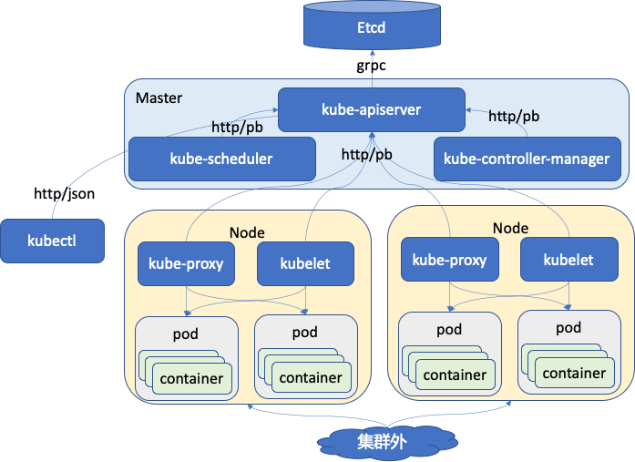

## 前言

代码 clone 地址：[https://github.com/kubernetes/client-go](https://github.com/kubernetes/client-go)。实际上在 kubernetes 的源码中也包含了这部分代码：`vendor/k8s.io/client-go/`。看代码都没问题。

client-go 是 kubernetes 中比较重要的一个组件，从我上一篇文章中梳理的图中可以看出来，apiserver 是一个核心，其它组件都要和这个核心模块交互，所以 client-go 的出现就是为了统一封装对 apiserver 的交互访问。还是放这个图哈。

    *我思故我在*
    client-go 这种设计思路还是不错的，当然是适合 kubernetes 这样的项目，几乎所有的模块都在围绕 apiserver，那么和 apiserver 的交互就显的尤为重要，那么这部分代码的抽象封装也就顺理成章了。这种解偶方式也是挺特别的，在看了书，走读了这部分的源码之后也才发现，同样的 client 在使用方式，使用对象不一样，就需要不一样的封装方式。
    
    kubernetes 的 client-go 根据具体使用的方式进行了基础库封装和另外 4 种（书上介绍 3 种，我认为 scale client 也是一种 client）类型的 client 封装，分别针对不同的应用场景。discovery client，dynamic client，clientset，scale client。

    今天在公司讨论 sdk 的封装上就讨论到这一点， sdk 的封装很多时候不能过分也不能太简单。太简单，开发体验不好，开发者还有设置或者配置或者开发很多东西，封装太过，封装了很多开发者不想要的内容也很麻烦。所以这样的封装一定要多元化，多层次的来提供。



## 目录结构
认识代码还是从目录结构开始，我认为 golang 的规范做的非常好，有官方自己的代码规范工具，还有指导的工程代码目录结构规范。这里针对 client-go 我只列出我认为重要的一些目录。

| 目录名 | 用途 |
| - | - |
| discovery| 这个是 discovery client 的代码，是对 rest 客户端的进一步封装，用于发现 apiserver 所支持的能力和信息 |
| dynamic | 这个是 dynamic client 的代码，是对 rest 客户端的进一步封装，动态客户端，面向处理 CRD |
| examples | 这里面有一些例子，比如对 deployment 创建、修改，如何选主，workqueue 如何使用等等 |
| informers | 这就是 client-go 中非常有名的 informer 机制的核心代码 |
| kubernetes | clientset 的代码，也是对 rest 客户端的进一步封装，提供复杂的资源访问和管理能力 |
| listers | 为每个 k8s 资源提供 lister 功能，提供了只读缓存功能 |
| metadata | |
| pkg | 主要是一些功能函数，比如版本函数 |
| rest | 这是最基础的 client，其它的 client 都是基于此派生的 |
| scale | scale client 的代码 |
| tools | 工具函数库，主要是和 k8s 相关的工具函数 |
| util | 通用的一些工具函数|
| transport | 提供安全 tcp 链接 |

## rest client 核心数据结构
首先还是从核心数据结构走起:
```golang
type RESTClient struct {
	// 这个初始化的 apiserver 的地址，下面我也贴了一个 kubeconfig 文件的内容，这个地址就是 cluster 的 server。
	base *url.URL

    // 这个是 apiVersion 
	versionedAPIPath string
    // 对客户端编解码的设置
	content ClientContentConfig

	// creates BackoffManager that is passed to requests.
	createBackoffMgr func() BackoffManager

    // 限流控制，是针对这个客户端的所有请求的。这个也是非常好的一个设计，一般 sdk 的设计很少考虑这个，大多数只考虑功能
	rateLimiter flowcontrol.RateLimiter

	// warningHandler is shared among all requests created by this client.
	// If not set, defaultWarningHandler is used.
	warningHandler WarningHandler

	// http 请求客户端
	Client *http.Client
}
```
## clinet-go 启动配置文件
客户端启动是需要配置文件的，要知道要去链接那个 apiserver，使用那个账户信息等等。这个配置文件保存在 `~/.kube/config`。我机器上的格式如下：
```yaml
apiVersion: v1
clusters:
- cluster:
    certificate-authority-data: xxx
    server: https://192.168.1.10:60002
  name: local
contexts:
- context:
    cluster: local
    user: admin
  name: master
current-context: master
kind: Config
preferences: {}
users:
- name: admin
  user:
    token: xxx
```
主要分为 clusters，contexts，users，用户保存集群信息，可以支持多个集群，多个账户访问使用，每个集群和用户有自己独立的鉴权数据或是 token。

## client 封装
client-go 的 rest client 实际上在很多时候使用起来还是不方便的，而且在逐步的发展中 对 client 的要求会有多种多样，所以针对这一需求 client-go 又进行了抽象和封装，把常用到的 client 类型进行专门封装，形成独立的库，以方便直接使用，这样避免了直接使用基础 rest client 时又要进行再次编码封装。目前形成的常用到的封装 client 有这样几个：discovery client，dynamic client，clientset 和 scaleClient，scaleClient 在《kubernetes源码剖析》这本书中没有提到，但是我看了 1.14 版本的代码中是有这个的实现和介绍的。在它的代码介绍中是这样介绍的：
``` go
// scaleClient is an implementation of ScalesGetter
// which makes use of a RESTMapper and a generic REST
// client to support an discoverable resource.
// It behaves somewhat similarly to the dynamic ClientPool, 
// but is more specifically scoped to Scale.
// 简单翻译最后一句话：它的功能有点像 dynamic ClientPool，但是它更聚焦在扩展能力上。
```
这种封装在一定程度上是可以提升开发者体验的，对开发者比较好，很多代码直接由官方来提供，而不用开发者自己再写。避免了直接使用裸的基础 client。但是这种封装也一定得有限制不能无限多，不然维护成本会很高。

## 后记
针对这几种客户端，我后面想写一些例子来实际跑一跑，目前只是简单的认识这些 client。当然源代码中也有例子可以参考学习，目前由于我的时间问题只是走读了代码，没有对官方的源码例子进行编译执行。实际上公司内有同学开发了一个对 k8s 事件收集的模块，这个模块的代码我也是参与开发了一部分，从编译执行上来说是没问题，之前是没有从 client-go 这部分代码上去理解，现在感觉对这部分代码的认识更深了一些。