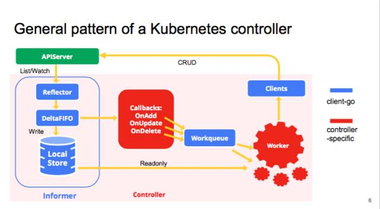

## 前言
根据我们社区制定的计划，本周是开始走读 client-go 中的 informers 模块了，但是无奈这周时间是相当的不充裕，公司内的事情也突然多了几当子要紧急赶工的事情，另外就是准备 GIAC 和和社区的同仁们组织云原生社区深圳站的交流，接着 GIAC 的风也顺便把这些天南地北的同仁们聚到了一起。所以这部分代码的走读计划还是有所延误了，但是还是要走起。

## informers 机制介绍
Informer (就是 SharedInformer)是 client-go 的重要组成部分，在了解 client-go 之前，了解一下 Informer 的实现是很有必要的，下面引用了官方的图，可以看到 Informer 在 client-go 中的位置。

主要使用到 Informer 和 workqueue 两个核心组件。Controller 可以有一个或多个 informer 来跟踪某一个 resource。Informter 跟 API server 保持通讯获取资源的最新状态并更新到本地的 cache 中，一旦跟踪的资源有变化，informer 就会调用 callback。把关心的变更的 Object 放到 workqueue 里面。然后 woker 执行真正的业务逻辑，计算和比较 workerqueue 里 items 的当前状态和期望状态的差别，然后通过 client-go 向 API server 发送请求，直到驱动这个集群向用户要求的状态演化。


这里写了一个测试代码，主要是监控 deployment。
``` golang
package main

import (
	"flag"
	"fmt"
	"log"
	"path/filepath"
	"time"

	v1 "k8s.io/api/apps/v1"
	"k8s.io/apimachinery/pkg/labels"
	"k8s.io/client-go/informers"
	"k8s.io/client-go/kubernetes"
	"k8s.io/client-go/tools/clientcmd"
	// "k8s.io/client-go/rest"
	"k8s.io/client-go/tools/cache"
	"k8s.io/client-go/util/homedir"
)

// func demo(config *rest.Config, namespace string) {
func main() {
	var namespace = "default"
	var kubeconfig *string
	if home := homedir.HomeDir(); home != "" {
		kubeconfig = flag.String("kubeconfig", filepath.Join(home, ".kube", "config"), "(optional) absolute path to the kubeconfig file")
	} else {
		kubeconfig = flag.String("kubeconfig", "", "absolute path to the kubeconfig file")
	}
	flag.Parse()
	config, err := clientcmd.BuildConfigFromFlags("", *kubeconfig)
	if err != nil {
		log.Println(err)
	}
	clientset, err := kubernetes.NewForConfig(config)
	if err != nil {
		panic(err)
	}

	informerFactory := informers.NewSharedInformerFactory(clientset, time.Minute)
	informer := informerFactory.Apps().V1().Deployments()
	informer.Informer().AddEventHandler(
		cache.ResourceEventHandlerFuncs{
			AddFunc:    onAdd,
			UpdateFunc: onUpdate,
			DeleteFunc: onDelete,
		})
	lister := informer.Lister()

	stopCh := make(chan struct{})
	defer close(stopCh)
	informerFactory.Start(stopCh)
	if !cache.WaitForCacheSync(stopCh, informer.Informer().HasSynced) {
		return
	}

	deployments, err := lister.Deployments(namespace).List(labels.Everything())
	if err != nil {
		panic(err)
	}
	for _, deployment := range deployments {
		fmt.Printf("%s\r\n", deployment.Name)
	}
	<-stopCh
}

func onAdd(obj interface{}) {
	deployment := obj.(*v1.Deployment)
	fmt.Printf("onAdd:%s\r\n", deployment.Name)
}

func onUpdate(old, new interface{}) {
	oldDeployment := old.(*v1.Deployment)
	newDeployment := new.(*v1.Deployment)
	fmt.Printf("onUpdate:%s to %s\r\n", oldDeployment.Name, newDeployment.Name)
}

func onDelete(obj interface{}) {
	deployment := obj.(*v1.Deployment)
	fmt.Printf("onDelete:%s\r\n", deployment.Name)
}

```

