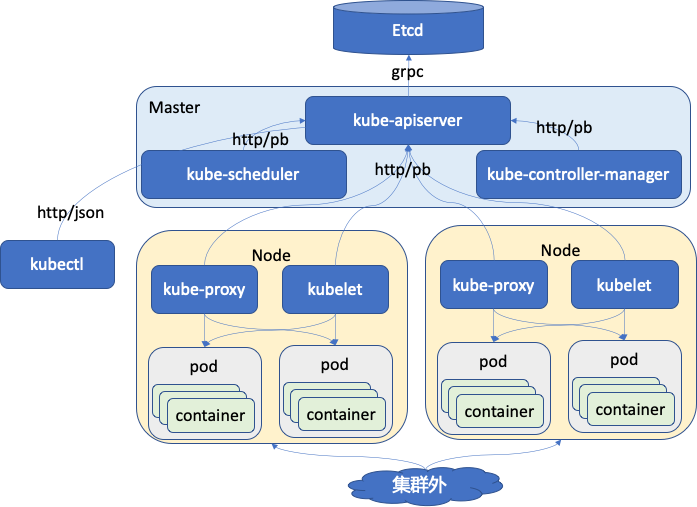

## 前言

今天开始走读 k8s 的代码，首先选择的是 controller-manager 这个组件。这几天也看了《kubernetes源码剖析》的前两章，这本书还是不错的，推荐大家阅读。前面两章主要讲解什么是 kubernets，它的来历，它的架构，它的代码结构，以及它的编译过程。读代码首先要了解它的架构，其次要知道它的代码结构。代码结构就是整个代码目录的组成，那个目录中的文件是做什么的。看了这本书的前面 2 章，对它的架构和结构就会有比较清晰的认识。

## kubernetes 的代码目录结构
这里先列出我这一期认识到的比较重要的目录。

| 目录| 说明 | 备注 |
| - | - | - |
| cmd | 这里面主要就是可以运行的模块，main 函数所在，比如 apiserver，kubectl，kubelet 等 |  - |
| pkg | 这里面是开发的主要代码，看代码实现的重要地方 | - |
| third_party | 一些第三方库 | - |
| logo | 这个目录中放有 kubernetes 的 logo 图片 | - |
| translations | 是 kubectl 的语言包 | - |


## kube-controller-manager 代码走读之主函数
其实看过一级目录后发现 kubernetes 的目录结构还是非常清晰的。比如我今天要看 controller-manager 的代码，那就直接先从 cmd 目录找起，找到 `kube-controller-manager` 这个目录，这个目录下的文件也非常简单。

``` console
 helightxu@  ~/k8s/kubernetes/cmd/kube-controller-manager  ls                                          
BUILD                 OWNERS                app                   controller-manager.go
 helightxu@  ~/k8s/kubernetes/cmd/kube-controller-manager    
```
`app` 是一个目录，`controller-manager.go` 就是主文件，里面有 main 函数。这个文件中的代码也是非常简单，就是一个 main 函数，里面创建了 controller-manager 的 command，然后初始化日志，最后启动执行这个command。删除注释和空行后的 main 函数。

``` golang
func main() {
	rand.Seed(time.Now().UnixNano())
	command := app.NewControllerManagerCommand()
	logs.InitLogs()
	defer logs.FlushLogs()
	if err := command.Execute(); err != nil {
		fmt.Fprintf(os.Stderr, "%v\n", err)
		os.Exit(1)
	}
}
```

## kube-controller-manager 代码走读之 command
这里主要分析上面提到的 app.NewControllerManagerCommand() 这个函数和相关执行过程。这个函数是在 app 这个目录下的 `controllermanager.go` 这个文件中。

NewControllerManagerCommand 函数返回的是一个 cobra.Command 类型指针，里面主要的就是看 `Run` 这个方法，其它都是配置参数加载，解析，help 函数和使用函数注册。这个 `Run` 方法在后面执行 command.Execute() 的时候执行。`Run` 方法里面执行的还是一个 Run 函数，这个函数是在这个文件中定义的，这个函数也是 controller-manager 的主要函数，所有功能从此走起。

这个函数中首先做的是在多个 controller-manager 中进行选主，在 k8s 的所有组件中据说是除了 api-server 没有高可用外，其它的组件都利用 etcd 进行高可用了。所以 controller-manager 启动后首先也是进行选主，只有主服务才进行服务，其它状态的服务处在等待状态，等待争取主状态。选主之后主服务会启用正式的服务，代码如下，还是在 Run 函数中，Run 函数的最后代码就是这块了。
``` go
    leaderelection.RunOrDie(context.TODO(), leaderelection.LeaderElectionConfig{
		Lock:          rl,
		LeaseDuration: c.ComponentConfig.Generic.LeaderElection.LeaseDuration.Duration, // 租约时间
		RenewDeadline: c.ComponentConfig.Generic.LeaderElection.RenewDeadline.Duration, // 更新租约的时间
		RetryPeriod:   c.ComponentConfig.Generic.LeaderElection.RetryPeriod.Duration, // 非leader节点重试时间
		Callbacks: leaderelection.LeaderCallbacks{
			OnStartedLeading: run,  // 变为 leader 后执行的业务代码
			OnStoppedLeading: func() { // 进程退出
				klog.Fatalf("leaderelection lost")
			},
		},
		WatchDog: electionChecker,
		Name:     "kube-controller-manager",
	})
```
leaderelection 这个组件这里先不多说，我在上面的代码中也做了简单的注释说明。这里分析 controllermanager 的主体逻辑，所以关键看它变为 leader 后要执行的业务代码。
也就是上面看到 `OnStartedLeading` 后面有一个 run 函数，这个 run 函数是在 Run 函数中定义的函数，如下：

``` golang
run := func(ctx context.Context) {
    rootClientBuilder := controller.SimpleControllerClientBuilder{ // 构建客户端
		ClientConfig: c.Kubeconfig,
	}
	var clientBuilder controller.ControllerClientBuilder
...
    controllerContext, err := CreateControllerContext(c, rootClientBuilder, clientBuilder, ctx.Done()) 
	if err != nil {
		klog.Fatalf("error building controller context: %v", err)
	}
	saTokenControllerInitFunc := serviceAccountTokenControllerStarter{rootClientBuilder: rootClientBuilder}.startServiceAccountTokenController

	if err := StartControllers(controllerContext, saTokenControllerInitFunc, NewControllerInitializers(controllerContext.LoopMode), unsecuredMux); err != nil {
		klog.Fatalf("error starting controllers: %v", err)
	} // 这里是根据配置信息启动相应的控制器，启动的控制可以看下面的代码

	controllerContext.InformerFactory.Start(controllerContext.Stop) // 启动
	close(controllerContext.InformersStarted)

	select {} // 等待
}
```
上面提到的默认的一些控制器，可以看到我们使用中的这些控制器都在这里。
``` go
func NewControllerInitializers(loopMode ControllerLoopMode) map[string]InitFunc {
	controllers := map[string]InitFunc{}
	controllers["endpoint"] = startEndpointController
	controllers["replicationcontroller"] = startReplicationController
	controllers["podgc"] = startPodGCController
	controllers["resourcequota"] = startResourceQuotaController
	controllers["namespace"] = startNamespaceController
	controllers["serviceaccount"] = startServiceAccountController
	controllers["garbagecollector"] = startGarbageCollectorController
	controllers["daemonset"] = startDaemonSetController
	controllers["job"] = startJobController
	controllers["deployment"] = startDeploymentController
	controllers["replicaset"] = startReplicaSetController
	controllers["horizontalpodautoscaling"] = startHPAController
	controllers["disruption"] = startDisruptionController
	controllers["statefulset"] = startStatefulSetController
	controllers["cronjob"] = startCronJobController
	controllers["csrsigning"] = startCSRSigningController
。。。
```

## 核心数据结构 ControllerContext
这里顺着代码我看了一下这个核心的数据结构，作为 controllermanager 调度核心，目前是简单翻译了一下注释，后面会进一步分析。
```
type ControllerContext struct {
	// ClientBuilder 会提供一个客户端给这个 controller 来使用
	ClientBuilder controller.ControllerClientBuilder

	// InformerFactory 让 controller 可以访问 informers
	InformerFactory informers.SharedInformerFactory

	// ComponentConfig 对制定的 controller 提供访问初始的参数项
	ComponentConfig kubectrlmgrconfig.KubeControllerManagerConfiguration

	// DeferredDiscoveryRESTMapper is a RESTMapper that will defer
	// initialization of the RESTMapper until the first mapping is
	// requested.
	RESTMapper *restmapper.DeferredDiscoveryRESTMapper

	// AvailableResources is a map listing currently available resources
	// 当前可用资源的列表
	AvailableResources map[schema.GroupVersionResource]bool

	// Cloud is the cloud provider interface for the controllers to use.
	// It must be initialized and ready to use. 
	Cloud cloudprovider.Interface

	// Control for which control loops to be run  
	// 控制执行哪些控制器循环，目前有两种：IncludeCloudLoops ，ExternalLoops 后面还要再走读分析
	// IncludeCloudLoops is for a kube-controller-manager running all loops
	// ExternalLoops is for a kube-controller-manager running with a cloud-controller-manager
	LoopMode ControllerLoopMode

	// Stop is the stop channel 为了停止进程而设置的 channel
	Stop <-chan struct{}

	// InformersStarted is closed after all of the controllers have been initialized and are running.  After this point it is safe,
	// for an individual controller to start the shared informers. Before it is closed, they should not.
	// InformersStarted channel 在所有控制器都初始化完成并且运行之后会关闭。对于个人定义的控制器，要通过这个启动共享 informers。
	InformersStarted chan struct{}

	// ResyncPeriod generates a duration each time it is invoked; this is so that
	// multiple controllers don't get into lock-step and all hammer the apiserver
	// with list requests simultaneously.
	// ResyncPeriod 调用的时候会产生一个时间片；这样多个控制器就不会进入锁定步骤，所有的控制器都会同时用列表请求冲击 apiserver。
	// 这部分还不理解，后面再详细分析。
	ResyncPeriod func() time.Duration
}
```
## 总结
目前看 kube-controller-manager 的代码看起来还算比较清晰顺利，不过目前也只是梳理了一个皮毛，真正工作的模块还没有梳理呢。我后面会继续对这部分的代码进行走读分析进行。

不过这周开始要先走读一下 client-go 这个组件，社区发起了一个代码走读活动，本月大家的主要方向是 client-go，controller-manager 是我们还没有定好走读计划之前自己想走读的模块，所以先读了一点。后面由于时间问题，会和大家一起从 client-go 走读。

[Kubernetes 源码研习社：https://github.com/cloudnativeto/sig-k8s-source-code](https://github.com/cloudnativeto/sig-k8s-source-code)，大家有兴趣可以加入进来一起走读代码。

最后加个学习中梳理的一个图：
